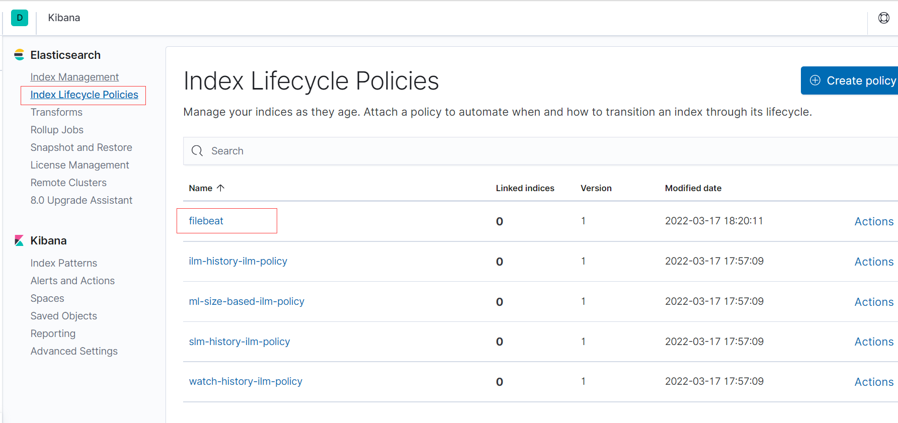

# FileBeat
# 概述
Filebeat 是一个用于转发和集中日志数据的轻量级传送器。作为代理安装在您的服务器上，Filebeat 监控您指定位置的日志文件，收集日志事件，并将它们转发到[Elasticsearch](https://www.elastic.co/products/elasticsearch)或 [Logstash](https://www.elastic.co/products/logstash)以进行索引。

以下是 Filebeat 的工作原理：当您启动 Filebeat 时，它会启动一个或多个输入，这些输入去您指定的位置中查找日志文件。对于 Filebeat 定位的每个日志，Filebeat 都会启动一个收集器**(harvester)**。每个harvester 读取单个日志以获取新内容并将新日志数据发送到libbeat，libbeat 聚合事件并将聚合数据发送到配置好的输出。


> Filebeat 是 Elastic Beat，基于libbeat 框架。

为每个文件启动一个收集器， 其逐行读取文件，并将内容发送到输出。 收集器负责打开和关闭文件，这意味着在收集器运行时文件描述符保持打开状态。

### Filebeat 如何保持文件的状态？
Filebeat 会保存每个文件的状态，并经常在将状态刷新到注册表文件。 该状态用于记住收集器读取的最后一个偏移量，并确保发送所有日志行。 如果无法访问 Elasticsearch 或 Logstash 等输出，Filebeat 会跟踪发送的最后几行，并在输出再次可用时继续读取文件。 在 Filebeat 运行时，每个输入的状态信息也会保存在内存中。 当 Filebeat 重新启动时，来自注册表文件的数据用于重建状态，并且 Filebeat 在最后一个已知位置继续每个收集器。

对于每个输入，Filebeat 都会保存它找到的每个文件的状态。 因为文件可以重命名或移动，所以文件名和路径不足以识别文件。 对于每个文件，Filebeat 都会存储唯一标识符，以检测文件是否以前被收集过。

### Filebeat 如何确保至少一次交付？
Filebeat 保证事件将至少传递到配置的输出一次，并且不会丢失数据。Filebeat 能够实现这种行为是因为它将每个事件的传递状态存储在注册表文件中。

在定义的输出被阻塞并且没有确认所有事件的情况下，Filebeat 将继续尝试发送事件，直到输出确认它已收到事件。

如果 Filebeat 在发送事件的过程中关闭，它不会在关闭前等待输出确认所有事件。任何发送到输出但在 Filebeat 关闭之前未确认的事件，在 Filebeat 重新启动时会再次发送。这可确保每个事件至少发送一次，但最终可能会将重复的事件发送到输出。您可以通过设置`shutdown_timeout`选项将 Filebeat 配置为在关闭之前等待特定的时间。

# 与es集成
## 索引策略
索引生命周期是elasticsearch管理索引的一种方式，可以根据运行状态决定创建新的索引、删除索引等。

从 7.0 版本开始，Filebeat 在连接支持生命周期管理的es集群时，默认使用索引生命周期管理。具体说，filebeat会在连接ES时，在ES上创建filebeat定义好的生命周期。您可以在 Kibana 的索引生命周期策略 UI 中查看和编辑策略。 



你可以在filebeat使用下面的属性配置索引生命周期策略:

* setup.ilm.enabled:
有效值为 true、false 和 auto。 在 7.0 及更高版本指定 auto（默认）时，如果在 Elasticsearch 中启用了该功能并具有所需的许可证，Filebeat 会自动使用索引生命周期管理； 否则，Filebeat 会每天创建一个新的索引。
* setup.ilm.rollover\_alias
索引生命周期写入别名。 默认值为 `filebeat-%{[agent.version]}`。 设置此选项会更改别名。
* setup.ilm.pattern
翻转索引的模式。 默认值为 %{now/d}-000001。配合`setup.ilm.rollover_alias`决定索引的名称，例如：filebeat-7.7.1-2022.03.17-000001
* setup.ilm.policy\_name
用于生命周期策略的名称。 默认为filebeat。看上图
* setup.ilm.policy\_file
包含生命周期策略配置的 JSON 文件的路径。 使用此设置加载您自己定义的生命周期策略。
* setup.ilm.check\_exists
当设置为 false 时，禁用对现有生命周期策略的检查。 默认值为真。 如果连接到安全集群的 Filebeat 用户没有 read\_ilm 权限，您需要禁用此检查。如果将此选项设置为 false，请设置 setup.ilm.overwrite: true 以便可以安装生命周期策略。
* setup.ilm.overwrite
设置为 true 时，生命周期策略在启动时被覆盖。 默认值为false。

> **更多配置参考文档**

## 索引模板
索引模板定义了您可以在创建新索引时自动应用的设置和映射。 Elasticsearch 根据与索引名称匹配的索引模式将模板应用于新索引。

您可以调整以下设置以加载自己的模板或覆盖现有模板。


* setup.template.enabled

设置为 false 可禁用模板加载。如果将此值设置为 false，则必须手动加载模板。

* setup.template.name

模板的名称。缺省值为filebeat 。版本始终附加到名称后，因此最终名称为 。**filebeat-%{\[agent.version\]}**

* setup.template.pattern

要应用于默认索引设置的模板模式。缺省模式为`filebeat-*`。Filebeat 版本始终包含在模式中，因此最终模式为` filebeat-%{[agent.version]}-*`。通配符用于匹配所有日期。


* setup.template.fields

描述字段的 YAML 文件的路径。缺省值为fields.yml 。如果设置了相对路径，则将其视为相对于配置路径。

* setup.template.overwrite

一个布尔值，它指定是否覆盖现有模板。默认值为 false。

* setup.template.settings

es索引的设置信息，例如下面的例子：

```yaml
setup.template.name: "filebeat"
setup.template.fields: "fields.yml"
setup.template.overwrite: false
setup.template.settings:
  index.number_of_shards: 1
  index.number_of_replicas: 1
```
> 更多配置参考文档

# 与kibana集成
## 配置 Kibana 仪表板
Filebeat 附带了示例 Kibana 仪表板、可视化效果和搜索，用于在 Kibana 中可视化 Filebeat 数据,例如nginx、mysql等。你可以通过配置kibana连接信息，来将这些 仪表板导入到kibana。

```yaml
setup.kibana.host: "192.0.2.255:5601"
setup.kibana.username: ""
setup.kibana.password: ""
setup.kibana.protocol: "http"
setup.kibana.path: /kibana
```
要加载仪表板，您可以在配置文件的部分中启用仪表板加载，也可以运行`setup`命令。默认情况下，仪表板加载处于禁用状态。

启用仪表板加载后，Filebeat 将使用 Kibana API 加载示例仪表板。仅当 Filebeat 启动时，才会尝试加载仪表板。如果 Kibana 在启动时不可用，Filebeat 将因错误而停止。

要启用仪表板加载，请将以下设置添加到配置文件中：

```Plain Text
setup.dashboards.enabled: true
```
> 更多配置参考文档，如果单纯是日志集成，可能不需要配置这些

# 安装
安装命令：

```bash
curl -L -O https://artifacts.elastic.co/downloads/beats/filebeat/filebeat-7.7.1-amd64.deb
sudo dpkg -i filebeat-7.7.1-amd64.deb
```
系统：Ubuntu WSL

版本：filebeat-7.7.1-amd64.deb

安装目录信息：

| Type       | Location                |
| ---------- | ----------------------- |
| **home**   | /usr/share/filebeat     |
| **bin**    | /usr/share/filebeat/bin |
| **config** | /etc/filebeat           |
| **data**   | /var/lib/filebeat       |
| **logs**   | /var/log/filebeat       |

## 快速入门
前置要求：

* 安装kibana
* 安装elasticsearch

启动命令：

```bash
filebeat  -c filebeat.yaml  -e 
```
# 配置
```yaml
filebeat.registry:
  flush: 1

#扩展
path.config: /etc/log_agent/filebeat
path.data: /var/lib/log_agent/filebeat
path.logs: /var/log/log_agent/filebeat


filebeat.config.inputs:
  enabled: true
  path: ${path.config}/*.yml  #扩展
  reload.enabled: true
  reload.period: 10s


filebeat.inputs:
- type: log
  enabled: true
  paths: ['d:\logs\**\*.log','e:\logs\**\*.log']
  multiline.pattern: '^\[[0-9]{4}-[0-9]{2}-[0-9]{2}'
  multiline.negate: true
  multiline.match: after
  recursive_glob.enabled: true 
  exclude_lines: ['\$no_es']
  ignore_older: 72h
  clean_inactive: 120h
  scan_frequency: 10s

fields_under_root: false
fields:
  env: staging  #扩展
  team: apollo


output.elasticsearch:
  hosts: ["localhost:9200"]

# output.console:
#   pretty: true

# output.logstash:
#   hosts: ["127.0.0.1:5044"]

processors:
 # - add_host_metadata: ~
  - script:
      when:
        contains:
          message: "$to_decode"
      lang: javascript
      id: url_decode
      source: >  
        function process(event) {
            var message=event.Get("message");
            event.Put("message", decodeURI(message)); 
        }
  - script:
      when:
        contains:
          message: "$to_encode"
      lang: javascript
      id: password_encode
      source: >  
        function process(event) {
            var message=event.Get("message");
            message= message.replace(/\$to_encode\{(.*)\}/,"*****");
            event.Put("message", message); 
            
        }
  - dissect:
      tokenizer: "[%{log_date}] - %{thread}  %{log_level}  %{logger}  %{msg}"
      field: "message"
      target_prefix: "service"
  - script:
      lang: javascript
      id: parse_service
      source: >
        function process(event) {
            var service=event.Get("log.file.path");
            var split=service.split("\\");
            var filname=split[split.length-1];
            var names=filname.split('-');
            if(names.length==2){
                event.Put("service.name", names[0]);
                var index=names[1].indexOf('.');
                if(index!=-1){
                   event.Put("service.subName", names[1].substring(0,index));
                }
              
            }
           
        }
  - drop_fields:
      fields: ["agent", "ecs"]
      ignore_missing: true
```
## 配置项目路径
Filebeat 在`path.config`查找 Elasticsearch 模板文件，并在`path.logs`写入日志文件。 Filebeat 在`path.data`查找其注册表文件。

```yaml
path.home: /usr/share/beat
path.config: /etc/beat
path.data: /var/lib/beat
path.logs: /var/log/
```
* home: filebeat的安装路径。默认值为 Filebeat 二进制文件的位置
* config: 配置文件路径，包括主 YAML 配置文件和 Elasticsearch 模板文件
* data: 数据文件的位置，这些数据文件主要存贮input需要监听的文件信息。filebeat称这些文件为注册表文件。在同一主机上运行多个 Filebeat 实例时，请确保每个实例都具有不同的`path.data`值。
* log: filebeat运行日志的位置。

> 当你把filebeat.yaml放在外部位置时，可能需要配置上面的信息

## 配置全局属性
控制诸如发布者行为和某些文件的位置。下面的配置都在filebeat 命名空间下，即：

```Plain Text
filebeat.registry.path: ${path.data}/registry
```
**registry.path**

注册表的根路径。如果使用相对路径，则将其视为相对于数据路径。缺省值为 `${path.data}/registry`。


注册表将其数据存储在子目录 filebeat/data.json 中。它还包含一个名为 filebeat/meta.json 的元数据文件。元文件包含文件格式版本号。data.json的内容如下：

```json
[
    {
        "source": "d:\\logs\\aa.log",
        "offset": 28,
        "timestamp": "2022-03-19T21:16:07.1332085+08:00",
        "ttl": -1,
        "type": "log",
        "meta": null,
        "FileStateOS": {
            "idxhi": 9043968,
            "idxlo": 148068,
            "vol": 3840767598
        }
    }
]
```
注册表仅在刷新新事件时更新，而不是在预定义的时间段内更新。这意味着，如果某些状态的 TTL 已过期，则只有在处理新事件时才会删除这些状态。


**registry.file\_permissions**

应用于注册表数据文件的权限掩码。默认值为 0600。


**registry.flush**

控制何时将注册表项写入磁盘（刷新）的超时值。如果设置为 0s，则在每批事件成功发布后，注册表将写入磁盘。默认值为 0。

当 Filebeat 正常关闭时，注册表始终会更新。异常关闭后，如果值为 >0s，则注册表将不是最新的。Filebeat 将再次发送已发布的事件（取决于上次更新的注册表文件中的值）。

设置为值 >0 可减少写入操作，从而帮助 Filebeat 处理更多事件。


**shutdown\_timeout**

在 Filebeat 关闭之前等待发布服务器完成发送事件的关闭时间。


默认情况下，此选项处于禁用状态，Filebeat 不会等待发布者完成发送事件后才关闭。这意味着，当您重新启动 Filebeat 时，将再次发送发送到输出但在 Filebeat 关闭之前未确认的任何事件。


您可以配置该选项以指定 Filebeat 在关闭之前等待发布服务器完成发送事件的最长时间。


此选项不建议进行设置，因为正确值在很大程度上取决于 Filebeat 运行的环境和输出的当前状态。


## 常规配置选项
由于它们是常用选项，因此它们不带命名空间。**这些字段可以在用在input命名空间下**。例如：

```Plain Text
name: "my-shipper"
tags: ["service-X", "web-tier"]
```
**name**

filebeat的名称。如果此选项为空，则使用服务器的hostname 。该名称作为`agent.name`字段的值，包含在每个已发布的事件中。您可以使用该名称对单个 Beat 发送的所有交易进行分组。


**tags**

该值包含在日志事件的`tags`字段中。该值是数组

```Plain Text
tags: ["my-service", "hardware", "test"]
```


**fields**

该值包含在日志事件的`fields`字段中。该值可以是标量值、数组、字典或这些字段的任何嵌套组合

```Plain Text
fields: {project: "myproject", instance-id: "574734885120952459"}
```


**fields\_under\_root**

如果此选项设置为 true，则**fields字段的值**将作为顶级域存储在输出文档中，而不是分组到**fields**子字典下。如果自定义字段名称与其他字段名称冲突，则自定义字段将覆盖其他字段


**processors**

数据的处理器列表。对日志事件进行转化解析等操作


**max\_procs**

设置可以同时执行的 CPU 的最大数量。默认值是系统中可用的逻辑 CPU 数。

## 加载外部配置文件
Filebeat 可以为输入和模块加载外部配置文件，允许您将配置分成多个较小的配置文件。

对于输入配置，请在文件部分指定filebeat.config.inputs选项。

```yaml
filebeat.config.inputs:
  enabled: true
  path: inputs.d/*.yml
```
找到的每个文件都必须包含一个或多个输入定义的列表

每个外部配置文件的第一行必须是以`type`开头的输入定义。例如：

```yaml
- type: log
  paths:
    - /var/log/mysql.log
  scan_frequency: 10s

- type: log
  paths:
    - /var/log/apache.log
  scan_frequency: 5s
```
## 实时加载配置文件
Filebeat 发生更改时，支持动态重新加载外部配置文件。但是不支持重新加载主配置文件。

```yaml
filebeat.config.inputs:
  enabled: true
  path: configs/*.yml
  reload.enabled: true
  reload.period: 10s
```


不要将 `period `设置为小于 1s，因为文件的修改时间通常以秒为单位存储。将 `period`设置为小于 1 将导致不必要的开销


## 日志配置
filebeat运行日志配置如下：

```Plain Text
logging.level: info
logging.to_files: true
logging.files:
  path: /var/log/filebeat
  name: filebeat
  keepfiles: 7
  permissions: 0644
```
除了在配置文件中设置日志记录选项外，还可以从命令行修改日志记录输出配置。

**logging.to\_stderr**

如果为 true，则将所有日志记录输出写入标准错误输出。这等效于使用-e命令行选项。


**logging.to\_syslog**

如果为 true，则将所有日志记录输出写入系统日志。

**logging.to\_eventlog**

如果为 true，则将所有日志记录输出写入 Windows 事件日志。


**logging.to\_files**

如果为 true，则将所有日志记录输出写入文件。当达到日志文件大小限制时，将自动轮换日志文件。

**logging.level**

debug、info、warning、error。缺省日志级别为 info。

**logging.metrics.enabled**

记录性能指标。默认值为 true。下面是一个示例日志行：

```Plain Text
2017-12-17T19:17:42.667-0500    INFO    [metrics]       log/log.go:110  Non-zero metrics in the last 30s: beat.info.uptime.ms=30004 beat.memstats.gc_next=5046416
```
**logging.metrics.period**

记录内部指标的时间段。默认值为 30 秒。


**logging.files.path**

日志文件写入的目录。默认值为日志路径。


**logging.files.name**

日志写入的文件的名称。默认值为 filebeat。

**logging.files.rotateeverybytes**

日志文件的最大大小。如果达到限制，将生成一个新的日志文件。默认大小限制为 10485760 （10 MB）。


**logging.files.keepfiles**

要保留在磁盘上的最新轮换日志文件数。较旧的文件在日志轮换期间被删除。默认值为 7。选项必须在 2 到 1024 个文件的范围内。


**logging.files.permissions**

轮换日志文件时要应用的权限掩码。默认值为 0600。

# 输入
这里主要讲log类型的输入，其他类型请参考官方文档。

```yaml
filebeat.inputs:
- type: log 
  paths:
    - /var/log/system.log
    - /var/log/wifi.log
- type: log 
  paths:
    - "/var/log/apache2/*"
  fields:
    apache: true
  fields_under_root: true
```
## 主要的配置
**paths**

Golang Glob模式的文件列表。  例如：/var/log/\*/\*.log。 这会从 /var/log 的子文件夹中获取所有 .log 文件， 但是不会从 /var/log 文件夹本身获取日志文件。

 

**recursive\_glob.enabled**

将 `** `扩展为递归 glob 模式。 启用此功能后，每个路径中最右边的 `**` 将扩展为固定数量的 glob 模式。 例如：`/foo/**` 扩展为 `/foo、/foo/*、/foo/*/*` 等。 如果启用，它将单个` ** `扩展为 8 级深度` * `模式。

默认情况下启用此功能。

**encoding**

日志的文件编码。

**exclude\_lines**

使用正则表达式排除行。如果指定了多行设置，则在 exclude\_lines 过滤行之前，将多行消息合并为一行。

以下示例将 Filebeat 配置为删除任何以 DBG 开头的行。

```Plain Text
filebeat.inputs:
- type: log
  ...
  exclude_lines: ['^DBG']
```


**include\_lines**

包含正则表达式匹配的行。 默认情况下，所有行都被导出。 空行被忽略。

如果指定了多行设置，则每个多行消息在被 include\_lines 过滤之前组合成一行。

```Plain Text
filebeat.inputs:
- type: log
  ...
  include_lines: ['^ERR', '^WARN']
```


> 如果同时定义了 include\_lines 和 exclude\_lines，Filebeat 会先执行 include\_lines，然后再执行 exclude\_lines。 这两个选项的定义顺序无关紧要。 


**harvester\_buffer\_size**

每个收集器使用的缓冲区大小（以字节为单位）。 默认值为 16384。


**max\_bytes**

单个日志消息可以拥有的最大字节数。 max\_bytes 之后的所有字节都被丢弃并且不发送。  默认值为 10MB (10485760)。


**exclude\_files**

忽略匹配正则表达式的文件，可以用来进一步窄化paths指定的文件范围。

```yaml
filebeat.inputs:
- type: log
  ...
  exclude_files: ['\.gz$']
```


## 多行设置
下面是java中抛出的异常日志。我们要把这个多行归到一行。

```bash
[beat-logstash-some-name-832-2015.11.28] IndexNotFoundException[no such index]
    at org.elasticsearch.cluster.metadata.IndexNameExpressionResolver$WildcardExpressionResolver.resolve(IndexNameExpressionResolver.java:566)
    at org.elasticsearch.cluster.metadata.IndexNameExpressionResolver.concreteIndices(IndexNameExpressionResolver.java:133)
    at org.elasticsearch.cluster.metadata.IndexNameExpressionResolver.concreteIndices(IndexNameExpressionResolver.java:77)
    at org.elasticsearch.action.admin.indices.delete.TransportDeleteIndexAction.checkBlock(TransportDeleteIndexAction.java:75)
```
可以发现，正常的行开头都是` [` , 两个` [` 之间的文本，我们可以归为一行。所以我们配置如下：

```yaml
multiline.pattern: '^\['
multiline.negate: true
multiline.match: after
```
与指定正则表达式匹配的行被视为**前一行的延续**或**新多行事件的开始**

**multiline.negate**

定义模式是否被否定。默认值为false.

**multiline.match**

指定 Filebeat 如何将匹配的行组合成一个事件。设置为after或before。

| 设置为`negate` | 设置为`match` | 结果                                         | 例子`pattern: ^b`                                            |
| -------------- | ------------- | -------------------------------------------- | ------------------------------------------------------------ |
| false          | after         | 匹配模式的连续行被附加到不匹配的前一行。     |  |
| false          | before        | 与模式匹配的连续行被添加到下一个不匹配的行。 |  |
| true           | after         | 不匹配模式的连续行将附加到匹配的前一行。     |  |
| true           | before        | 与模式不匹配的连续行被添加到匹配的下一行。   |  |

multiline.flush\_pattern

指定一个正则表达式，其中当前的多行将从内存中刷新，结束多行消息。

multiline.max\_lines

可以组合成一个事件的最大行数。如果多行消息包含多于max\_lines，则丢弃任何其他行。默认值为 500。

multiline.timeout

在指定的超时之后，即使没有找到新的模式来启动新事件，Filebeat 也会发送多行事件。默认为 5 秒。


## 运行方式配置
### **ignore\_older**
如果启用此选项，Filebeat 将忽略在指定时间跨度之前修改的所有文件。 

如果您长时间保留日志文件，配置ignore\_older 可能特别有用。 例如，如果您想启动 Filebeat，但只想发送最新的文件和上周的文件，您可以配置此选项。

您可以使用时间字符串，例如 2h（2 小时）和 5m（5 分钟）。 默认值为 0，即禁用该设置。

受此设置影响的文件分为两类：

* 之前未曾被收集过的文件
* 之前读取过，但是长时间没有更新的文件

对于以前从未见过的文件，偏移状态设置为文件末尾。 如果状态已经存在，则偏移量不会改变。 如果稍后再次更新文件，则在设置的偏移位置继续读取。

ignore\_older 设置依赖于文件的修改时间来确定文件是否被忽略。 如果在将行写入文件时，文件的修改时间没有更新（这可能在 Windows 上发生），ignore\_older 设置可能会导致 Filebeat 忽略该文件。

**在 Filebeat 可以忽略文件之前，必须关闭该文件。 为确保文件在被忽略时不再被收集，您必须将 ignore\_older 设置为比 close\_inactive 更长的时间。**

如果当前正在收割的文件属于ignore\_older，则收集器将首先完成对该文件的读取，并在达到close\_inactive后将其关闭。 然后，在那之后，该文件将被忽略。

**scan\_frequency**

检查新文件的频率。 例如，如果您指定像 /var/log/\* 这样的 glob，则使用 scan\_frequency 指定的频率扫描目录中的新文件。 我们不建议将此值设置为 <1s。

如果您需要近乎实时地发送日志行，请不要使用非常低的 scan\_frequency， 而是调整 close\_inactive 以便文件处理程序保持打开状态并不断轮询您的文件。

默认设置为 10 秒。


**scan.sort**

指定扫描的顺序， 可能的值是 modtime 和 filename。 要按文件修改时间排序，请使用 modtime，否则使用 filename。 将此选项留空以禁用它。默认设置为禁用。


**scan.order**

指定升序或降序。可能的值是 asc 或 desc。默认设置为 asc。


**tail\_files**

如果此选项设置为 true，Filebeat 会在每个文件的末尾而不是开头开始读取新文件。 当此选项与日志轮换结合使用时，可能会跳过新文件中的第一个日志条目。 默认设置为False。

此选项适用于 Filebeat 尚未处理的文件。 如果您之前运行过 Filebeat 并且文件的状态已经持久化，tail\_files 将不适用。 


**symlinks**

除了常规文件之外，该选项还允许 Filebeat 收集符号链接。收集符号链接时，Filebeat 打开并读取原始文件。

当您配置符号链接以进行收集时，请确保排除原始路径。如果将单个输入配置为同时获取符号链接和原始文件，Filebeat 将检测到问题并仅处理它找到的第一个文件。但是，如果配置了两个不同的输入（一个用于读取符号链接，另一个用于读取原始路径），则两条路径都将被收集，导致 Filebeat 发送重复数据并且输入会覆盖彼此的状态。

如果日志文件的符号链接在文件名中包含其他元数据，并且您希望在 Logstash 中处理元数据，则该`symlinks`选项可能很有用。例如，Kubernetes 日志文件就是这种情况。

因为这个选项可能会导致数据丢失，所以默认是禁用的。


##### **backoff**
该`backoff`选项定义了 Filebeat 在到达 EOF 后再次检查文件之前等待的时间。默认值为 1s，这意味着如果添加了新行，则每秒检查一次文件。这可以实现近乎实时的爬行。每次文件中出现新行时，该`backoff`值都会重置为初始值。默认值为 1 秒。


##### **max\_backoff**
Filebeat 在达到 EOF 后再次检查文件之前等待的最长时间。等待时间是依次增加的，例如第一次1秒，第二次`2*1`*秒，第三次**2\*2\*1*，等待时间不会超过`max_backoff`. 这个2就是因子。默认值为 10 秒。

要求：`backoff <= max_backoff <= scan_frequency`。如果`max_backoff`需要更高，建议改为关闭文件处理程序，让 Filebeat 重新拾取文件。


##### **backoff\_factor**
此选项指定等待时间增加的速度。退避因子越大，达到`max_backoff`值的速度就越快。退避因子呈指数增长。默认值为 2。


##### **harvester\_limit**
为一个输入并行启动的收集器数量。这与打开的文件处理程序的最大数量直接相关。默认为`harvester_limit`0，表示没有限制。如果要收集的文件数量超过操作系统的打开文件处理程序限制，此配置很有用。

对收集器的数量设置限制意味着可能并非所有文件都并行打开。因此，我们建议您将此选项与`close_*`选项结合使用，以确保更频繁地停止收集器，以便拾取新文件。

目前，如果可以再次启动新的收集器，则收集器是随机采集的。这意味着可能会启动刚刚关闭然后再次更新的文件的收集器，而不是长时间未收割的文件的收集器。


### close\_\* 配置
close\_\* 配置选项用于在特定条件或时间后关闭收集器。 关闭收集器意味着关闭文件处理程序。 scan\_frequency时间过去后， 将再次收集该文件。 但是，如果在harvester 关闭时移动或删除文件，Filebeat 将无法再次拾取该文件，并且harvester 尚未读取的数据都将丢失。

**close\_inactive**

启用此选项后，如果在指定的时间段内未收集文件，Filebeat 将关闭文件句柄。当收集器读取最后一个日志行时，定义时间段的计数器开始计时。它不是基于文件的修改时间。如果关闭的文件再次更改，则会启动一个新的收集器，并在 scan\_frequency 过去后获取最新的更改。

我们建议您将 close\_inactive 设置为大于日志文件更新的值。 例如，如果您的日志文件每隔几秒更新一次，您可以安全地将 close\_inactive 设置为 1m。 

将 close\_inactive 设置为较低的值意味着文件句柄会更快关闭。 然而，这有副作用，如果收集器关闭，新的日志行不会近乎实时地发送。

关闭文件的时间戳不依赖于文件的修改时间。 相反，Filebeat 使用一个内部时间戳来反映文件上次获取的时间。 例如，如果 close\_inactive 设置为 5 分钟，则 5 分钟的倒计时在 Harvester 读取文件的最后一行后开始。

您可以使用时间字符串，例如 2h（2 小时）和 5m（5 分钟）。 默认值为 5m。


**close\_renamed** 

启用此选项后，Filebeat 会在重命名文件时关闭文件处理程序。 例如，在旋转文件时会发生这种情况。 默认情况下，harvester 保持打开状态并继续读取文件，因为文件处理程序不依赖于文件名。 如果启用了 close\_renamed 选项并且文件被重命名或移动，使得它不再与指定的文件模式匹配，则不会再次拾取文件。 Filebeat 将无法完成文件的读取。

> 如果您的 Windows 日志轮换系统由于无法轮换文件而显示错误，您应该启用此选项。


**close\_removed**

启用此选项后，Filebeat 会在删除文件时关闭收集器。 通常，只有在 close\_inactive 指定的时间内处于非活动状态后，才应删除文件。 但是，如果文件被提前删除并且您没有启用 close\_removed，Filebeat 会保持文件打开以确保收集器已完成。 如果此设置导致文件由于过早从磁盘中删除而未完全读取，请禁用此选项。

默认情况下启用此选项。 如果禁用此选项，则还必须禁用 clean\_removed。

> 如果您的 Windows 日志轮换系统由于无法轮换文件而显示错误，请确保启用此选项。


**close\_eof**

启用此选项后，Filebeat 会在到达文件末尾时立即关闭文件。 当您的文件只写入一次并且不时常更新时，这很有用。 默认情况下禁用此选项。


**close\_timeout**

启用此选项后，Filebeat 会为每个收集器提供预定义的生命周期。无论读取器在文件中的哪个位置，读取都将在 close\_timeout 时间过后停止。

虽然 close\_timeout 将在预定义的超时后关闭文件，但如果文件仍在更新，Filebeat 将根据定义的 scan\_frequency 再次启动新的收集器。并且这个收集器的 close\_timeout 将重新开始超时倒计时。

这个选项在输出被阻塞的情况下特别有用。将 close\_timeout 设置为 5m 可确保文件定期关闭，以便操作系统可以释放它们。

如果您将 close\_timeout 设置为等于 ignore\_older，则如果在收集器关闭时对其进行了修改，则不会拾取该文件。这种设置组合通常会导致数据丢失，并且不会发送完整的文件。

当您对包含多行事件的日志使用 close\_timeout 时，收集器可能会在多行事件的中间停止，这意味着只会发送部分事件。如果再次启动收集器并且文件仍然存在，则只会发送事件的第二部分。

此选项默认设置为 0，这意味着它被禁用。


### clean\_\*配置
clean\_\* 选项用于清理注册表文件中的状态条目。 这些设置有助于减小注册表文件的大小，并且可以防止潜在的 inode 重用问题。


**clean\_inactive**

启用此选项后，Filebeat 会在指定的不活动时间过后删除文件的状态。 只有当文件已经被 Filebeat 忽略时，才能删除状态。 **clean\_inactive 设置必须大于 ignore\_older **

scan\_frequency 确保在仍在收集文件时不会被删除任何状态。 否则，该设置可能会导致 Filebeat 不断地重新发送完整内容，因为 clean\_inactive 会删除 Filebeat 仍检测到的文件的状态。 如果文件被更新或再次出现，则从头开始读取该文件。

clean\_inactive 配置选项对于减小注册表文件的大小很有用，尤其是在每天生成大量新文件的情况下。

此配置选项对于防止 Linux 上因 inode 重用而导致的 Filebeat 问题也很有用。 


**clean\_removed**

启用此选项后，如果无法在磁盘上找到文件，Filebeat 会从注册表中清除文件。 这意味着重命名的文件也将被删除。 默认情况下启用此选项。

如果共享驱动器在短时间内消失并再次出现，则会从头开始重新读取所有文件，因为已从注册表文件中删除了状态。 在这种情况下，我们建议您禁用 clean\_removed 选项。

如果您还禁用 close\_removed，则必须禁用此选项。

## 机制总结
**当文件到末尾时？**

1.  当日志收集到达文件末尾时，收集器会等待backoff（默认1s）,然后重新读取文件是否有更新。
2.  如果文件没有更新，收集器会等待 backoff=backoff(上一次的)\*backoff\_factor(默认2) 
3.  当backoff超过max\_backoff时，backoff会重新开始计数。

**当文件长时间不更新时？**

1.  当在 close\_inactive（默认5m）没有新事件被收集，收集器会被关闭。
2.  经过scan\_frequency（默认10s）,收集器会被重新打开。

**当文件旋转时？**

1.  文件旋转时，会把当前文件重命名，然后移动位置。然后创建新的空的文件写入新的日志。
2.  默认情况下， 收集器还会监听老文件，即被重命名的文件。直到超过close\_inactive时间，才会关闭这个文件。
3.  经过scan\_frequency时间，会重新读取这个文件，这种情况明显不是我们想要的。一般旋转后的文件都会被归档，基本不会发生变更了，收集器重新打开这个文件，虽然不会读取已经读取过的数据，但是会占用资源。怎样避免这种情况呢？
4.  ignore\_older属性就是解决这个问题的，他会忽略长时间没有更新的文件。
5.  虽然这个文件不会被读取了，但是仍然在在注册表中记录，我们还需要清除这个记录，通过配置clean\_inactive 达到目的，这个值要大于ignore\_older

**当文件删除时？**

1. 文件被删除，收集器仍然会占用这个文件，直到超过close\_inactive，该文件才会被真正删除

# 定义处理器
在将数据发送到配置的输出之前，可以使用处理器来筛选和增强数据。要定义处理器，请指定处理器名称、可选条件和一组参数：

```yaml
processors:
  - <processor_name>:
      when:
        <condition>
      <parameters>

  - <processor_name>:
      when:
        <condition>
      <parameters>
```
* `<processor_name>`指定执行某种操作（如选择导出的字段或向事件添加元数据）的[处理器](https://www.elastic.co/guide/en/beats/filebeat/7.7/defining-processors.html#processors%20%22Processors%22)。
* `<condition>`指定可选[条件](https://www.elastic.co/guide/en/beats/filebeat/7.7/defining-processors.html#conditions%20%22Conditions%22)。如果条件存在，则仅当满足条件时才执行操作。如果未设置任何条件，则始终执行该操作。
* `<parameters>`是要传递给处理器的参数列表。

更复杂的条件处理可以通过使用 if-then-else 处理器配置来完成。这允许基于单个条件执行多个处理器。

```yaml
processors:
  - if:
      <condition>
    then: 
      - <processor_name>:
          <parameters>
      - <processor_name>:
          <parameters>
      ...
    else: 
      - <processor_name>:
          <parameters>
      - <processor_name>:
          <parameters>
```
### 处理器在哪里有效？
处理器有效：

* 在配置的顶层。处理器应用于 Filebeat 收集的所有数据。
* 在特定输入下。处理器应用于为该输入收集的数据。

```yaml
- type: <input_type>
  processors:
    - <processor_name>:
        when:
          <condition>
        <parameters>
```


# 注意事项
* 两个正在运行的输入没有定义重叠的文件路径。如果多个输入同时收集同一文件，则可能导致意外行为。

## 日志轮换导致事件丢失或重复
Filebeat 支持从旋转日志文件中读取数据。但是，某些日志轮换策略在使用 Filebeat 转发消息时可能会导致丢失或重复的事件。要解决此问题，请执行以下操作：

* **避免复制和截断日志文件的日志轮换策略**

复制和截断输入日志文件的日志轮换策略可能会导致 Filebeat 发送重复事件。发生这种情况是因为 Filebeat 通过 inode 和设备名称标识文件。在日志轮换期间，Filebeat 已处理的行将移动到新文件中。当 Filebeat 遇到新文件时，它会从头开始读取，因为以前的状态信息（偏移量和读取时间戳）与旧文件的 inode 和设备名称相关联。

此外，如果将行写入日志文件是在复制之后但在截断之前写入日志文件，则复制和截断输入日志文件的策略可能会导致事件丢失。

* **确保 Filebeat 配置为从所有轮换的日志中读取**

在日志轮换期间移动或重命名输入日志文件时，Filebeat 能够识别该文件已被读取。轮换文件后，将创建一个新的日志文件，并且应用程序将继续日志记录。Filebeat 在下次扫描期间选取新文件。由于文件具有新的 inode 和设备名称，因此 Filebeat 会从头开始读取它。

若要避免从轮换文件中丢失事件，请将输入配置为从日志文件和所有轮换文件中读取。下面是具体的配置信息。

logrotate 是一种用于在 Linux 上执行日志轮换的常用工具，后跟读取所有轮换日志的 Filebeat 配置。

**logrotate.conf，**日志每天轮换，并使用指定的权限创建新文件。

```Plain Text
/var/log/my-server/my-server.log {
    daily
    missingok
    rotate 7
    notifempty
    create 0640 www-data www-data
}
```
在此示例中，Filebeat 配置为读取所有日志文件，以确保它不会错过任何事件。

```Plain Text
filebeat.inputs:
- type: log
  enabled: false
  paths:
  - /var/log/my-server/my-server.log*
```


## logstash还是beats
Beats 是轻量级数据传送器，您可以将其作为代理安装在服务器上，以将特定类型的操作数据发送到 Elasticsearch。Beats 占用空间小，使用的系统资源比 Logstash 少。

Logstash 的占用空间较大，但提供了广泛的输入、过滤器和输出插件，用于从各种源收集、丰富和转换数据。


# 规范
如何我们不想在项目中配置filebeat文件，就需要项目产生日志的时候，遵循下面的约定.

1. **加密**

如果某行日志需要加密输出，你在日志中输出 `$to_encode{content}，` 我们会对这个字符串之后的内容进行 `**`加密， 注意这种格式不能解密

2. **解密**

如果你的url是加密的，，你在日志中输出 `$to_decode，` 我们会对这个字符串之后的内容进行base64解密

3. **排除行**

有些时候，我们不希望有些日志输出到es，可以在日志中包含` $no_es` 字符串

4. **日志文件的命名**

服务名称-服务类型-其他标识.log

* 服务名称用来识别是哪个应用
* 服务类型有这几类： 
   * short：标识是个job（运行完任务之后，进程就不存在了）类型的应用产生的日志。
   * shell：标识是shell脚本运行后产生的日志。存在shell 调用job的情况，如何关联呢？
   * service: 标识是一个web服务产生的日志。
   * 如果你不知道这个属性怎么设置，就写成service即可。

> 服务的名称和类型会在kibana中用于检索。

5. **日志文件的位置**

filebeat默认会读取 `/var/lib/applogs` （一级目录）目录下的日志，你需要把日志存储到这个目录下的三个子目录（二级目录）：

* short：对应服务类型short
* shell：对应服务类型shell
* service: 对应服务类型service

你可以在二级目录下面新建目录来区分日志，嵌套不要超过三层。超过这些日志数据可能不会被推送。

> 之所以对日志这样切分，是为了性能考虑。service类型需要我们一直监听事件 ，shell 和short 我们可以间隔很长时间去监听以下是否有新数据到达。

6. **日志轮转问题**

使用者不需要配置。但我们应该配置

7. **多行日志**

```yaml
[2022-03-21 14:19:47.891] - [main]  ERROR  cn.zhao.FileBeatTest  zzq exception
java.lang.ArithmeticException: / by zero
	at cn.zhao.FileBeatTest.testError(FileBeatTest.java:19)
	at cn.zhao.FileBeatTest.main(FileBeatTest.java:13)
```
请保证每行的开头是 \[ , 正则格式是 `^\[[0-9]{4}-[0-9]{2}-[0-9]{2}`


问题：

服务名称和服务类型可能不会被很好的规范，使用java-agent技术解决这个问题。

linux alias 解决echo 问题？

主配置文件内容：

```bash
filebeat.registry:
  flush: 1

#扩展
path.home: D:\dev_soft\filebeat-7.7.1-windows-x86_64
path.config: D:\filebeat\config
path.data: D:\filebeat\data
path.logs: D:\filebeat\logs


filebeat.config.inputs:
  enabled: true
  path: ${path.config}/*.yml  #扩展
  reload.enabled: true
  reload.period: 10s

filebeat.inputs:
- type: log
  enabled: true
  paths: #扩展
    - d:\logs\**\*.log
  multiline.pattern: '^\[[0-9]{4}-[0-9]{2}-[0-9]{2}'
  multiline.negate: true
  multiline.match: after
  recursive_glob.enabled: true 
  exclude_lines: ['\$no_es']
  ignore_older: 72h
  clean_inactive: 120h
  scan_frequency: 10s


filebeat.config.modules:
  path: ${path.config}/modules.d/*.yml # 扩展
  reload.enabled: true

#name: # 扩展
tags: ["apollo","158459"] # 扩展
fields:
  env: staging  #扩展


# output.elasticsearch:
#   hosts: ["localhost:9200"]

output.console:
  pretty: true

processors:
 # - add_host_metadata: ~
  - script:
      lang: javascript
      id: url_decode
      source: >  
        function process(event) {
            var message=event.Get("message");
            if(message.indexOf("$to_decode")!=-1){
              event.Put("message", decodeURI(message)); 
            }
        }
  - script:
      lang: javascript
      id: password_encode
      source: >  
        function process(event) {
            var message=event.Get("message");
            if(message.indexOf("$to_encode")!=-1){
              message= message.replace(/\$to_encode\{(.*)\}/,"*****");
              event.Put("message", message); 
            }
        }
  - dissect:
      tokenizer: "[%{log_date}] - %{thread}  %{log_level}  %{logger}  %{msg}"
      field: "message"
      target_prefix: "service"
  - script:
      lang: javascript
      id: parse_service
      source: >
        function process(event) {
            var service=event.Get("log.file.path");
            var split=service.split("\\");
            var filname=split[split.length-1];
            var names=filname.split('-');
            if(names.length==2){
                event.Put("service.name", names[0]);
                var index=names[1].indexOf('.');
                if(index!=-1){
                   event.Put("service.type", names[1].substring(0,index));
                }
              
            }
           
        }

```
## 用户自定义示例
如果上面的规范不能满足你的需求，你可以自定义filebeat配置文件。

你只需要将定义好的配置文件上传到我们指定的目录即可，大约10s，配置就会生效。

注意： 自定义支持：

* 日志文件的位置
* 多行
* 排除行
* 处理器

下面是该文件的详细格式：

```yaml
- type: log
  enabled: true
  paths: #扩展
    - d:\logs\**\*.log  # 日志文件的位置
  multiline.pattern: '^\[[0-9]{4}-[0-9]{2}-[0-9]{2}' #多行内容开始
  multiline.negate: true 
  multiline.match: after
  recursive_glob.enabled: true 
  exclude_lines: ['\$no_es'] # 排除行的规则
  ignore_older: 72h   # 默认
  clean_inactive: 120h # 默认
  scan_frequency: 10s # 默认
  processors:  # 指定处理器
    - <processor_name>:
        when:
          <condition>
        <parameters>
```
处理器类型请参考 [Add fields | Filebeat Reference \[7.7\] | Elastic](https://www.elastic.co/guide/en/beats/filebeat/7.7/add-fields.html) 

注意： filebeat的版本是7.x 


上线的步骤：

1. udeploy统一部署filbeat ,将著配置文件定义好，将监听配置文件定义好
2. 用户按照规范，是不需要定义filebeat的配置文件的
3. 如果用户想要自定义一些规范，请将配置文件安装到监听配置文件的目录。
