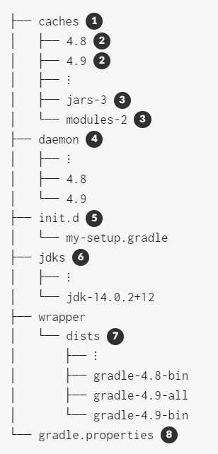
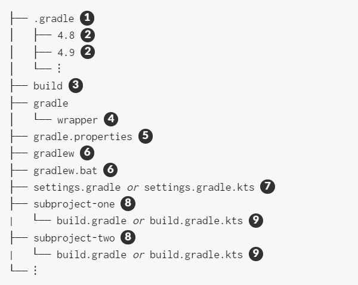

# 核心概念 

## 1. Gradle 是一个通用的构建工具

Gradle 可以用于构建（build）任何软件，因为它对你要构建的东西或构建方式几乎不做任何假设。不过当前它最大的限制是，只支持兼容 Maven 和 lvy 的仓库和文件系统。

这并不意味着你需要为构建做许多工作。Gradle 可以通过[插件（*plugins*）](https://docs.gradle.org/current/userguide/plugins.html#plugins)添加一层约定（convention）以及预构建功能（prebuild functionality）来让常见的项目类型，例如 Java 库，更容易被构建。你甚至能将自己的约定和构建功能封装成插件来发布。

## 2. 核心模型基于 task

task 是 Gradle 的工作单元。Gradle 的构建模型就是一个 task 的定向无环图（Directed Acyclic Graphs, DAGs）。也就是说，构建本质上是在配置一个由 task 组成的定向无环图。task 之间根据它们的依赖关系相连。一旦 task 图被创建，Gradle 就能确定该以何种顺序执行 task。

这张图显示了两个 task 图的例子，一个是抽象的，一个是具体的，task 之间的依赖关系用箭头表示：


几乎所有的构建过程都可以通过这种方式建模为一个 task 图，这也是 Gradle 灵活的原因之一。而且这个 task 图可以由插件和你的构建脚本来定义，并通过 [task 依赖机制](https://docs.gradle.org/current/userguide/tutorial_using_tasks.html#sec:task_dependencies)将 task 连接起来。

一个 task 包括：

- 动作（Actions）——执行某些工作。例如复制文件或者编译源码。
- 输入（Inputs）——给动作使用或操作的值、文件和目录
- 输出（Outputs）——由动作修改或生成的文件和目录

以上内容都是可选的，使用与否取决于实际需要。一些 task，比如[标准生命周期 task（standard lifecycle tasks）](https://docs.gradle.org/current/userguide/base_plugin.html#sec:base_tasks)，甚至没有任何动作。它们只是将多个任务聚合在一起，以方便使用。

你可以选择你需要的 task 来运行。为了节约时间，请选择刚好能满足需要的 task。如果想运行单元测试，就选择执行单元测试的 task——通常是 `test`。如果想打包一个应用，大多数构建都提供一个 `assemble` task 以供使用。

最后，Gradle 的[增量构建](https://docs.gradle.org/current/userguide/more_about_tasks.html#sec:up_to_date_checks)支持强大而又可靠，所以为了保持构建的运行速度，请避免运行 `clean` task，除非你确实想执行清理。

## 3. Gradle 的多个固定构建阶段

Gradle 会在三个阶段（phases）评估（evaluates）并执行（execute）构建脚本。理解这三个阶段非常重要。

1. 初始化（Initialization）
   设置构建的环境，并明确哪些项目将参与其中。
2. 配置（Configuration）
   构造并配置构建的 task 图。然后根据用户想要运行的 task，确定需要运行哪些任务，以及运行的顺序。
3. 执行（Execution）
   运行配置阶段结束时选择的 task。

这些阶段组成了 Gradle 的[构建生命周期（Build Lifecycle）](https://docs.gradle.org/current/userguide/build_lifecycle.html#build_lifecycle)。

**与 Apache Maven 术语的比较**

Gradle 的“构建阶段”与 Maven 的“阶段”不同。Maven 的“阶段”将构建执行划分成了多个部分。它们的作用类似于 Gradle 的 task 图，尽管没有那么灵活。

Maven 的构建生命周期概念与 Gradle 的[生命周期 task](https://docs.gradle.org/current/userguide/base_plugin.html#sec:base_tasks) 大致相似。

设计良好的构建脚本主要[由声明式配置组成，而非命令式逻辑](https://docs.gradle.org/current/userguide/authoring_maintainable_build_scripts.html#sec:avoid_imperative_logic_in_scripts)。容易理解的是，这些配置在配置阶段就会被评估。但许多构建也有 task 动作（例如通过 `doLast {}` 和 `doFirst {}` 添加的），它们在执行阶段被评估。理解这一点非常重要，因为配置阶段评估的代码无法感知到执行阶段发生的变化。

配置阶段的另一个重要方面是，每当构建运行时，都会对其中涉及的一切进行评估。因此要[避免在配置阶段做复杂的工作](https://docs.gradle.org/current/userguide/authoring_maintainable_build_scripts.html#sec:minimize_logic_executed_configuration_phase)。除此之外，[构建扫描（build scan）](https://scans.gradle.com/)可以帮助你识别这样的热点。

## 4. Gradle 可以使用多种方式进行扩展

如果你能用 Gradle 内建的构建逻辑来构建你的项目，那再好不过了。然而事实往往没有这么顺利。大多数构建都有一些特殊的要求，这就要求你能添加自定义构建逻辑。

Gradle 提供了多种机制来进行扩展，比如：

- [自定义 task 类型](https://docs.gradle.org/current/userguide/custom_tasks.html)
  当你想让构建做一些现有 task 不能做的工作时，你可以简单地编写自己的 task 类型。通常最好把自定义 task 类型的源文件放在 [*buildSrc*](https://docs.gradle.org/current/userguide/organizing_gradle_projects.html#sec:build_sources) 目录或打包的插件中。然后你就可以像使用任何 Gradle 内建的 task 类型一样，使用这个自定义 task 类型。
- 自定义 task 动作
  你可以通过 `Task.doFirst()` 和 `Task.doLast()` 方法将自定义构建逻辑附加在 task 之前或之后执行。
- 项目和 task 的[额外属性](https://docs.gradle.org/current/userguide/writing_build_scripts.html#sec:extra_properties)
  你可以将自定义属性添加到项目或 task 中，并在自定义动作或任何其他构建逻辑中使用。额外的属性甚至能被应用到那些不是由你明确创建的 task 上，比如由 Gradle 核心插件创建的 task。
- 自定义约定
  约定是简化构建的有力方法，它可以让用户更容易理解和使用。这可以从标准项目结构和命名约定中看出，比如 [Java 构建](https://docs.gradle.org/current/userguide/building_java_projects.html#building_java_projects)。你可以编写你自己的插件来提供约定，它们只需要为构建的相关方面配置默认值。
- [自定义模型](https://guides.gradle.org/implementing-gradle-plugins/#modeling_dsl_like_apis)
  Gradle 允许你在构建中引入除了 task、文件、依赖配置之外的新概念。你可以在大多数语言插件中看到这一点，它们将[源集（source sets）](https://docs.gradle.org/current/userguide/building_java_projects.html#sec:java_source_sets)的概念添加到了构建之中。对构建过程进行适当的建模可以大大提高构建的易用性和效率。

## 5. 用构建脚本操作 API

Gradle 的构建脚本看起来像可执行代码，实际上它的确是。这里有一个实现细节：设计良好的构建脚本描述了构建软件需要哪些（*what*）步骤，而不是这些步骤应该如何（*how*）完成工作。那是自定义任务类型和插件的工作。

有一个普遍的误解，认为 Gradle 的强大和灵活来自于它的构建脚本是代码这一事实。这个观点完全错误。实际上那是底层模型和 API 提供的力量。正如我们在最佳实践中所建议的那样，你应该[避免在你的构建脚本中放入过多的命令式逻辑](https://docs.gradle.org/current/userguide/authoring_maintainable_build_scripts.html#sec:avoid_imperative_logic_in_scripts)。

然而，有一个领域，“将构建脚本视为可执行代码”在此领域是很有用的，即：理解构建脚本的语法如何映射到 Gradle 的 API。API 文档（由 [Groovy DSL 参考](https://docs.gradle.org/current/dsl/)和 [Javadocs](https://docs.gradle.org/current/javadoc/) 组成）中列出了方法、属性并题及了闭包和动作。它们在构建脚本的上下文中有什么含义？请阅读 [Groovy 构建脚本入门](https://docs.gradle.org/current/userguide/groovy_build_script_primer.html#groovy_build_script_primer)来获得这个问题的答案。这能帮助你有效地使用 API 文档。

由于 Gradle 运行在 JVM 上，构建脚本也可以使用标准的 Java API。Groovy 构建脚本可以额外使用 Groovy API，而 Kotlin 构建脚本可以使用 Kotlin 的。


# Gradle生命周期

## build.gradle文件
build脚本构建有三个阶段：

* 初始化: Gradle 支持单项目和多项目构建。在初始化阶段，Gradle 确定哪些项目将参与构建，并为每个项目创建Project实例。
* 配置: 配置Project对象。 all 脚本里面的内容被执行用来配置所有项目。
* 执行：Gradle 确定要执行的任务子集，这些任务在配置阶段创建和配置。子集由传递给gradle命令的任务名称参数和当前目录确定。然后，Gradle 执行每个选定的任务。

## settings.gradle文件
设置文件在初始化阶段执行。multi-project项目必须在根目录创建settings文件，因为该文件定义了哪些项目参与构建。对于单项目，设置文件是可选的。除了定义包含的项目之外，您可能还需要它来将库添加到构建脚本类路径。

**示例：单项目的构建配置**

***settings.gradle***

```groovy
rootProject.name = 'basic'
println 'This is executed during the initialization phase.'
```


***build.gradle***

```groovy
println 'This is executed during the configuration phase.'

tasks.register('configured') {
    println 'This is also executed during the configuration phase, because :configured is used in the build.'
}

tasks.register('test') {
    doLast {
        println 'This is executed during the execution phase.'
    }
}

tasks.register('testBoth') {
    doFirst {
      println 'This is executed first during the execution phase.'
    }
    doLast {
      println 'This is executed last during the execution phase.'
    }
    println 'This is executed during the configuration phase as well, because :testBoth is used in the build.'
}
```
输出结果：

```bash
> gradle test testBoth
This is executed during the initialization phase.

> Configure project :
This is executed during the configuration phase.
This is executed during the configuration phase as well, because :testBoth is used in the build.

> Task :test
This is executed during the execution phase.

> Task :testBoth
This is executed first during the execution phase.
This is executed last during the execution phase.

BUILD SUCCESSFUL in 0s
2 actionable tasks: 2 executed
```
对于Build脚本，属性访问和方法调用的目标对象都是project。而settings脚本的目标对象是settings。

## 初始化
Gradle 如何知道是进行单项目构建还是多项目构建？如果你触发构建的目录存在settings.gradle文件，gradle会使用该文件进行build。gradle也允许你在任何子项目目录下进行构建。当gradle运行的时候当前目录不存在settings.gradle文件，将会按照下面的方式查找：

* 在父目录中查找
* 如果没有发现，按照单项目执行
* 如果发现，Gradle 会检查当前项目是否是多项目层次结构的一部分。如果不是，则作为单个项目执行。否则，将执行多项目build。

此行为的目的是什么？Gradle 需要确定您所处的项目是否为多项目构建的子项目。当然，如果是子项目，则仅构建子项目及其依赖项目，但是gradle需要为整个多项目创建build配置。

## 生命周期监听
监听构建过程有两种方式：实现监听器接口或触发执行闭包。

你可以在项目evaluated之前或之后收到通知。这在可以在所有build脚本被定义后加入一些自己的逻辑，例如日志和监控。

下面是一个示例，该示例向`hasTests`属性值为 true 的每个项目添加一个任务。

***build.gradle***

```clojure
allprojects {
    afterEvaluate { project ->
        if (project.hasTests) {
            println "Adding test task to $project"
            project.task('test') {
                doLast {
                    println "Running tests for $project"
                }
            }
        }
    }
}
```
***project-a.gradle***

```groovy
hasTests = true
```
输出：

```bash
> gradle -q test
Adding test task to project ':project-a'
Running tests for project ':project-a'
```
评估任何项目时，也可以接收通知。此示例执行项目评估的一些自定义日志记录。请注意，无论项目评估成功还是失败并出现异常，都会收到通知。

***build.gradle***

```groovy
gradle.afterProject { project ->
    if (project.state.failure) {
        println "Evaluation of $project FAILED"
    } else {
        println "Evaluation of $project succeeded"
    }
}
```
输出：

```bash
> gradle -q test
Evaluation of root project 'build-project-evaluate-events' succeeded
Evaluation of project ':project-a' succeeded
Evaluation of project ':project-b' FAILED

FAILURE: Build failed with an exception.

* Where:
Build file '/home/user/gradle/samples/project-b.gradle' line: 1

* What went wrong:
A problem occurred evaluating project ':project-b'.
> broken

* Try:
> Run with --stacktrace option to get the stack trace.
> Run with --info or --debug option to get more log output.
> Run with --scan to get full insights.

* Get more help at https://help.gradle.org

BUILD FAILED in 0s
```
将任务添加到项目后，您可以立即收到通知。这可用于在构建文件中提供任务之前设置一些默认值或添加行为。

下面的示例在创建每个任务时设置`srcDir`属性

***build.gradle***

```groovy
tasks.whenTaskAdded { task ->
    task.ext.srcDir = 'src/main/java'
}

tasks.register('a')

println "source dir is $a.srcDir"
```
输出：

```bash
> gradle -q a
source dir is src/main/java
```
您可以在执行任何任务之前和之后立即收到通知。

下面的示例记录每个任务执行的开始和结束。请注意，无论任务是成功完成还是失败并出现异常，都会收到通知。

***build.gradle***

```groovy
tasks.register('ok')

tasks.register('broken') {
    dependsOn ok
    doLast {
        throw new RuntimeException('broken')
    }
}

gradle.taskGraph.beforeTask { Task task ->
    println "executing $task ..."
}

gradle.taskGraph.afterTask { Task task, TaskState state ->
    if (state.failure) {
        println "FAILED"
    }
    else {
        println "done"
    }
}
```
# gradle使用的目录和文件
Gradle 使用两个主要目录来执行和管理其工作：[Gradle 用户主目录](https://docs.gradle.org/current/userguide/directory_layout.html#dir:gradle_user_home)和[项目根目录](https://docs.gradle.org/current/userguide/directory_layout.html#dir:project_root)。以下两节介绍每个部分中存储的内容以及如何清理瞬态文件和目录。

## [Gradle 用户主目录](https://docs.gradle.org/current/userguide/directory_layout.html#dir:gradle_user_home)
Gradle 用户主目录（默认情况下）用于存储全局配置属性和初始化脚本以及缓存和日志文件。其结构大致如下：`$USER_HOME/.gradle`



1. 全局缓存目录（用于非项目特定的所有内容）
2. 特定于版本的缓存（例如，支持增量构建）
3. 共享缓存（例如，用于依赖项的工件）
4. Gradle 守护进程的注册表和日志
5. 全局初始化脚本
6. 工具链支持下载的 JDK
7. 由 Gradle Wrapper 下载的发行版
8. 全局 Gradle 配置属性

### [清理缓存和分发](https://docs.gradle.org/current/userguide/directory_layout.html#dir:gradle_user_home:cache_cleanup)
从版本 4.10 开始，Gradle 会自动清理其用户主目录。当 Gradle 守护程序停止或关闭时，清理将在后台运行。如果使用 `--no-daemon`，它将在build后的以前台方式运行，并带有可视进度指示器

定期应用以下清理策略（最多每 24 小时一次）：

* 将检查`caches/<gradle-version>/` 中特定于版本的缓存，以确定它们是否仍在使用中。否则，发布版本的目录将在 30 天处于非活动状态后删除，快照版本的目录将在不活动 7 天后删除。
* 检查。`caches` 中的共享缓存（例如 jars-\*）是否仍在使用。如果没有仍在使用它们的 Gradle 版本，则会将其删除
* 当前 Gradle 版本使用的共享缓存`caches/`中的文件（例如 `jars-3h或modules-2` ） 将检查上次访问它们的时间。根据文件是可以在本地重新创建还是必须再次从远程存储库下载，该文件将分别在 7 天或 30 天未被访问后被删除。
* 将检查`wrapper/dists/` 中的 Gradle 发行版是否仍在使用，即是否存在相应的特定于版本的缓存目录。未使用的分配将被删除。

## [项目根目录](https://docs.gradle.org/current/userguide/directory_layout.html#dir:project_root)
项目根目录包含属于项目的所有源文件。此外，它还包含由 Gradle 生成的文件和目录，例如 `.gradle和build` 。虽然前者通常签入源代码管理，但后者是Gradle用于支持增量构建等功能的瞬态文件。总体而言，典型项目根目录的剖析大致如下：



1. 	由 Gradle 生成的特定于项目的缓存目录
2. 特定于版本的缓存（例如，支持增量构建）
3. 此项目的构建目录，Gradle 在其中生成所有构建工件。
4. 包含 Gradle Wrapper 的 JAR 文件和配置
5. 特定于项目的 Gradle 配置属性
6. 用于使用 Gradle 包装器执行构建的脚本
7. 项目的设置文件，其中定义了子项目列表
8. 通常，一个项目被组织成一个或多个子项目
9. 每个子项目都有自己的 Gradle 构建脚本

### [项目缓存清理](https://docs.gradle.org/current/userguide/directory_layout.html#dir:project_root:cache_cleanup)
从版本 4.10 开始，Gradle 会自动清理特定于项目的缓存目录。生成项目后，将定期（最多每 24 小时）检查`.gradle/<gradle-version>/` 中特定于版本的缓存目录，以确定它们是否仍在使用中。如果 7 天未使用，则会将其删除。


# gradle属性配置
Gradle 提供了多种机制来配置 Gradle 本身和特定项目的行为。 以下是使用这些机制的参考。

配置 Gradle 行为时，您可以使用这些方法，按优先级从高到低的顺序列出：

* 命令行：例如` --build-cache`
* 系统属性：`gradle.properties`  文件中以 `systemProp` 开头的属性 ，例如 `systemProp.http.proxyHost=somehost.org`
* gradle属性：项目根目录或用户gradle目录 `gradle.properties`  文件 中的属性，例如 `org.gradle.caching=true`
* 环境变量：`GRADLE_OPTS` 环境变量中指定的属性

除了配置构建环境之外，您还可以使用项目属性（例如 `-PreleaseType=final`）配置给定的项目构建。


## gradle属性
Gradle 考虑的最终配置是命令行上设置的所有 Gradle 属性和您的 gradle.properties 文件的组合。 如果在多个位置配置了一个选项，则在这些位置中的任何一个中找到的第一个将获胜：

* 命令行，例如 -P 或 --project-prop 指定的属性
* `GRADLE_USER_HOME` 目录下的 gradle.properties
* 项目根目录下gradle.properties
* gradle安装目录下的 gradle.properties

>   -Dgradle.user.home 命令行更改用户目录

下面的这些属性来配置gradle的构建环境：

* org.gradle.caching=(true,false)：当设置为 true 时，Gradle 将尽可能重用任何先前构建的任务输出，从而加快构建速度。 默认情况下，构建缓存未启用。
* org.gradle.daemon=(true,false)：当设置为 true 时，Gradle 守护进程用于运行构建。 默认为 true，构建将使用守护程序运行。
* org.gradle.jvmargs=(JVM arguments)：指定用于 Gradle 守护程序的 JVM 参数。 该设置对于配置 JVM 内存设置以提高构建性能特别有用。 这不会影响 Gradle 客户端 VM 的 JVM 设置。默认：*-Xmx512m "-XX:MaxMetaspaceSize=256m"*
* org.gradle.logging.level=(quiet,warn,lifecycle,info,debug)：指定gradle的日志级别。默认是lifecycle
* org.gradle.parallel=(true,false):配置后，Gradle 将 fork org.gradle.workers.max JVM 以并行执行项目。  默认为false。
* org.gradle.workers.max=(max # of worker processes):配置并行工作线程数，默认和CPU个数相同

## 系统属性
使用 -D 命令行选项，您可以将系统属性传递给运行 Gradle 的 JVM。 gradle 命令的 -D 选项与 java 命令的 -D 选项作用相同。

您还可以在 gradle.properties 文件中使用前缀 systemProp 设置系统属性。

下面是常用的系统属性：

* gradle.wrapperUser=(myuser)： 下载gradle发行包时使用的basic身份验证-用户名
* gradle.wrapperPassword=(mypassword)：下载gradle发行包时使用的basic身份验证-密码
* gradle.user.home=(path to directory)： 指定gradle的用户目录
* https.protocols：以逗号分隔格式指定支持的 TLS 版本。 例如：TLSv1.2、TLSv1.3。

> 在多项目构建中，除根以外的任何项目中设置的systemProp属性都将被忽略。 也就是说，只会检查根项目的 gradle.properties 文件中以“systemProp”开头的属性。


配置gradle wapper的http代理

```java
systemProp.http.proxyHost=www.somehost.org
systemProp.http.proxyPort=8080
systemProp.http.proxyUser=userid
systemProp.http.proxyPassword=password
systemProp.http.nonProxyHosts=*.nonproxyrepos.com|localhost

systemProp.https.proxyHost=www.somehost.org
systemProp.https.proxyPort=8080
systemProp.https.proxyUser=userid
systemProp.https.proxyPassword=password
systemProp.http.nonProxyHosts=*.nonproxyrepos.com|localhost
```
## 环境变量
以下环境变量可用于 gradle 命令。 请注意，命令行选项和系统属性优先于环境变量。

* GRADLE\_OPTS： 指定启动 Gradle 客户端 VM 时要使用的 JVM 参数。 客户端 VM 仅处理命令行输入/输出，因此很少需要更改其 VM 选项。 实际构建由 Gradle 守护程序运行，不受此环境变量的影响。
* GRADLE\_USER\_HOME
* JAVA\_HOME：指定用于客户端 VM 的 JDK 安装目录。 此 VM 也用于守护进程，除非在带有 org.gradle.java.home 的 Gradle 属性文件中指定了不同的 VM。

## 项目属性
您可以通过 -P 命令行选项将属性直接添加到您的项目对象。

Gradle 还可以在看到特殊命名的系统属性或环境变量时设置项目属性。 如果环境变量名称看起来像 ORG\_GRADLE\_PROJECT\_prop=somevalue，那么 Gradle 将在您的项目对象上设置一个 prop 属性，其值为 somevalue。 Gradle 也支持系统属性，但命名模式不同，类似于 org.gradle.project.prop。 以下两项都将您的 Project 对象上的 foo 属性设置为“bar”。

> 如果引用了项目属性但不存在，则会引发异常并且构建将失败。使用 Project.hasProperty(java.lang.String) 方法检查是否存在。


```groovy
tasks.register('performRelease') {
    doLast {
        if (project.hasProperty("isCI")) {
            println("Performing release actions")
        } else {
            throw new InvalidUserDataException("Cannot perform release outside of CI")
        }
    }
}
```
# 初始化脚本
初始化脚本（又名 init 脚本）类似于 Gradle 中的其他脚本。 但是，这些脚本在构建开始之前运行。 以下是几种可能的用途：

* 设置企业范围的配置，例如在哪里可以找到自定义插件。
* 根据当前环境设置属性，例如开发人员的机器与持续集成服务器。
* 提供构建所需的有关用户的个人信息，例如存储库或数据库身份验证凭据。
* 定义特定于机器的详细信息，例如 JDK 的安装位置。
* 注册构建监听器。 希望收听 Gradle 事件的外部工具可能会发现这很有用。
* 注册构建记录器。 您可能希望自定义 Gradle 如何记录它生成的事件。

> 初始化脚本的一个主要限制是它们无法访问 buildSrc 项目中的类


# 依赖管理


就拿java项目来举例。可能需要导入Guava类库，这是一个提供丰富实用函数的开源库。除了Guava，该项目还需要JUnit库来编译和执行测试代码。

Guava和JUnit代表了这个项目的依赖关系。开发人员可以在构建脚本中声明不同范围的依赖关系，例如仅用于编译源代码或执行测试。在Gradle中，依赖项的范围称为配置（*configuration*）。

依赖关系通常以模块（[modules](https://docs.gradle.org/current/userguide/dependency_management_terminology.html#sub:terminology_module)）的形式出现。您需要告诉Gradle在哪里可以找到这些模块，以便在构建过程中使用它们。存储模块的位置称为存储库。通过为构建声明存储库，Gradle将知道如何查找和检索模块。存储库可以有不同的形式：本地目录或远程存储库。

在运行时，Gradle将根据指定的任务查找声明的依赖项。依赖项可能需要从远程存储库下载、从本地目录检索或需要在多项目设置中构建另一个项目。此过程称为依赖关系解析。

解析后，解析机制将依赖项的底层文件存储在本地缓存（也称为依赖缓存）中。未来的构建重用缓存中存储的文件，以避免不必要的网络调用。

模块可以提供额外的元数据。元数据是更详细地描述模块的数据，例如在存储库中查找模块的坐标、项目信息或其作者。作为元数据的一部分，模块可以定义需要其他模块才能正常工作。例如，JUnit5平台模块还需要平台公共模块。Gradle自动解析这些附加模块，称为传递依赖关系。如果需要，您可以根据项目的需求定制行为和传递依赖关系的处理。

具有数十个或数百个已声明依赖项的项目很容易受到依赖地狱的困扰。Gradle提供了足够的工具，可以通过构建扫描或内置任务来可视化、导航和分析项目的依赖关系图。


## 存储库管理

### 支持的存储库

* Maven Central是一个流行的存储库，托管开源库供Java项目使用。
* Google 存储库托管了特定于 Android 的工件，包括 Android SDK。
* maven自定义url
* 某些项目可能更喜欢将依赖项存储在共享驱动器上，或作为项目源代码的一部分存储，而不是二进制存储库产品。如果要使用（flatDir）文件系统目录作为存储库。这种类型的存储库不支持任何元数据格式，如 Ivy XML 或 Maven POM 文件。相反，Gradle 将根据工件的存在动态生成一个模块描述符
* Gradle 可以使用[本地 Maven 存储库](https://maven.apache.org/guides/introduction/introduction-to-repositories.html)中提供的依赖项。声明此存储库对于使用一个项目发布到本地 Maven 存储库并在另一个项目中使用 Gradle 工件的团队是有益的


```groovy
repositories {
    mavenCentral()
    google()
    maven {
        url "https://repo.spring.io/release"
    }
    flatDir {
        dirs 'lib'
    }
    flatDir {
        dirs 'lib1', 'lib2'
    }
    mavenLocal()

}
```

> 声明的顺序决定了 Gradle 在运行时如何检查依赖项。如果 Gradle 在特定存储库中找到模块描述符，它将尝试从同一存储库下载该模块的所有工件。

> Maven POM 元数据可以引用其他存储库。这些将被Gradle忽略，Gradle将仅使用构建本身中声明的存储库。

作为建议，应避免添加`mavenLocal()`为存储库。

* Maven 将其用作缓存，而不是存储库，这意味着它可以包含部分模块。
   * 例如，如果 Maven 从未下载过给定模块的源代码或 javadoc 文件，则 Gradle 也不会找到它们，因为一旦找到模块，它就会[在单个存储库中搜索文件](https://docs.gradle.org/current/userguide/dependency_resolution.html#sec:how-gradle-downloads-deps)。
* 作为[本地存储库](https://docs.gradle.org/current/userguide/declaring_repositories.html#sub:local-repos)，Gradle 不信任其内容，因为：
   * 无法跟踪工件的来源，这是一个正确性和安全问题
   * 工件很容易被覆盖，这是一个安全性、正确性和可重复性问题
* 为了减轻元数据和/或工件可以更改的事实，Gradle 不会对[本地存储库](https://docs.gradle.org/current/userguide/declaring_repositories.html#sub:local-repos)执行[任何缓存](https://docs.gradle.org/current/userguide/dependency_resolution.html#sec:dependency_cache)
   * 因此，您的构建速度较慢
   * 鉴于存储库的顺序很重要，首先添加`mavenLocal()`意味着所有构建速度都会变慢。

### 筛选器

Gradle公开了一个API来声明存储库可能包含或不包含的内容。它有不同的用例：

* 性能，当您知道在特定存储库中永远找不到依赖项时
* 安全性，通过避免泄露私有项目中使用的依赖项
* 可靠性，当某些存储库包含损坏的元数据或工件时

当考虑到存储库的声明顺序很重要时，这一点更为重要。

**示例一： 按照group过滤**

```groovy
repositories {
    maven {
        url "https://repo.mycompany.com/maven2"
        content {
            // this repository *only* contains artifacts with group "my.company"
            includeGroup "my.company"
        }
    }
    mavenCentral {
        content {
            // this repository contains everything BUT artifacts with group starting with "my.company"
            excludeGroupByRegex "my\\.company.*"
        }
    }
}
```

默认情况下，存储库包含所有内容，不排除任何内容：

* 如果您声明include，那么它将排除除包含的内容之外的所有内容。
* 如果您声明了一个exclude，那么它包括除被排除的内容之外的所有内容。
* 如果同时声明include和exclude，那么它只包含显式包含而不排除的内容。

可以严格地或使用正则表达式按组、模块或版本进行过滤。使用严格版本时，可以使用Gradle支持的格式使用版本范围。此外，还有按解析上下文筛选选项：配置名称甚至配置属性。有关详细信息，请参阅RepositoryContentDescriptor。

**示例二： 按照版本类型过滤**


```Plain Text
repositories {
    maven {
        url "https://repo.mycompany.com/releases"
        mavenContent {
            releasesOnly()
        }
    }
    maven {
        url "https://repo.mycompany.com/snapshots"
        mavenContent {
            snapshotsOnly()
        }
    }
}
```


### 插件存储库

Gradle将在构建期间的两个不同阶段使用存储库。

* 第一个阶段是配置构建并加载它应用的插件。为此，Gradle将使用一组特殊的存储库。
* 第二阶段是在依赖关系解析期间。此时Gradle将使用项目中声明的存储库。

默认情况下，Gradle将使用Gradle插件门户来查找插件。然而，出于不同的原因，其他公共或非公共存储库中都有可用的插件。当构建需要其中一个插件时，需要指定额外的存储库，以便Gradle知道在哪里搜索。


**settings.gradle**

```groovy
pluginManagement {
    repositories {
        maven(url = "./maven-repo")
        gradlePluginPortal()
        ivy(url = "./ivy-repo")
    }
}
```


### 集中声明存储库
Gradle提供了一种在所有项目的中心位置声明存储库的方法，而不是在构建的每个子项目中或通过allprojects块声明存储库：

**settings.gradle**

```groovy
dependencyResolutionManagement {
    repositories {
        mavenCentral()
    }
}
```
默认情况下，项目声明的存储库将**覆盖**settings中声明的任何内容。您可以更改此行为以确保始终使用settings中的存储库：

**settings.gradle**

```groovy
dependencyResolutionManagement {
    repositoriesMode.set(RepositoriesMode.PREFER_SETTINGS)
}
```

如果出于某种原因，项目或插件在项目中声明了存储库，Gradle会警告您。但是，如果您希望强制只使用设置存储库，则可以使其在生成过程中失败：

**settings.gradle**

```
dependencyResolutionManagement {
    repositoriesMode.set(RepositoriesMode.FAIL_ON_PROJECT_REPOS)
}
```


### 处理凭据

有些仓库访问，需要通过身份认证。

```Plain Text
repositories {
    maven {
        url "http://repo.mycompany.com/maven2"
        credentials {
            username "user"
            password "password"
        }
    }
}
```
摘要式身份验证

```Plain Text
repositories {
    maven {
        url 'https://repo.mycompany.com/maven2'
        credentials {
            username "user"
            password "password"
        }
        authentication {
            digest(DigestAuthentication)
        }
    }
}
```
[basic](https://docs.gradle.org/current/javadoc/org/gradle/authentication/http/BasicAuthentication.html)[身份验证](https://docs.gradle.org/current/javadoc/org/gradle/authentication/http/BasicAuthentication.html)

```Plain Text
repositories {
    maven {
        url 'https://repo.mycompany.com/maven2'
        credentials {
            username "user"
            password "password"
        }
        authentication {
            basic(BasicAuthentication)
        }
    }
}
```
[使用 HTTP 标头身份验证](https://docs.gradle.org/current/userguide/declaring_repositories.html#sub:http-header-auth)

```Plain Text
repositories {
    maven {
        url "http://repo.mycompany.com/maven2"
        credentials(HttpHeaderCredentials) {
            name = "Private-Token"
            value = "TOKEN"
        }
        authentication {
            header(HttpHeaderAuthentication)
        }
    }
}
```
外部化存储库凭据

```groovy
    repositories {
        maven {
            name = 'mySecureRepository'
            credentials(PasswordCredentials)
            // url = uri(<<some repository url>>)
        }
    }
```
用户名和密码将从 `mySecureRepositoryUsername`和 `mySecureRepositoryPassword`属性中查找。


### 

> 


### 共享依赖管理
示例一： 基本使用

1. 在setting文件中声明依赖

```groovy
dependencyResolutionManagement {
    versionCatalogs {
        libs {
            version('groovy', '3.0.5')
            version('checkstyle', '8.37')
            library('groovy-core', 'org.codehaus.groovy', 'groovy').versionRef('groovy')
            library('groovy-json', 'org.codehaus.groovy', 'groovy-json').versionRef('groovy')
            library('groovy-nio', 'org.codehaus.groovy', 'groovy-nio').versionRef('groovy')
            library('commons-lang3', 'org.apache.commons', 'commons-lang3').version {
                strictly '[3.8, 4.0['
                prefer '3.9'
            }
        }
    }
}
```
2. 在build文件中引入依赖：

```groovy
dependencies {
  implementation libs.commons.lang3
}
```
> 声明依赖名称中指定的 `-` ，在引入时需要转化成 `.`


示例二： 依赖分组管理

我们可以将几个相关的依赖组合在一起，然后引入的时候一起引入。

```groovy
dependencyResolutionManagement {
    versionCatalogs {
        libs {
            version('groovy', '3.0.5')
            version('checkstyle', '8.37')
            library('groovy-core', 'org.codehaus.groovy', 'groovy').versionRef('groovy')
            library('groovy-json', 'org.codehaus.groovy', 'groovy-json').versionRef('groovy')
            library('groovy-nio', 'org.codehaus.groovy', 'groovy-nio').versionRef('groovy')
            library('commons-lang3', 'org.apache.commons', 'commons-lang3').version {
                strictly '[3.8, 4.0['
                prefer '3.9'
            }
            bundle('groovy', ['groovy-core', 'groovy-json', 'groovy-nio'])
        }
    }
}
```
只需要引入分组名称，就可以引入多个依赖：

```groovy
dependencies {
    implementation libs.bundles.groovy
}
```
示例三： 插件版本

除了可以集中管理依赖，还可以集中管理插件

```groovy
dependencyResolutionManagement {
    versionCatalogs {
        libs {
            plugin('jmh', 'me.champeau.jmh').version('0.6.5')
        }
    }
}
```
在build文件中引入声明的插件：

```groovy
plugins {
    id 'java-library'
    id 'checkstyle'
    alias(libs.plugins.jmh)
}
```


示例四：toml文件集中声明依赖

Gradle 还提供了一个常规文件来声明依赖，避免在settings文件中管理。这个文件名称默认是 `libs.versions.toml` ，可以在settings文件使用下列配置更改名称：

```groovy
dependencyResolutionManagement {
    defaultLibrariesExtensionName.set('projectLibs')
}
```
libs.versions.toml文件的示例内容如下：

```groovy
[versions]
groovy = "3.0.5"
checkstyle = "8.37"
my-lib = { strictly = "[1.0, 2.0[", prefer = "1.2" }

[libraries]
groovy-core = { module = "org.codehaus.groovy:groovy", version.ref = "groovy" }
groovy-json = { module = "org.codehaus.groovy:groovy-json", version.ref = "groovy" }
groovy-nio = { module = "org.codehaus.groovy:groovy-nio", version.ref = "groovy" }
commons-lang3 = { group = "org.apache.commons", name = "commons-lang3", version = { strictly = "[3.8, 4.0[", prefer="3.9" } }

[bundles]
groovy = ["groovy-core", "groovy-json", "groovy-nio"]

[plugins]
jmh = { id = "me.champeau.jmh", version = "0.6.5" }
```
示例五： 导入bom文件

另一种集中管理项目依赖的方式是platform，maven的BOM文件就是platform的一个示例：

```groovy
dependencies {
    // import a BOM
    implementation platform('org.springframework.boot:spring-boot-dependencies:1.5.8.RELEASE')

    // define dependencies without versions
    implementation 'com.google.code.gson:gson'
    implementation 'dom4j:dom4j'
}
```


# 插件

## 常用插件
### java 
Java插件将Java编译以及测试和打包功能添加到项目中。它是许多其他JVM语言Gradle插件的基础。

### java-library
功能如下：

* compileJava：编译 \_src/main/\_java 下所有 Java 源文件
* compileTestJava：编译 *src/test/java* 下的源文件
* test： 从 *src/test/java* 运行测试的任务
* jar：将已编译的类和*src/main/resources* 的资源打包 `project-version.jar`
* javadoc: 为类生成 Javadoc

Java 库插件还将上述任务集成到标准[的基本插件生命周期任务中](https://docs.gradle.org/current/userguide/base_plugin.html#sec:base_tasks)：

* `jar`附加到 `ssemble`
* `test`附加到`check`


自定义源文件目录

```groovy
sourceSets {
    main {
         java {
            srcDirs = ['src']
         }
    }

    test {
        java {
            srcDirs = ['test']
        }
    }
}
```
这会覆盖默认的配置，下面的方式是在默认的方式上进行追加：

```groovy
sourceSets {
    main {
        java {
            srcDir 'thirdParty/src/main/java'
        }
    }
}
```


指定jdk的版本：

```groovy
java {
    toolchain {
        languageVersion = JavaLanguageVersion.of(8)
    }
}
```
### application插件
创建可执行的JVM应用程序，它使在开发过程中轻松地在本地启动应用程序，并将应用程序打包为TAR或ZIP，包括特定于操作系统的启动脚本。

该插件会隐式的引用java插件，用来指定source set.

该插件隐式引用 [Distribution plugin](https://docs.gradle.org/current/userguide/distribution_plugin.html#distribution_plugin) ， 该插件用来打包应用，包括启动脚本。

使用：

```groovy
plugins {
    id 'application'
}
application {
    // 启动类
    mainClass = 'org.gradle.sample.Main'
    // 启动脚本的目录
    executableDir = 'custom_bin_dir'
}
```
### java-platform
* 子项目间共享依赖版本,例如constraints 
* 引入异构项目的BOM清单，用于统一版本，例如spring boot
