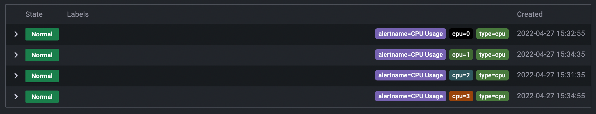
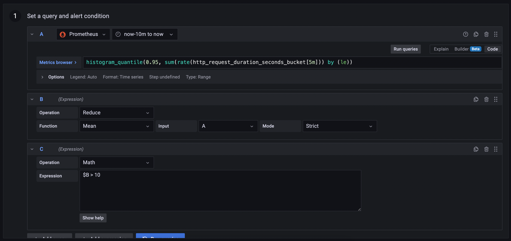
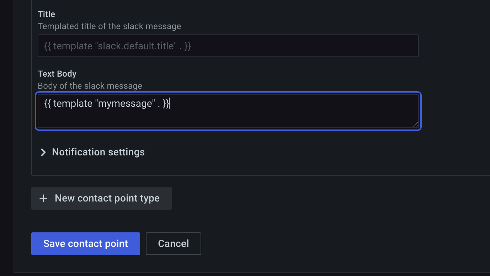
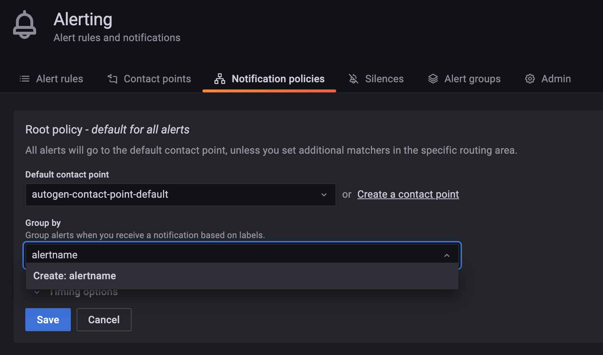

# 报警


**警报规则**

设置评估标准，确定警报实例是否触发。警报规则由一个或多个查询表达式、条件、求值频率以及满足条件的持续时间（可选）组成。

Grafana支持多维警报，这意味着每个警报规则可以创建多个警报实例。如果您在一个表达式中观察多个序列，这是非常强大的。

一旦创建了警报规则，它们将经历各种状态和转换。


**命名空间**

创建 Grafana 管理的规则时，该文件夹可用于访问控制。


**组**

组内的所有规则都以相同的时间间隔进行评估。

组中的警报规则和记录规则将始终按顺序进行评估。


**警报实例**

Grafana 支持多维度警报。每个警报规则可以创建多个警报实例。如果您在单个表达式中观察多个序列，这将非常强大。

请考虑以下 PromQL 表达式：

```plain
sum by(cpu) (
  rate(node_cpu_seconds_total{mode!="idle"}[1m])
)
```

使用此表达式的规则将创建与第一次评估后观察到的 CPU 数量一样多的警报实例，从而允许单个规则报告每个 CPU 的状态。




**标签**

将警报规则及其实例与通知策略和静默相匹配。它们还可以用于按严重程度对警报进行分组。

**通知策略**

设置警报路由的地点、时间和方式。每个通知策略都指定一组标签匹配器，以指示它们负责哪些警报。通知策略有一个分配给它的联络点，该联络点由一个或多个联系人组成。

**联络点**

定义警报触发时如何通知联系人。支持多种ChatOps工具。


**注解**

注释是键值对，提供有关警报的附加元信息。您可以使用以下注释：description、summary、runbook_url、alertId、dashboardUid和panelId。例如，description、summary和runbook URL。这些将显示在规则和警报详细信息的UI上，并且可以在联系人消息模板中使用。

**标签**

标签是键值对，包含有关警报的信息，用于唯一标识警报。警报的标签集将在整个警报评估生成并添加到通知进程中。


在Grafana中，可以像在Prometheus中那样使用模板注释和标签。以前使用过Prometheus的人应该熟悉`$labels`变量，它保存警报实例的标签键/值对，以及`$value`变量，它保持警报实例的评估值。

在Grafana中，即使您的警报不使用Prometheus数据源，也可以使用来自Promethes的相同变量来模板注释和标签。

例如，假设我们想在Grafana中创建一个警报，当我们的一个实例停机超过5分钟时通知我们。就像在普罗米修斯中一样，我们可以添加一个摘要注释来显示已关闭的实例：

```plain
Instance {{ $labels.instance }} has been down for more than 5 minutes
```

对于我们还想知道警报触发时的值，我们可以使用$labels和$value变量添加更多信息摘要：

```plain
{{ $labels.instance }} has a 95th percentile request latency above 1s: {{ $value }})
```

Grafana和Prometheus的一个区别是，Prometheus使用$value来同时保存警报触发时的标签和条件值。例如 下面的 $value 内容：

```plain
[ var='B' labels={instance=http_server} value=10 ]
```

如果警报规则有两个或多个查询，或者使用reduce和数学表达式，则可以使用$values变量对每个查询和表达式的简化结果进行模板化。该变量保存每个简化查询的标签和值，以及任何数学表达式的结果。但是，它不保存每个查询的样本。



如果此规则创建警报实例，$values将保存reduce表达式B和数学表达式C的结果。它将不会保存查询A返回的结果，因为查询A不会返回单个值，而是会随时间返回一系列值。

如果我们要编写摘要注释，例如：

```plain
{{ $labels.instance }} has a 95th percentile request latency above 1s: {{ $value }})
```

我们会发现，由于警报的条件，数学表达式C必须是布尔比较，它必须返回0或1。我们需要的是归约表达式B的第95个百分位：

```plain
{{ $labels.instance }} has a 95th percentile request latency above 1s: {{ $values.B }})
```

我们还可以显示B的标签，但是由于此警报规则只有一个查询，因此B的标签相当于$labels：

```plain
{{ $values.B.Labels.instance }} has a 95th percentile request latency above 1s: {{ $values.B }})
```

No data and execution errors or timeouts

如果查询A未返回任何数据，则缩减表达式B也将不返回任何数据。这意味着｛｛$values.B｝｝将为零。为了确保即使查询没有返回数据，注释和标签仍然可以模板化，我们可以使用if语句检查$values.B：

```plain
{{ if $values.B }}{{ $labels.instance }} has a 95th percentile request latency above 1s: {{ $values.B }}){{ end }}
```

如果规则使用经典条件而不是reduce和数学表达式，则$values包含refID和条件位置的组合。例如，{{ $values.A0 }} and {{ $values.A1 }}。
 展开注释和标签时，以下模板变量可用:

| **Name** | **Description**                                              |
| -------- | ------------------------------------------------------------ |
| $labels  | 查询或条件中的标签。例如，｛｛$labels.instance｝｝和｛｛$labels.job｝｝｝。当规则使用经典条件时，此选项不可用 |
| $values  | 为此警报规则计算的所有reduce表达式和数学表达式的值。例如，｛｛$values.A｝｝、｛｛$values.A.Labels｝和｛｛$values.A.Value｝｝｝，其中A是reduce或数学表达式的refID。如果规则使用经典条件而不是reduce和数学表达式，则$values包含refID和条件位置的组合。 |
| $value   | 警报实例的值字符串。例如: [ var='A' labels={instance=foo} value=10 ]。 |

使用标签和标签匹配器将警报规则链接到通知策略和静默。这允许一种非常灵活的方式来管理警报实例，指定应该处理它们的策略，以及静默哪些警报。

标签匹配器由3个不同的部分组成：标签、值和运算符。

- 标签字段是要匹配的标签的名称。它必须与标签名称完全匹配。
- 值字段与指定标签名称的相应值匹配。它的匹配方式取决于Operator。
- 运算符字段是与标签值匹配的运算符。可用的运算符有：

| **Operator** | **Description** |
| ------------ | --------------- |
| =            | 等于            |
| !=           | 不等于          |
| =~           | 正则匹配        |
| !~           | 正则不匹配      |

如果使用多个标签匹配器，则使用AND逻辑运算符将它们组合起来。这意味着所有匹配器必须匹配才能将规则链接到策略。


有三个关键组件：警报规则状态、警报实例状态和警报规则运行状况。尽管相互关联，但每个组件传递的信息都有细微的不同。

警报规则状态：

| **State**   | **Description**                                |
| ----------- | ---------------------------------------------- |
| **Normal**  | 评估引擎返回的时间序列均未处于待定或触发状态。 |
| **Pending** | 评估引擎返回的至少一个时间序列处于待定状态。   |
| **Firing**  | 评估引擎返回的至少一个时间序列处于firing状态。 |

警报将首先转换为挂起，然后触发，因此在触发警报之前至少需要两个评估周期。

警报实例状态:

| **State**    | **Description**                                  |
| ------------ | ------------------------------------------------ |
| **Normal**   | 警报的状态既不触发也不挂起，一切正常工作。       |
| **Pending**  | 处于活动状态的警报的状态小于配置的阈值持续时间。 |
| **Alerting** | 活动时间超过配置阈值持续时间的警报的状态。       |
| **NoData**   | 在配置的时间窗口内未收到任何数据。               |
| **Error**    | 尝试评估警报规则时发生的错误。                   |

警报规则运行状况:

| **State**  | **Description**                                  |
| ---------- | ------------------------------------------------ |
| **Ok**     | 评估警报规则时没有错误。                         |
| **Error**  | 评估警报规则时出错。                             |
| **NoData** | 在规则评估期间返回的至少一个时间序列中缺少数据。 |

当警报规则的评估产生状态NoData或Error时，Grafana alerting将生成具有以下附加标签的警报实例：

| **Label**          | **Description**                                              |
| ------------------ | ------------------------------------------------------------ |
| **alertname**      | Either DatasourceNoData or DatasourceError depending on the state. |
| **datasource_uid** | The UID of the data source that caused the state.            |

## 配置联系人

通过联系点发送的通知是使用消息模板生成的。Grafana的默认模板基于Go模板系统，其中一些字段被计算为文本，而另一些字段被评估为HTML（这可能会影响转义）。默认模板，在default_template.go中定义，可以参考其写法：

```plain
{{ define "__subject" }}[{{ .Status | toUpper }}{{ if eq .Status "firing" }}:{{ .Alerts.Firing | len }}{{ if gt (.Alerts.Resolved | len) 0 }}, RESOLVED:{{ .Alerts.Resolved | len }}{{ end }}{{ end }}] {{ .GroupLabels.SortedPairs.Values | join " " }} {{ if gt (len .CommonLabels) (len .GroupLabels) }}({{ with .CommonLabels.Remove .GroupLabels.Names }}{{ .Values | join " " }}{{ end }}){{ end }}{{ end }}
{{ define "__text_values_list" }}{{ $len := len .Values }}{{ if $len }}{{ $first := gt $len 1 }}{{ range $refID, $value := .Values -}}
{{ $refID }}={{ $value }}{{ if $first }}, {{ end }}{{ $first = false }}{{ end -}}
{{ else }}[no value]{{ end }}{{ end }}
{{ define "__text_alert_list" }}{{ range . }}
Value: {{ template "__text_values_list" . }}
Labels:
{{ range .Labels.SortedPairs }} - {{ .Name }} = {{ .Value }}
{{ end }}Annotations:
{{ range .Annotations.SortedPairs }} - {{ .Name }} = {{ .Value }}
{{ end }}{{ if gt (len .GeneratorURL) 0 }}Source: {{ .GeneratorURL }}
{{ end }}{{ if gt (len .SilenceURL) 0 }}Silence: {{ .SilenceURL }}
{{ end }}{{ if gt (len .DashboardURL) 0 }}Dashboard: {{ .DashboardURL }}
{{ end }}{{ if gt (len .PanelURL) 0 }}Panel: {{ .PanelURL }}
{{ end }}{{ end }}{{ end }}
{{ define "default.title" }}{{ template "__subject" . }}{{ end }}
{{ define "default.message" }}{{ if gt (len .Alerts.Firing) 0 }}**Firing**
{{ template "__text_alert_list" .Alerts.Firing }}{{ if gt (len .Alerts.Resolved) 0 }}
{{ end }}{{ end }}{{ if gt (len .Alerts.Resolved) 0 }}**Resolved**
{{ template "__text_alert_list" .Alerts.Resolved }}{{ end }}{{ end }}
{{ define "__teams_text_alert_list" }}{{ range . }}
Value: {{ template "__text_values_list" . }}
Labels:
{{ range .Labels.SortedPairs }} - {{ .Name }} = {{ .Value }}
{{ end }}
Annotations:
{{ range .Annotations.SortedPairs }} - {{ .Name }} = {{ .Value }}
{{ end }}
{{ if gt (len .GeneratorURL) 0 }}Source: [{{ .GeneratorURL }}]({{ .GeneratorURL }})
{{ end }}{{ if gt (len .SilenceURL) 0 }}Silence: [{{ .SilenceURL }}]({{ .SilenceURL }})
{{ end }}{{ if gt (len .DashboardURL) 0 }}Dashboard: [{{ .DashboardURL }}]({{ .DashboardURL }})
{{ end }}{{ if gt (len .PanelURL) 0 }}Panel: [{{ .PanelURL }}]({{ .PanelURL }})
{{ end }}
{{ end }}{{ end }}
{{ define "teams.default.message" }}{{ if gt (len .Alerts.Firing) 0 }}**Firing**
{{ template "__teams_text_alert_list" .Alerts.Firing }}{{ if gt (len .Alerts.Resolved) 0 }}
{{ end }}{{ end }}{{ if gt (len .Alerts.Resolved) 0 }}**Resolved**
{{ template "__teams_text_alert_list" .Alerts.Resolved }}{{ end }}{{ end }}
```

以下示例演示如何使用默认模板在Slack中呈现警报消息。消息标题包含正在触发或已解决的警报计数。消息正文列出了警报及其状态:


下面的示例显示了如何使用自定义模板：



模板嵌套

您可以在其他模板中嵌入模板。例如，您可以使用define关键字定义模板片段：

```plain
{{ define "mytemplate" }}
  {{ len .Alerts.Firing }} firing. {{ len .Alerts.Resolved }} resolved.
{{ end }}
```

然后，可以使用template关键字将自定义模板嵌入此片段中。例如：

```plain
Alert summary:
{{ template "mytemplate" . }}
```

您可以使用以下任何内置模板选项嵌入自定义模板:

| default.title         | 显示高级状态信息。                                |
| --------------------- | ------------------------------------------------- |
| default.message       | 提供触发和已解决警报的格式化摘要。                |
| teams.default.message | 类似于default.messsage。为Microsoft Teams格式化。 |

通知策略决定如何将警报路由到联系点。策略具有树结构，其中每个策略可以有一个或多个子策略。除根策略外，每个策略还可以匹配特定的警报标签。每个警报由根策略评估，然后由每个子策略评估。如果为特定策略启用了“继续匹配后续同级节点”选项，则即使在一个或多个匹配之后，评估也会继续。当没有任何子策略匹配时，命中根策略。



分组是Grafana Alerting的一个新的关键概念，它将类似性质的警报通知分类为单个漏斗。这样，当系统的许多部分同时发生故障，导致大量警报同时触发时，您可以在较大的停机期间正确地路由警报通知。

例如，假设您有100个服务连接到不同环境中的数据库。这些服务通过标签env=environmentname进行区分。有一个警报规则，用于监视您的服务是否可以访问名为alertname=DatabaseUnreach的数据库。

当出现网络分区时，一半的服务将无法再访问数据库。结果，会触发50个不同的警报（假设您的服务有一半）。对于这种情况，您希望收到一个带有受影响环境列表的单页通知（而不是50页）。

您可以将分组配置为group_by:[alertname]（请注意，省略了env标签）。有了这个配置，Grafana会发送一个紧凑的通知，其中包含此警报规则的所有受影响环境。

Grafana还有一个名为`…`的特殊标签，您可以使用它按所有标签对所有警报进行分组（有效地禁用分组），因此每个警报都将进入自己的组。它不同于默认的group_by:null，其中所有警报都进入一个组。


静音定时是警告重复发送的时间间隔。使用它们可以防止警报在特定的重复周期内触发。

与静音类似，静音计时不会阻止评估警报规则，也不会阻止警报实例在用户界面中显示。它们仅阻止创建通知。


使用静音停止来自一个或多个警报规则的通知。静默不会阻止评估警报规则。它们也不会停止警告实例在用户界面中显示。静音仅阻止创建通知。沉默只持续一段特定的时间。

- 
