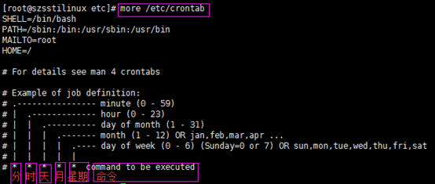

# 查看linux系统信息

## 查看内核信息

```shell
zzq@Zhao:~$ uname -a
Linux Zhao 5.10.16.3-microsoft-standard-WSL2 #1 SMP Fri Apr 2 22:23:49 UTC 2021 x86_64 x86_64 x86_64 GNU/Linux

zzq@Zhao:~$ cat /proc/version
Linux version 5.10.16.3-microsoft-standard-WSL2 (oe-user@oe-host) (x86_64-msft-linux-gcc (GCC) 9.3.0, GNU ld (GNU Binutils) 2.34.0.20200220) #1 SMP Fri Apr 2 22:23:49 UTC 2021
```

## 查看系统的发行版本

```shell
zzq@Zhao:~$  ls /etc/*release
/etc/lsb-release  /etc/os-release

zzq@Zhao:~$ cat /etc/os-release
NAME="Ubuntu"
VERSION="20.04.4 LTS (Focal Fossa)"
ID=ubuntu
ID_LIKE=debian
PRETTY_NAME="Ubuntu 20.04.4 LTS"
VERSION_ID="20.04"
HOME_URL="https://www.ubuntu.com/"
SUPPORT_URL="https://help.ubuntu.com/"
BUG_REPORT_URL="https://bugs.launchpad.net/ubuntu/"
PRIVACY_POLICY_URL="https://www.ubuntu.com/legal/terms-and-policies/privacy-policy"
VERSION_CODENAME=focal
UBUNTU_CODENAME=focal
```


# 常见目录

FHS（Filesystem Hierarchy Standard），文件系统层次化标准，该标准规定了 Linux 系统中所有一级目录以及部分二级目录（/usr 和 /var）的用途。发布此标准的主要目的就是为了让用户清楚地了解每个目录应该存放什么类型的文件。

| 一级目录 | 功能（作用）                                                 |
| -------- | ------------------------------------------------------------ |
| /bin/    | 存放系统命令，普通用户和 root 都可以执行。放在 /bin 下的命令在单用户模式下也可以执行 |
| /boot/   | 系统启动目录，保存与系统启动相关的文件，如内核文件和启动引导程序（grub）文件等 |
| /dev/    | 设备文件保存位置                                             |
| /etc/    | 配置文件保存位置。系统内所有采用默认安装方式（rpm 安装）的服务配置文件全部保存在此目录中，如用户信息、服务的启动脚本、常用服务的配置文件等 |
| /home/   | 普通用户的主目录（也称为家目录）。在创建用户时，每个用户要有一个默认登录和保存自己数据的位置，就是用户的主目录，所有普通用户的主目录是在 /home/ 下建立一个和用户名相同的目录。如用户 liming 的主目录就是 /home/liming |
| /lib/    | 系统调用的函数库保存位置                                     |
| /media/  | 挂载非移动设备的目录。系统建议用来挂载媒体设备，如软盘和光盘 |
| /mnt/    | 挂载移动设备的目录。早期 Linux 中只有这一个挂载目录，并没有细分。系统建议这个目录用来挂载额外的设备，如 U 盘、移动硬盘和其他操作系统的分区 |
| /misc/   | 挂载目录。系统建议用来挂载 NFS 服务的共享目录。虽然系统准备了三个默认挂载目录 /media/、/mnt/、/misc/，但是到底在哪个目录中挂载什么设备可以由管理员自己决定。例如，笔者在接触 Linux 的时候，默认挂载目录只有 /mnt/，所以养成了在 /mnt/ 下建立不同目录挂载不同设备的习惯，如 /mnt/cdrom/ 挂载光盘、/mnt/usb/ 挂载 U 盘，都是可以的 |
| /opt/    | 第三方安装的软件保存位置。这个目录是放置和安装其他软件的位置，手工安装的源码包软件都可以安装到这个目录中。不过笔者还是习惯把软件放到 /usr/local/ 目录中，也就是说，/usr/local/ 目录也可以用来安装软件 |
| /root/   | root 的主目录。普通用户主目录在 /home/ 下，root 主目录直接在“/”下 |
| /sbin/   | 保存与系统环境设置相关的命令，只有 root 可以使用这些命令进行系统环境设置，但也有些命令可以允许普通用户查看 |
| /srv/    | 服务数据目录。一些系统服务启动之后，可以在这个目录中保存所需要的数据 |
| /tmp/    | 临时目录。系统存放临时文件的目录，在该目录下，所有用户都可以访问和写入。建议此目录中不能保存重要数据，最好每次开机都把该目录清空 |

FHS 针对根目录中包含的子目录仅限于表 1，但除此之外，Linux 系统根目录下通常还包含表 2 中的几个一级目录。

| 一级目录     | 功能（作用）                                                 |
| ------------ | ------------------------------------------------------------ |
| /lost+found/ | 当系统意外崩溃或意外关机时，产生的一些文件碎片会存放在这里。在系统启动的过程中，fsck 工具会检查这里，并修复已经损坏的文件系统。这个目录只在每个分区中出现，例如，/lost+found 就是根分区的备份恢复目录，/boot/lost+found 就是 /boot 分区的备份恢复目录 |
| /proc/       | 虚拟文件系统。该目录中的数据并不保存在硬盘上，而是保存到内存中。主要保存系统的内核、进程、外部设备状态和网络状态等。如 /proc/cpuinfo 是保存 CPU 信息的，/proc/devices 是保存设备驱动的列表的，/proc/filesystems 是保存文件系统列表的，/proc/net 是保存网络协议信息的...... |
| /sys/        | 虚拟文件系统。和 /proc/ 目录相似，该目录中的数据都保存在内存中，主要保存与内核相关的信息 |

usr（注意不是 user），全称为 Unix Software Resource，此目录用于存储系统软件资源。FHS 建议所有开发者，应把软件产品的数据合理的放置在 /usr 目录下的各子目录中，而不是为他们的产品创建单独的目录。

| 子目录       | 功能（作用）                                                 |
| ------------ | ------------------------------------------------------------ |
| /usr/bin/    | 存放系统命令，普通用户和超级用户都可以执行。这些命令和系统启动无关，在单用户模式下不能执行 |
| /usr/sbin/   | 存放根文件系统不必要的系统管理命令，如多数服务程序，只有 root 可以使用。 |
| /usr/lib/    | 应用程序调用的函数库保存位置                                 |
| /usr/XllR6/  | 图形界面系统保存位置                                         |
| /usr/local/  | 手工安装的软件保存位置。我们一般建议源码包软件安装在这个位置 |
| /usr/share/  | 应用程序的资源文件保存位置，如帮助文档、说明文档和字体目录   |
| /usr/src/    | 源码包保存位置。我们手工下载的源码包和内核源码包都可以保存到这里。不过笔者更习惯把手工下载的源码包保存到 /usr/local/src/ 目录中，把内核源码保存到 /usr/src/linux/ 目录中 |
| /usr/include | C/[C++](http://c.biancheng.net/cplus/) 等编程语言头文件的放置目录 |

/var 目录用于存储动态数据，例如缓存、日志文件、软件运行过程中产生的文件等。通常，此目录下建议包含如表 4 所示的这些子目录。

| /var子目录        | 功能（作用）                                                 |
| ----------------- | ------------------------------------------------------------ |
| /var/lib/         | 程序运行中需要调用或改变的数据保存位置。如 [MySQL](http://c.biancheng.net/mysql/) 的数据库保存在 /var/lib/mysql/ 目录中 |
| /var/log/         | 登陆文件放置的目录，其中所包含比较重要的文件如 /var/log/messages, /var/log/wtmp 等。 |
| /var/run/         | 一些服务和程序运行后，它们的 PID（进程 ID）保存位置          |
| /var/spool/       | 里面主要都是一些临时存放，随时会被用户所调用的数据，例如 /var/spool/mail/ 存放新收到的邮件，/var/spool/cron/ 存放系统定时任务。 |
| /var/www/         | RPM 包安装的 Apache 的网页主目录                             |
| /var/nis和/var/yp | NIS 服务机制所使用的目录，nis 主要记录所有网络中每一个 client 的连接信息；yp 是 linux 的 nis 服务的日志文件存放的目录 |
| /var/tmp          | 一些应用程序在安装或执行时，需要在重启后使用的某些文件，此目录能将该类文件暂时存放起来，完成后再行删除 |

根据以上各表列举的各目录及作用，如果我们要做一些实验和练习，需要创建一些临时文件，应该保存在哪里呢？  

答案是用户的主目录或 /tmp/ 临时目录。但是要小心有些目录中不能直接修改和保存数据，比如 /proc/fn/sys/ 目录，因为它们是保存在内存中的，如果在这里写入数据，那么你的内存会越来越小，直至死机；/boot/ 目录也不能保存额外数据，因为 /boot/ 目录会单独分区作为启动分区，如果没有空闲空间，则会导致系统不能正常启动。

# 挂载

Linux 系统中“一切皆文件”，所有文件都放置在以根目录为树根的树形目录结构中。在 Linux 看来，任何硬件设备也都是文件，它们各有自己的一套文件系统（文件目录结构）。  

因此产生的问题是，当在 Linux 系统中使用这些硬件设备时，只有将Linux本身的文件目录与硬件设备的文件目录合二为一，硬件设备才能为我们所用。合二为一的过程称为“挂载”。  

**挂载，指的就是将设备文件中的顶级目录连接到 Linux 根目录下的某一目录（最好是空目录），访问此目录就等同于访问设备文件。**

**纠正一个误区，并不是根目录下任何一个目录都可以作为挂载点，由于挂载操作会使得原有目录中文件被隐藏，因此根目录以及系统原有目录都不要作为挂载点，会造成系统异常甚至崩溃，挂载点最好是新建的空目录。**

举个例子，我们想通过命令行访问某个 U 盘中的数据，图 1 所示为 U 盘文件目录结构和 Linux 系统中的文件目录结构。


图 1 中可以看到，目前 U 盘和 Linux 系统文件分属两个文件系统，还无法使用命令行找到 U 盘文件，需要将两个文件系统进行挂载。  

接下来，我们在根目录下新建一个目录 /sdb-u，通过挂载命令将 U 盘文件系统挂载到此目录，挂载效果如图 2 所示。


可以看到，U 盘文件系统已经成为 Linux 文件系统目录的一部分，此时访问 /sdb-u/ 就等同于访问 U 盘。

前面讲过，根目录下的 /dev/ 目录文件负责所有的硬件设备文件，事实上，当 U 盘插入 Linux 后，系统也确实会给 U 盘分配一个目录文件（比如 sdb1），就位于 /dev/ 目录下（/dev/sdb1），但无法通过 /dev/sdb1/ 直接访问 U 盘数据，访问此目录只会提供给你此设备的一些基本信息（比如容量）。

| 硬件设备      | 文件名称                                                     |
| ------------- | ------------------------------------------------------------ |
| IDE设备       | /dev/hd[a-d]，现在的 IDE设备已经很少见了，因此 一般的硬盘设备会以 /dev/sd 开头。 |
| SCSI/SATA/U盘 | /dev/sd[a-p]，一台主机可以有多块硬盘，因此系统 采用 a~p 代表 16 块不同的硬盘。 |
| 软驱          | /dev/fd[0-1]                                                 |
| 打印机        | /dev/lp[0-15]                                                |
| 光驱          | /dev/cdrom                                                   |
| 鼠标          | /dev/mouse                                                   |
| 磁带机        | /dev/st0 或 /dev/ht0                                         |

# 定时任务

## crontab服务管理

- 查看服务是否安装：`rpm -qa| grep 'crontab' `
- 服务是否启动：service crond status
- 启动： service crond start
- 关闭： service crond stop
- 开机自启： service crond enable

## 定时任务编写

- 编写 crontab -e
- 查询当前用户定时任务 crontab -l
- 删除当前用户定时任务 crontab -r

## cron的全局配置文件

crontab在/etc目录下面存在cron.hourly,cron.daily,cron.weekly,cron.monthly,cron.d五个目录和crontab,cron.deny两个文件。

- **cron.daily**是每天执行一次的job
- **cron.weekly**是每个星期执行一次的job
- **cron.monthly**是每月执行一次的job
- **cron.hourly**是每个小时执行一次的job
- **cron.d**是系统自动定期需要做的任务

- **crontab**是设定定时任务的可执行文件
- **cron.deny**文件就是用于控制不让哪些用户使用Crontab的功能

## cron用户配置文件

- 每个用户都有自己的cron配置文件,通过crontab -e 就可以编辑。
- 一般情况下我们编辑好用户的cron配置文件保存退出后,系统会自动就存放于/var/spool/cron/目录中,文件以用户名命名.
- linux的cron服务是每隔一分钟去读取一次/var/spool/cron,/etc/cron.d下面所有的内容.

## crontab文件格式



- **minute：** 表示分钟，可以是从0到59之间的任何整数。
- **hour：**表示小时，可以是从0到23之间的任何整数。
- **day：**表示日期，可以是从1到31之间的任何整数。
- **month：**表示月份，可以是从1到12之间的任何整数。
- **week：**表示星期几，可以是从0到7之间的任何整数，这里的0或7代表星期日。
- **command**：要执行的命令，可以是系统命令，也可以是自己编写的脚本文件。


1. 星号（*）：代表每的意思，例如month字段如果是星号，则表示每月都执行该命令操作。
2. 逗号（,）：表示分隔时段的意思，例如，“1,3,5,7,9”。 
3. 中杠（-）：表示一个时间范围，例如“2-6”表示“2,3,4,5,6”。 
4. 正斜线（/）：可以用正斜线指定时间的间隔频率，例如“0-23/2”表示每两小时执行一次。同时正斜线可以和星号一起使用，例如*/10，如果用在minute字段，表示每十分钟执行一次。

## **定时任务书写要领**

**要领1：**定时任务要加注释

**要领2：**定时任务命令或脚本结尾加 &>/dev/null 或 >/dev/null 2>&1 或 1>/dev/null 2>/dev/null

**要领3：**定时任务执行shell脚本前加/bin/sh，定时任务执行shell脚本不必添加执行权限

**要领4：**定时任务命令或程序尽量写到脚本里，定时任务只要执行脚本即可

​     注意操作步骤：

　　（1）、命令行执行

　　（2）、编写脚本

　　（3）、测试脚本

　　（4）、设置定时任务

**要领5：**生产任务程序不要随意打印输出信息

**要领6：**定时任务执行的脚本要规范路径 (例如 /server/script)

**要领7：**配置定时任务要规范操作过程

**要领8：**定时任务执行特殊的字符需要进行转义，否则会报错，例如 百分号% 转义 \%

**要领9：**定时任务脚本中如果涉及使用到环境变量，必须在脚本中重新定义，不然，定时任务识别不了

