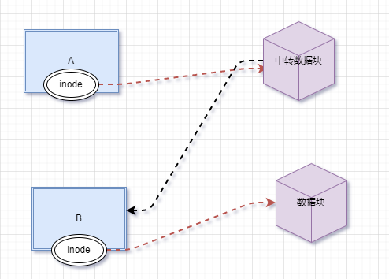
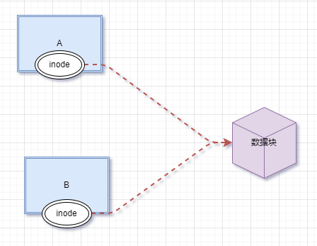

# 软连接

## ext4 文件系统

如果要想说清楚 ln 命令，则必须先解释下 ext 文件系统（Linux 文件系统）是如何工作的。而我们的 Linux 目前使用的是 ext4 文件系统。如果用一张示意图来描述 ext4 文件系统：


ext4 文件系统会把分区主要分为两大部分（暂时不提超级块）：小部分用于保存文件的 inode (i 节点）信息；剩余的大部分用于保存 block 信息。  

inode 的默认大小为 128 Byte，用来记录文件的权限（r、w、x）、文件的所有者和属组、文件的大小、文件的状态改变时间（ctime）、文件的最近一次读取时间（atime）、文件的最近一次修改时间（mtime）、真正保存文件数据的 block 编号。每个文件需要占用一个 inode。大家如果仔细查看，就会发现 inode 中是不记录文件名的，那是因为文件名记录在文件所在目录的 block 中。  

block 的大小可以是 1KB、2KB、4KB，默认为 4KB。block 用于实际的数据存储，如果一个 block 放不下数据，则可以占用多个 block。例如，有一个 10KB 的文件需要存储，则会占用 3 个 block，虽然最后一个 block 不能占满，但也不能再放入其他文件的数据。这 3 个 block 有可能是连续的，也有可能是分散的。  

由此，我们可以知道以下 2 个重要的信息：

1. 每个文件都独自占用一个 inode，文件内容由 inode 的记录来指向；

1. 如果想要读取文件内容，就必须借助目录中记录的文件名找到该文件的 inode，才能成功找到文件内容所在的 block 块；

了解了 Linux 系统底层文件的存储状态后，接下来学习 ln 命令。


## ln 命令

ln 命令用于给文件创建链接，根据 Linux 系统存储文件的特点，链接的方式分为以下 2 种：

- 软链接：A是B的软链接（A和B都是文件名），A的目录项中的inode节点号与B的目录项中的inode节点号不相同，A和B指向的是两个不同的inode，继而指向两块不同的数据块。但是A的数据块中存放的只是B的路径名（可以根据这个找到B的目录项）。A和B之间是“主从”关系，如果B被删除了，A仍然存在（因为两个是不同的文件），但指向的是一个无效的链接。



- 硬链接：A是B的硬链接（A和B都是文件名），则A的目录项中的inode节点号与B的目录项中的inode节点号相同，即一个inode节点对应两个不同的文件名，两个文件名指向同一个文件，A和B对文件系统来说是完全平等的。如果删除了其中一个，对另外一个没有影响。每增加一个文件名，inode节点上的链接数增加一，每删除一个对应的文件名，inode节点上的链接数减一，直到为0，inode节点和对应的数据块被回收。注：文件和文件名是不同的东西，rm A删除的只是A这个文件名，而A对应的数据块（文件）只有在inode节点链接数减少为0的时候才会被系统回收。




**主要区别、限制：**

**硬链接：**

a：不能对目录创建硬链接，原因有几种，最重要的是：文件系统不能存在链接环（目录创建时的".."除外，这个系统可以识别出来）,存在环的后果会导致例如文件遍历等操作的混乱(du，pwd等命令的运作原理就是基于文件硬链接，顺便一提，ls -l结果的第二列也是文件的硬链接数，即inode节点的链接数)

b：不能对不同的文件系统创建硬链接,即两个文件名要在相同的文件系统下。

c：不能对不存在的文件创建硬链接，由原理即可知原因。

**软链接：**

a：可以对目录创建软链接，遍历操作会忽略目录的软链接。

b：可以跨文件系统

c：可以对不存在的文件创建软链接，因为放的只是一个字符串，至于这个字符串是不是对于一个实际的文件，就是另外一回事了


ln 命令的基本格式如下：

```
[root@localhost ~]# ln [选项] 源文件 目标文件
```

选项：  

- -s：建立软链接文件。如果不加 "-s" 选项，则建立硬链接文件；

- -f：强制。如果目标文件已经存在，则删除目标文件后再建立链接文件；

【例 1】创建硬链接：

```
[root@localhost ~]# touch cangls
[root@localhost ~]# ln /root/cangls /tmp
#建立硬链接文件，目标文件没有写文件名，会和原名一致
#也就是/tmp/cangls 是硬链接文件
```

【例 2】创建软链接：

```
[root@localhost ~]# touch bols
[root@localhost ~]# In -s /root/bols /tmp
```

这里需要注意的是，软链接文件的源文件必须写成绝对路径，而不能写成相对路径（硬链接没有这样的要求）；否则软链接文件会报错。


# 文件操作

## ls命令

> ls 默认会以文件名排序.

显示隐藏的目录：

```shell
zzq@Zhao:~/test$ ls
aa.sh
zzq@Zhao:~/test$ ls -a #显示所有的隐藏文件
.  ..  .aa  aa.sh
zzq@Zhao:~/test$ ls -A #只显示有效的隐藏文件
.aa  aa.sh
```

> 点号开头的文件时隐藏文件

可读的形式显示目录信息：

```shell
zzq@Zhao:/$ ls -hl
total 1.5M
lrwxrwxrwx   1 root root    7 Mar 25  2022 bin -> usr/bin
drwxr-xr-x   2 root root 4.0K Mar 25  2022 boot
drwxr-xr-x   8 root root 2.9K Dec  1 11:04 dev
drwxr-xr-x  98 root root 4.0K Dec  1 11:10 etc
```

在 Linux 中第一个字符代表这个文件是目录、文件或链接文件等等。

- 当为 **d** 则是目录
- 当为 **-** 则是文件；
- 若是 **l** 则表示为链接文档(link file)；
- 若是 **b** 则表示为装置文件里面的可供储存的接口设备(可随机存取装置)；
- 若是 **c** 则表示为装置文件里面的串行端口设备，例如键盘、鼠标(一次性读取装置)。


显示 inode 节点信息：

```shell
zzq@Zhao:/$ ls -i
             12 bin              1609 lib                   24578 mnt             49153 snap
           8193 boot             1610 lib32
```

连同子目录内容一起列出来:

```shell
zzq@Zhao:~$ ls -R
.:
 aa.txt                jb-linux-arm64:Zone.Identifier
 
./loki-mixin:
alerts.libsonnet  dashboards            jsonnetfile.json 

./loki-mixin/dashboards:
dashboard-loki-logs.json         loki-deletion.libsonnet         

./test:
aa.sh
```

按照文件大小排序：

```shell
zzq@Zhao:~$ ls -Slh
total 40M
-rwxrwxrwx 1 zzq  zzq   33M May 30  2022  otelcol-contrib.rpm
-rwxrwxrwx 1 root root 7.1M May 14  2022  jb-linux-arm64
-rw-r--r-- 1 zzq  zzq   32K Aug  7 11:39 'g | grep -i memory'
-rw-r--r-- 1 zzq  zzq  5.2K May 30  2022  filename.txt
drwxr-xr-x 3 root root 4.0K May 14  2022  loki-mixin
drwxr-xr-x 2 zzq  zzq  4.0K Dec  1 12:32  test
```

按照时间排序：

```shell
zzq@Zhao:~$ ls -tlh
total 40M
drwxr-xr-x 2 zzq  zzq  4.0K Dec  1 12:32  test
-rw-r--r-- 1 zzq  zzq   32K Aug  7 11:39 'g | grep -i memory'
-rw-r--r-- 1 zzq  zzq   953 Jun 12 22:22  conf
-rw-r--r-- 1 zzq  zzq  5.2K May 30  2022  filename.txt
```

逆序显示：

```shell
zzq@Zhao:~$ ls -tlh
total 40M
drwxr-xr-x 2 zzq  zzq  4.0K Dec  1 12:32  test
-rw-r--r-- 1 zzq  zzq   32K Aug  7 11:39 'g | grep -i memory'
-rw-r--r-- 1 zzq  zzq   953 Jun 12 22:22  conf
-rw-r--r-- 1 zzq  zzq  5.2K May 30  2022  filename.txt
```

显示完整时间：

```shell
zzq@Zhao:~$ ls -tlhr --full-time
total 40M
-rw-r--r-- 1 root root  663 2022-05-14 20:09:16.399359400 +0800  jb-linux-arm64:Zone.Identifier
-rwxrwxrwx 1 root root 7.1M 2022-05-14 20:09:16.399359400 +0800  jb-linux-arm64
drwxr-xr-x 3 root root 4.0K 2022-05-14 20:29:55.376519700 +0800  loki-mixin
-rwxrwxrwx 1 zzq  zzq    22 2022-05-30 10:31:26.410485200 +0800  test.sh
```

## cp命令

cp 命令，主要用来复制文件和目录，同时借助某些选项，还可以实现复制整个目录，以及比对两文件的新旧而予以升级等功能。

选项：

- -a：相当于 -d、-p、-r 选项的集合，这几个选项我们一一介绍；

- -d：如果源文件为软链接（对硬链接无效），则复制出的目标文件也为软链接；

- -i：询问，如果目标文件已经存在，则会询问是否覆盖；

- -l：把目标文件建立为源文件的硬链接文件，而不是复制源文件；

- -s：把目标文件建立为源文件的软链接文件，而不是复制源文件；

- -p：复制后目标文件保留源文件的属性（包括所有者、所属组、权限和时间）；

- -r：递归复制，用于复制目录；

- -u：若目标文件比源文件有差异，则使用该选项可以更新目标文件，此选项可用于对文件的升级和备用。

```shell
[root@localhost ~]# ln -s /root/cangls /tmp/cangls_slink
#建立一个测试软链接文件/tmp/cangls_slink
[root@localhost ~]# ll /tmp/cangls_slink
lrwxrwxrwx 1 root root 12 6 月 14 05:53 /tmp/cangls_slink -> /root/cangls
#源文件本身就是一个软链接文件
[root@localhost ~]# cp /tmp/cangls_slink /tmp/cangls_t1
#复制软链接文件，但是不加"-d"选项
[root@localhost ~]# cp -d /tmp/cangls_slink /tmp/cangls_t2
#复制软链接文件，加入"-d"选项
[root@localhost ~]# ll /tmp/cangls_t1 /tmp/cangls_t2
-rw-r--r-- 1 root root 0 6月 14 05:56 /tmp/cangls_t1
#会发现不加"-d"选项，实际复制的是软链接的源文件，而不是软链接文件
lrwxrwxrwx 1 root root 12 6 月 14 05:56/tmp/ cangls_t2-> /root/

```

## mv命令

mv 命令（move 的缩写），既可以在不同的目录之间移动文件或目录，也可以对文件和目录进行重命名。

选项：  

- -f：强制覆盖，如果目标文件已经存在，则不询问，直接强制覆盖；

- -i：交互移动，如果目标文件已经存在，则询问用户是否覆盖（默认选项）；

- -n：如果目标文件已经存在，则不会覆盖移动，而且不询问用户；

- -v：显示文件或目录的移动过程；

- -u：若目标文件已经存在，但两者相比，源文件更新，则会对目标文件进行升级；

```shell
[root@localhost ~]# touch test1.txt test2.txt test3.txt
#建立三个测试文件
[root@localhost ~]# mv -v *.txt /tmp
"test1.txt" -> "/tmp/test1.txt"
"test2.txt" -> "/tmp/test2.txt"
"test3.txt" -> "/tmp/test3.txt"
#加入"-v"选项，可以看到有哪些文件进行了移动
```

# 压缩文件处理

## tar命令

Linux 系统中，最常用的归档（打包,注意不是压缩）命令就是 tar，该命令可以将许多文件一起保存到一个单独的磁带或磁盘中进行归档。不仅如此，该命令还可以从归档文件中还原所需文件，也就是打包的反过程，称为解打包。

### 打包

打包常用选项：

- -c ： 将多个文件或目录进行打包。

- -A : 追加 tar 文件到归档文件。

- -f 包名：指定包的文件名。包的扩展名是用来给管理员识别格式的，所以一定要正确指定扩展名；

- -v： 显示打包文件的过程

【例 1】打包文件和目录：

```shell
#把anacondehks.cfg打包为 anacondehks.cfg.tar文件
tar -cvf ana.tar anaconda-ks.cfg /tmp/
```

【例 2】打包并压缩目录:

首先声明一点，压缩命令不能直接压缩目录，必须先用 tar 命令将目录打包，然后才能用 gzip 命令或 bzip2 命令对打包文件进行压缩。例如：

```shell
[root@localhost ~]ll -d test test.tar
drwxr-xr-x 2 root root 4096 6月 17 21:09 test
-rw-r--r-- 1 root root 10240 6月 18 01:06 test.tar
#我们之前已经把test目录打包成test.tar文件
[root@localhost ~] gzip test.tar
[root@localhost ~] ll test.tar.gz
-rw-r--r-- 1 root root 176 6月 18 01:06 test.tar.gz
#gzip命令会把test.tar压缩成test.tar.gz
```

### 解包

解包常用选项：

- -x： 对 tar 包做解打包操作

- -f： 指定要解压的 tar 包的包名。

- -t：只查看 tar 包中有哪些文件或目录，不对 tar 包做解打包操作。

- -C 目录： 指定解打包位置。

- -v：显示解打包的具体过程。

【例2】解包

```shell
tar -xvf test.tar -C /tmp
```

【例3】查看包的内容

```shell
[root@localhost ~]# tar -tvf test.tar
drwxr-xr-x root/root 0 2016-06-17 21:09 test/
-rw-r-r- root/root 0 2016-06-17 17:51 test/test3
-rw-r-r- root/root 0 2016-06-17 17:51 test/test2
-rw-r-r- root/root 0 2016-06-17 17:51 test/test1
```

tar 命令是可以同时打包并压缩的，此处常用的选项有以下 2 个，分别是：  

- -z：压缩和解压缩 ".tar.gz" 格式；

- -j：压缩和解压缩 ".tar.bz2"格式。

【例 1】压缩与解压缩 ".tar.gz"格式：

```shell
[root@localhost ~]# tar -zcvf tmp.tar.gz /tmp/
#把/temp/目录直接打包压缩为".tar.gz"格式，通过"-z"来识别格式，"-cvf"和打包选项一致

[root@localhost ~]# tar -zxvf tmp.tar.gz
#解压缩与解打包".tar.gz"格式
```

【例 2】压缩与解压缩 ".tar.bz2" 格式:

```shell
[root@localhost ~]# tar -jcvf tmp.tar.bz2 /tmp/
#打包压缩为".tar.bz2"格式，注意压缩包文件名
[root@localhost ~]# tar -jxvf tmp.tar.bz2
#解压缩与解打包".tar.bz2"格式
```

## zip命令

压缩常用选项：

- -r：递归压缩目录，及将指定目录下的所有文件以及子目录全部压缩。

- -m：将文件压缩之后，删除原始文件，相当于把文件移到压缩文件中。

- -v：显示详细的压缩过程信息。

- -q：在压缩的时候不显示命令的执行过程。

- -压缩级别：压缩级别是从 1~9 的数字，-1 代表压缩速度更快，-9 代表压缩效果更好。

- -u：更新压缩文件，即往压缩文件中添加新文件。

【例 1】zip 命令的基本使用：

```shell
[root@localhost ~]# zip ana.zip anaconda-ks.cfg
adding: anaconda-ks.cfg (deflated 37%)
#压缩
[root@localhost ~]# ll ana.zip
-rw-r--r-- 1 root root 935 6月 1716:00 ana.zip
#压缩文件生成
```

【例 2】使用 zip 命令压缩目录，需要使用“-r”选项

```shell
[root@localhost ~]# mkdir dir1
#建立测试目录
[root@localhost ~]# zip -r dir1.zip dir1
adding: dir1/(stored 0%)
#压缩目录
[root@localhost ~]# ls -dl dir1.zip
-rw-r--r-- 1 root root 160 6月 1716:22 dir1.zip
#压缩文件生成
```

## unzip命令

解压缩常用：

- -d 目录名：将压缩文件解压到指定目录下。

- -n：解压时并不覆盖已经存在的文件。

- -o：解压时覆盖已经存在的文件，并且无需用户确认。

- -v：查看压缩文件的详细信息，包括压缩文件中包含的文件大小、文件名以及压缩比等，但并不做解压操作。

- -t：测试压缩文件有无损坏，但并不解压。

- -x 文件列表：解压文件，但不包含文件列表中指定的文件。

【例 1】直接解压缩：

```shell
[root@localhost ~]# unzip dir1.zip
Archive: dir1.zip
creating: dirl/
#解压缩
```

【例 2】使用 -d 选项手动指定解压缩位置:

```
[root@localhost ~]# unzip -d /tmp/ ana.zip
Archive: ana.zip
inflating: /tmp/anaconda-ks.cfg
#把压缩包解压到指定位置
```

## gzip命令

常用选项：

- -c:将压缩数据输出到标准输出中，并保留源文件。

- -d:对压缩文件进行解压缩。

- -r:递归压缩指定目录下以及子目录下的所有文件。

- -v:对于每个压缩和解压缩的文件，显示相应的文件名和压缩比。

- -l:对每一个压缩文件，显示以下字段：

  - 压缩文件的大小；

  - 未压缩文件的大小；

  - 压缩比；

  - 未压缩文件的名称。

- -数字:用于指定压缩等级，-1 压缩等级最低，压缩比最差；-9 压缩比最高。默认压缩比是 -6。

【例 1】基本压缩：

```shell
[root@localhost ~]# gzip install.log
#压缩instal.log 文件
[root@localhost ~]# ls
anaconda-ks.cfg install.log.gz install.log.syslog
#压缩文件生成，但是源文件也消失了

```

【例 2】 压缩目录

```shell
[root@localhost ~]# mkdir test
[root@localhost ~]# touch test/test1
[root@localhost ~]# touch test/test2
[root@localhost ~]# touch test/test3 #建立测试目录，并在里面建立几个测试文件
[root@localhost ~]# gzip -r test/
#压缩目录，并没有报错
[root@localhost ~]# ls
anaconda-ks.cfg anaconda-ks.cfg.gz install.log.gz install.log.syslog test
#但是查看发现test目录依然存在，并没有变为压缩文件
[root@localhost ~]# ls test/
testl .gz test2.gz test3.gz
#原来gzip命令不会打包目录，而是把目录下所有的子文件分别压缩
```

## gunzip命令

gunzip 是一个使用广泛的解压缩命令，它用于解压被 gzip 压缩过的文件（扩展名为 .gz）。该命令常用的选项：

- -r:递归处理，解压缩指定目录下以及子目录下的所有文件。

- -c:把解压缩后的文件输出到标准输出设备。

- -f:强制解压缩文件，不理会文件是否已存在等情况。

- -l:列出压缩文件内容。

- -v:显示命令执行过程。

- -t:测试压缩文件是否正常，但不对其做解压缩操作。

【例 1】直接解压缩文件：

```shell
[root@localhost ~]# gunzip install.log.gz
```

当然，"gunzip -r"依然只会解压缩目录下的文件，而不会解打包。要想解压缩".gz"格式，还可以使用 "gzip -d"命令，例如：

```shell
[root@localhost ~]# gzip -d anaconda-ks.cfg.gz
```

## bzip2命令

bzip2 命令同 gzip 命令类似，只能对文件进行压缩（或解压缩），对于目录只能压缩（或解压缩）该目录及子目录下的所有文件。当执行压缩任务完成后，会生成一个以“.bz2”为后缀的压缩包。  

".bz2"格式是 Linux 的另一种压缩格式，从理论上来讲，".bz2"格式的算法更先进、压缩比更好；而 ".gz"格式相对来讲的时间更快。

常用选项：

- -d:执行解压缩，此时该选项后的源文件应为标记有 .bz2 后缀的压缩包文件。

- -k:bzip2 在压缩或解压缩任务完成后，会删除原始文件，若要保留原始文件，可使用此选项。

- -f:bzip2 在压缩或解压缩时，若输出文件与现有文件同名，默认不会覆盖现有文件，若使用此选项，则会强制覆盖现有文件。

- -t:测试压缩包文件的完整性。

- -v:压缩或解压缩文件时，显示详细信息。

- -数字:这个参数和 gzip 命令的作用一样，用于指定压缩等级，-1 压缩等级最低，压缩比最差；-9 压缩比最高

## bunzip2命令

要解压“.bz2”格式的压缩包文件，除了使用“bzip2 -d 压缩包名”命令外，还可以使用 bunzip2 命令。  

bunzip2 命令的使用和 gunzip 命令大致相同，bunzip2 命令只能用于解压文件，即便解压目录，也是解压该目录以及所含子目录下的所有文件。

- -k:解压缩后，默认会删除原来的压缩文件。若要保留压缩文件，需使用此参数。

- -f:解压缩时，若输出的文件与现有文件同名时，默认不会覆盖现有的文件。若要覆盖，可使用此选项。

- -v:显示命令执行过程。

- -L:列出压缩文件内容。

# 文本处理

## cat命令

cat 命令可以用来显示文本文件的内容，也可以把几个文件内容附加到另一个文件中，即连接合并文件。

常用选项：

- -A:相当于 -vET 选项的整合，用于列出所有隐藏符号；

- -E:列出每行结尾的回车符 $；

- -n:对输出的所有行进行编号；

- -b:同 -n 不同，此选项表示只对非空行进行编号。

- -T:把 Tab 键 ^I 显示出来；

- -V:列出特殊字符；

- -s:当遇到有连续 2 行以上的空白行时，就替换为 1 行的空白行。

注意，cat 命令用于查看文件内容时，不论文件内容有多少，都会一次性显示。如果文件非常大，那么文件开头的内容就看不到了。

显示行号：

```shell
[root@localhost ~]# cat -n anaconda-ks.cfg
1 # Kickstart file automatically generated by anaconda.
2
3
4 #version=DEVEL
5 install
6 cdrom
…省略部分内容...
```

将文件 file1.txt 和 file2.txt 的内容合并后输出到文件 file3.txt 中:

```shell
[root@localhost base]# cat file1.txt file2.txt > file3.txt
```

## more命令

more 命令可以分页显示文本文件的内容，使用者可以逐页阅读文件中内容。

| 选项 | 含义                                                     |
| ---- | -------------------------------------------------------- |
| -f   | 计算行数时，以实际的行数，而不是自动换行过后的行数。     |
| -p   | 不以卷动的方式显示每一页，而是先清除屏幕后再显示内容。   |
| -c   | 跟 -p 选项相似，不同的是先显示内容再清除其他旧资料。     |
| -s   | 当遇到有连续两行以上的空白行时，就替换为一行的空白行。   |
| -u   | 不显示下引号（根据环境变量 TERM 指定的终端而有所不同）。 |
| +n   | 从第 n 行开始显示文件内容，n 代表数字。                  |
| -n   | 一次显示的行数，n 代表数字。                             |

more 命令的执行会打开一个交互界面，因此读者有必要了解一些交互命令，常用的交互命令如表 2 所示。

| 交互指令            | 功能                         |
| ------------------- | ---------------------------- |
| h 或 ？             | 显示 more 命令交互命令帮助。 |
| q 或 Q              | 退出 more。                  |
| v                   | 在当前行启动一个编辑器。     |
| :f                  | 显示当前文件的文件名和行号。 |
| !<命令> 或 :!<命令> | 在子Shell中执行指定命令。    |
| 回车键              | 向下移动一行。               |
| 空格键              | 向下移动一页。               |
| Ctrl+l              | 刷新屏幕。                   |
| =                   | 显示当前行的行号。           |
| '                   | 转到上一次搜索开始的地方。   |
| Ctrf+f              | 向下滚动一页。               |
| .                   | 重复上次输入的命令。         |
| / 字符串            | 搜索指定的字符串。           |
| d                   | 向下移动半页。               |
| b                   | 向上移动一页。               |

## head命令

head 命令可以显示指定文件前若干行的文件内容，该命令常用选项：

| 选项 | 含义                                                         |
| ---- | ------------------------------------------------------------ |
| -n K | 这里的 K 表示行数，该选项用来显示文件前 K 行的内容； 如果使用 "-K" 作为参数，则表示除了文件最后 K 行外， 显示剩余的全部内容。 |
| -c K | 这里的 K 表示字节数，该选项用来显示文件前 K 个字节的内容； 如果使用 "-K"，则表示除了文件最后 K 字节的内容，显示剩余 全部内容。 |
| -v   | 显示文件名；                                                 |

## less命令

less 命令的作用和 more 十分类似，都用来浏览文本文件中的内容，不同之处在于，使用 more 命令浏览文件内容时，只能不断向后翻看，而使用 less 命令浏览，既可以向后翻看，也可以向前翻看。

不仅如此，为了方面用户浏览文本内容，less 命令还提供了以下几个功能：

- 使用光标键可以在文本文件中前后（左后）滚屏；

- 用行号或百分比作为书签浏览文件；

- 提供更加友好的检索、高亮显示等操作；

- 兼容常用的字处理程序（如 Vim、Emacs）的键盘操作；

- 阅读到文件结束时，less 命令不会退出；

- 屏幕底部的信息提示更容易控制使用，而且提供了更多的信息。

| 选项            | 选项含义                                               |
| --------------- | ------------------------------------------------------ |
| -N              | 显示每行的行号。                                       |
| -S              | 行过长时将超出部分舍弃。                               |
| -e              | 当文件显示结束后，自动离开。                           |
| -g              | 只标志最后搜索到的关键同。                             |
| -Q              | 不使用警告音。                                         |
| -i              | 忽略搜索时的大小写。                                   |
| -m              | 显示类似 more 命令的百分比。                           |
| -f              | 强迫打开特殊文件，比如外围设备代号、目录和二进制文件。 |
| -s              | 显示连续空行为一行。                                   |
| -b <缓冲区大小> | 设置缓冲区的大小。                                     |
| -o <文件名>     | 将 less 输出的内容保存到指定文件中。                   |
| -x <数字>       | 将【Tab】键显示为规定的数字空格。                      |

在使用 less 命令查看文件内容的过程中，和 more 命令一样，也会进入交互界面，因此需要读者掌握一些常用的交互指令：

| 交互指令   | 功能                                   |
| ---------- | -------------------------------------- |
| /字符串    | 向下搜索“字符串”的功能。               |
| ?字符串    | 向上搜索“字符串”的功能。               |
| n          | 重复*前一个搜索（与 / 成 ? 有关）。    |
| N          | 反向重复前一个搜索（与 / 或 ? 有关）。 |
| b          | 向上移动一页。                         |
| d          | 向下移动半页。                         |
| h 或 H     | 显示帮助界面。                         |
| q 或 Q     | 退出 less 命令。                       |
| y          | 向上移动一行。                         |
| 空格键     | 向下移动一页。                         |
| 回车键     | 向下移动一行。                         |
| 【PgDn】键 | 向下移动一页。                         |
| 【PgUp】键 | 向上移动一页。                         |
| Ctrl+f     | 向下移动一页。                         |
| Ctrl+b     | 向上移动一页。                         |
| Ctrl+d     | 向下移动一页。                         |
| Ctrl+u     | 向上移动半页。                         |
| j          | 向下移动一行。                         |
| k          | 向上移动一行。                         |
| G          | 移动至最后一行。                       |
| g          | 移动到第一行。                         |
| ZZ         | 退出 less 命令。                       |
| v          | 使用配置的编辑器编辑当前文件。         |
| [          | 移动到本文档的上一个节点。             |
| ]          | 移动到本文档的下一个节点。             |
| p          | 移动到同级的上一个节点。               |
| u          | 向上移动半页。                         |

## tail命令

tail 命令和 head 命令正好相反，它用来查看文件末尾的数据

此命令常用的选项:

| 选项 | 含义                                                         |
| ---- | ------------------------------------------------------------ |
| -n K | 这里的 K 指的是行数，该选项表示输出最后 K 行，在此基础上， 如果使用 -n +K，则表示从文件的第 K 行开始输出。 |
| -c K | 这里的 K 指的是字节数，该选项表示输出文件最后 K 个字节的内容 ，在此基础上，使用 -c +K 则表示从文件第 K 个字节开始输出。 |
| -f   | 输出文件变化后新增加的数据。                                 |

## gep命令

在 UNIX 系统中，搜索的模式（patterns）被称为正则表达式（regular expressions），为了要彻底搜索一个文件，有的用户在要搜索的字符串前加上前缀 global（全面的），一旦找到相匹配的内容，用户就像将其输出（print）到屏幕上，而将这一系列的操作整合到一起就是 global regular expressions print，而这也就是 grep 命令的全称。

grep命令能够在一个或多个文件中，搜索某一特定的字符模式（也就是正则表达式），此模式可以是单一的字符、字符串、单词或句子。

常用的选项：

| 选项 | 含义                                                       |
| ---- | ---------------------------------------------------------- |
| -c   | 仅列出文件中包含模式的行数。                               |
| -i   | 忽略模式中的字母大小写。                                   |
| -l   | 列出带有匹配行的文件名。                                   |
| -n   | 在每一行的最前面列出行号。                                 |
| -v   | 列出没有匹配模式的行。                                     |
| -w   | 把表达式当做一个完整的单字符来搜寻，忽略那些部分匹配的行。 |

注意，如果是搜索多个文件，grep 命令的搜索结果只显示文件中发现匹配模式的文件名；而如果搜索单个文件，grep 命令的结果将显示每一个包含匹配模式的行。

假设有一份 emp.data 员工清单，现在要搜索此文件，找出职位为 CLERK 的所有员工，则执行命令如下：

```shell
[root@localhost ~]# grep CLERK emp.data
```

而在此基础上，如果只想知道职位为 CLERK 的员工的人数，可以使用“-c”选项，执行命令如下：

```
[root@localhost ~]# grep -c CLERK emp.data
```

## sed命令

Vim 采用的是交互式文本编辑模式，你可以用键盘命令来交互性地插入、删除或替换数据中的文本。但本节要讲的 sed 命令不同，它采用的是流编辑模式，最明显的特点是，在 sed 处理数据之前，需要预先提供一组规则，sed 会按照此规则来编辑数据。

sed 会根据脚本命令来处理文本文件中的数据，此命令执行数据的顺序如下：

1. 每次仅读取一行内容；
2. 根据提供的规则命令匹配并修改数据。注意，sed 默认不会直接修改源文件数据，而是会将数据复制到缓冲区中，修改也仅限于缓冲区中的数据；
3. 将执行结果输出。

当一行数据匹配完成后，它会继续读取下一行数据，并重复这个过程，直到将文件中所有数据处理完毕。

sed 命令的基本格式如下：

```shell
[root@localhost ~]# sed [选项] [脚本命令] 文件名
```

| 选项            | 含义                                                         |
| --------------- | ------------------------------------------------------------ |
| -e 脚本命令     | 该选项会将其后跟的脚本命令添加到已有的命令中。               |
| -f 脚本命令文件 | 该选项会将其后文件中的脚本命令添加到已有的命令中。           |
| -n              | 默认情况下，sed 会在所有的脚本指定执行完毕后，会自动输出处理后的内容，而该选项会屏蔽启动输出，需使用 print 命令来完成输出。 |
| -i              | 此选项会直接修改源文件，要慎用。                             |

成功使用 sed 命令的关键在于掌握各式各样的脚本命令及格式，它能帮你定制编辑文件的规则。

#### sed s 替换文件内容

```
[address]s/pattern/replacement/flags
```

其中，address 表示指定要操作的具体行，pattern 指的是需要替换的内容，replacement 指的是要替换的新内容。

| flags 标记 | 功能                                                         |
| ---------- | ------------------------------------------------------------ |
| n          | 1~512 之间的数字，表示指定要替换的字符串出现第几次时才进行替换，例如，一行中有 3 个 A，但用户只想替换第二个 A，这是就用到这个标记； |
| g          | 对数据中所有匹配到的内容进行替换，如果没有 g，则只会在第一次匹配成功时做替换操作。例如，一行数据中有 3 个 A，则只会替换第一个 A； |
| p          | 会打印与替换命令中指定的模式匹配的行。此标记通常与 -n 选项一起使用。 |
| w file     | 将缓冲区中的内容写到指定的 file 文件中；                     |
| &          | 用正则表达式匹配的内容进行替换；                             |
| \n         | 匹配第 n 个子串，该子串之前在 pattern 中用 \(\) 指定。       |
| \          | 转义（转义替换部分包含：&、\ 等）。                          |

比如，可以指定 sed 用新文本替换第几处模式匹配的地方：

```shell
[root@localhost ~]# sed 's/test/trial/2' data4.txt
This is a test of the trial script.
This is the second test of the trial script.
```

可以看到，使用数字 2 作为标记的结果就是，sed 编辑器只替换每行中第 2 次出现的匹配模式。  

如果要用新文件替换所有匹配的字符串，可以使用 g 标记：

```shell
[root@localhost ~]# sed 's/test/trial/g' data4.txt
This is a trial of the trial script.
This is the second trial of the trial script.
```

我们知道，-n 选项会禁止 sed 输出，但 p 标记会输出修改过的行，将二者匹配使用的效果就是只输出被替换命令修改过的行，例如：

```shell
[root@localhost ~]# cat data5.txt
This is a test line.
This is a different line.
[root@localhost ~]# sed -n 's/test/trial/p' data5.txt
This is a trial line.
```

w 标记会将匹配后的结果保存到指定文件中，比如：

```shell
[root@localhost ~]# sed 's/test/trial/w test.txt' data5.txt
This is a trial line.
This is a different line.
[root@localhost ~]#cat test.txt
This is a trial line.
```

在使用 s 脚本命令时，替换类似文件路径的字符串会比较麻烦，需要将路径中的正斜线进行转义，例如：

```shell
[root@localhost ~]# sed 's/\/bin\/bash/\/bin\/csh/' /etc/passwd
```

#### sed c 替换整个文本行

c 命令表示将指定行中的所有内容，替换成该选项后面的字符串。该命令的基本格式为：

```
[address]c\用于替换的新文本
```

```shell
[root@localhost ~]# sed '3c\
> This is a changed line of text.' data6.txt
This is line number 1.
This is line number 2.
This is a changed line of text.
This is line number 4.
在这个例子中，sed 编辑器会修改第三行中的文本，其实，下面的写法也可以实现此目的：
[root@localhost ~]# sed '/number 3/c\
> This is a changed line of text.' data6.txt
This is line number 1.
This is line number 2.
This is a changed line of text.
This is line number 4.
```

#### sed y 转换文本内容

y 转换命令是唯一可以处理单个字符的 sed 脚本命令，其基本格式如下：

```
[address]y/inchars/outchars/
```

转换命令会对 inchars 和 outchars 值进行一对一的映射，即 inchars 中的第一个字符会被转换为 outchars 中的第一个字符，第二个字符会被转换成 outchars 中的第二个字符...这个映射过程会一直持续到处理完指定字符。如果 inchars 和 outchars 的长度不同，则 sed 会产生一条错误消息。

举个简单例子：

```
[root@localhost ~]# sed 'y/123/789/' data8.txt
This is line number 7.
This is line number 8.
This is line number 9.
This is line number 4.
This is line number 7 again.
This is yet another line.
This is the last line in the file.

```

可以看到，inchars 模式中指定字符的每个实例都会被替换成 outchars 模式中相同位置的那个字符。  

转换命令是一个全局命令，也就是说，它会文本行中找到的所有指定字符自动进行转换，而不会考虑它们出现的位置，再打个比方：

```
[root@localhost ~]# echo "This 1 is a test of 1 try." | sed 'y/123/456/'
This 4 is a test of 4 try.
```

sed 转换了在文本行中匹配到的字符 1 的两个实例，我们无法限定只转换在特定地方出现的字符。

#### sed p 打印文本内容

p 命令表示搜索符合条件的行，并输出该行的内容。p 命令常见的用法是打印包含匹配文本模式的行，例如：

```shell
[root@localhost ~]# cat data6.txt
This is line number 1.
This is line number 2.
This is line number 3.
This is line number 4.
[root@localhost ~]# sed -n '/number 3/p' data6.txt
This is line number 3.
```

可以看到，用 -n 选项和 p 命令配合使用，我们可以禁止输出其他行，只打印包含匹配文本模式的行。  

如果需要在修改之前查看行，也可以使用打印命令，比如与替换或修改命令一起使用。可以创建一个脚本在修改行之前显示该行，如下所示：

```
[root@localhost ~]# sed -n '/3/{
> p
> s/line/test/p
> }' data6.txt
This is line number 3.
This is test number 3.
```

sed 命令会查找包含数字 3 的行，然后执行两条命令。首先，脚本用 p 命令来打印出原始行；然后它用 s 命令替换文本，并用 p 标记打印出替换结果。输出同时显示了原来的行文本和新的行文本。

#### sed w 脚本命令

w 命令用来将文本中指定行的内容写入文件中，此命令的基本格式如下：

```shell
[address]w filename
```

这里的 filename 表示文件名，可以使用相对路径或绝对路径，但不管是哪种，运行 sed 命令的用户都必须有文件的写权限。  

下面的例子是将数据流中的前两行打印到一个文本文件中：

```
[root@localhost ~]# sed '1,2w test.txt' data6.txt
This is line number 1.
This is line number 2.
This is line number 3.
This is line number 4.
[root@localhost ~]# cat test.txt
This is line number 1.
This is line number 2.
```

当然，如果不想让行直接输出，可以用 -n 选项，再举个例子：

```
[root@localhost ~]# cat data11.txt
Blum, R       Browncoat
McGuiness, A  Alliance
Bresnahan, C  Browncoat
Harken, C     Alliance
[root@localhost ~]# sed -n '/Browncoat/w Browncoats.txt' data11.txt
cat Browncoats.txt
Blum, R       Browncoat
Bresnahan, C  Browncoat
```

可以看到，通过使用 w 脚本命令，sed 可以实现将包含文本模式的数据行写入目标文件。

#### sed r 脚本命令

r 命令用于将一个独立文件的数据插入到当前数据流的指定位置，该命令的基本格式为：

```
[address]r filename
```

sed 命令会将 filename 文件中的内容插入到 address 指定行的后面，比如说：

```
[root@localhost ~]# cat data12.txt
This is an added line.
This is the second added line.
[root@localhost ~]# sed '3r data12.txt' data6.txt
This is line number 1.
This is line number 2.
This is line number 3.
This is an added line.
This is the second added line.
This is line number 4.
```

如果你想将指定文件中的数据插入到数据流的末尾，可以使用 $ 地址符，例如：

```
[root@localhost ~]# sed '$r data12.txt' data6.txt
This is line number 1.
This is line number 2.
This is line number 3.
This is line number 4.
This is an added line.
This is the second added line.
```

#### sed q 退出脚本命令

q 命令的作用是使 sed 命令在第一次匹配任务结束后，退出 sed 程序，不再进行对后续数据的处理。

```
[root@localhost ~]# sed '2q' test.txt
This is line number 1.
This is line number 2.
```

可以看到，sed 命令在打印输出第 2 行之后，就停止了，是 q 命令造成的，再比如：

```
[root@localhost ~]# sed '/number 1/{ s/number 1/number 0/;q; }' test.txt
This is line number 0.
```

使用 q 命令之后，sed 命令会在匹配到 number 1 时，将其替换成 number 0，然后直接退出。

#### sed d 删除文件内容

如果需要删除文本中的特定行，可以用 d 脚本命令，它会删除指定行中的所有内容。但使用该命令时要特别小心，如果你忘记指定具体行的话，文件中的所有内容都会被删除，举个例子：

```shell
[root@localhost ~]# cat data1.txt
The quick brown fox jumps over the lazy dog
The quick brown fox jumps over the lazy dog
The quick brown fox jumps over the lazy dog
The quick brown fox jumps over the lazy dog
[root@localhost ~]# sed 'd' data1.txt
#什么也不输出，证明成了空文件
```

当和指定地址一起使用时，删除命令显然能发挥出大的功用。可以从数据流中删除特定的文本行。

通过行号指定，比如删除 data6.txt 文件内容中的第 3 行：

```shell
[root@localhost ~]# cat data6.txt
This is line number 1.
This is line number 2.
This is line number 3.
This is line number 4.
[root@localhost ~]# sed '3d' data6.txt
This is line number 1.
This is line number 2.
This is line number 4.
```

或者通过特定行区间指定，比如删除 data6.txt 文件内容中的第 2、3行：

```
[root@localhost ~]# sed '2,3d' data6.txt
This is line number 1.
This is line number 4.
```

也可以使用两个文本模式来删除某个区间内的行，但这么做时要小心，你指定的第一个模式会“打开”行删除功能，第二个模式会“关闭”行删除功能，因此，sed 会删除两个指定行之间的所有行（包括指定的行），例如：

```shell
[root@localhost ~]#sed '/1/,/3/d' data6.txt
#删除第 1~3 行的文本数据
This is line number 4.
```

或者通过特殊的文件结尾字符，比如删除 data6.txt 文件内容中第 3 行开始的所有的内容：

```
[root@localhost ~]# sed '3,$d' data6.txt
This is line number 1.
This is line number 2.
```

在此强调，在默认情况下 sed 并不会修改原始文件，这里被删除的行只是从 sed 的输出中消失了，原始文件没做任何改变。

#### sed a 和 i 插入内容

a 命令表示在指定行的后面附加一行，i 命令表示在指定行的前面插入一行，这里之所以要同时介绍这 2 个脚本命令，因为它们的基本格式完全相同，如下所示：

```shell
[address]a（或 i）\新文本内容
```

将一个新行插入到数据流第三行前，执行命令如下：

```
[root@localhost ~]# sed '3i\
> This is an inserted line.' data6.txt
This is line number 1.
This is line number 2.
This is an inserted line.
This is line number 3.
This is line number 4.
```

再比如说，将一个新行附加到数据流中第三行后，执行命令如下：

```
[root@localhost ~]# sed '3a\
> This is an appended line.' data6.txt
This is line number 1.
This is line number 2.
This is line number 3.
This is an appended line.
This is line number 4.
```

如果你想将一个多行数据添加到数据流中，只需对要插入或附加的文本中的每一行末尾（除最后一行）添加反斜线即可，例如：

```
[root@localhost ~]# sed '1i\
> This is one line of new text.\
> This is another line of new text.' data6.txt
This is one line of new text.
This is another line of new text.
This is line number 1.
This is line number 2.
This is line number 3.
This is line number 4.
```

可以看到，指定的两行都会被添加到数据流中。

#### sed 脚本命令的寻址方式

前面在介绍各个脚本命令时，我们一直忽略了对 address 部分的介绍。对各个脚本命令来说，address 用来表明该脚本命令作用到文本中的具体行。  

默认情况下，sed 命令会作用于文本数据的所有行。如果只想将命令作用于特定行或某些行，则必须写明 address 部分，表示的方法有以下 2 种：  

1. 以数字形式指定行区间；

1. 用文本模式指定具体行区间。

##### 以数字形式指定行区间

当使用数字方式的行寻址时，可以用行在文本流中的行位置来引用。sed 会将文本流中的第一行编号为 1，然后继续按顺序为接下来的行分配行号。  

在脚本命令中，指定的地址可以是单个行号，或是用起始行号、逗号以及结尾行号指定的一定区间范围内的行。这里举一个 sed 命令作用到指定行号的例子：

```
[root@localhost ~]#sed '2s/dog/cat/' data1.txt
The quick brown fox jumps over the lazy dog
The quick brown fox jumps over the lazy cat
The quick brown fox jumps over the lazy dog
The quick brown fox jumps over the lazy dog
```

可以看到，sed 只修改地址指定的第二行的文本。下面的例子中使用了行地址区间：

```
[root@localhost ~]# sed '2,3s/dog/cat/' data1.txt
The quick brown fox jumps over the lazy dog
The quick brown fox jumps over the lazy cat
The quick brown fox jumps over the lazy cat
The quick brown fox jumps over the lazy dog
```

在此基础上，如果想将命令作用到文本中从某行开始的所有行，可以用特殊地址——美元符（$）：

```
[root@localhost ~]# sed '2,$s/dog/cat/' data1.txt
The quick brown fox jumps over the lazy dog
The quick brown fox jumps over the lazy cat
The quick brown fox jumps over the lazy cat
The quick brown fox jumps over the lazy cat
```

##### 用文本模式指定行区间

sed 允许指定文本模式来过滤出命令要作用的行，格式如下：

```
/pattern/command
```

注意，必须用正斜线将要指定的 pattern 封起来，sed 会将该命令作用到包含指定文本模式的行上。  

举个例子，如果你想只修改用户 demo 的默认 shell，可以使用 sed 命令，执行命令如下：

```
[root@localhost ~]# grep demo /etc/passwd
demo:x:502:502::/home/Samantha:/bin/bash
[root@localhost ~]# sed '/demo/s/bash/csh/' /etc/passwd
root:x:0:0:root:/root:/bin/bash
...
demo:x:502:502::/home/demo:/bin/csh
...
```

虽然使用固定文本模式能帮你过滤出特定的值，就跟上面这个用户名的例子一样，但其作用难免有限，因此，sed 允许在文本模式使用正则表达式指明作用的具体行。正则表达式允许创建高级文本模式匹配表达式来匹配各种数据。这些表达式结合了一系列通配符、特殊字符以及固定文本字符来生成能够匹配几乎任何形式文本的简练模式。

## awk命令

和 sed 命令类似，awk 命令也是逐行扫描文件（从第 1 行到最后一行），寻找含有目标文本的行，如果匹配成功，则会在该行上执行用户想要的操作；反之，则不对行做任何处理。  

awk 命令的基本格式为：

```shell
[root@localhost ~] awk [选项] '脚本命令' 文件名
```

| 选项       | 含义                                                         |
| ---------- | ------------------------------------------------------------ |
| -F fs      | 指定以 fs 作为输入行的分隔符，awk 命令默认分隔符为空格或制表符。 |
| -f file    | 从脚本文件中读取 awk 脚本指令，以取代直接在命令行中输入指令。 |
| -v var=val | 在执行处理过程之前，设置一个变量 var，并给其初始值设置为 val。 |

awk 的强大之处在于脚本命令，它由 2 部分组成：`匹配规则{执行命令}`

这里的匹配规则，和 sed 命令中的 address 部分作用相同，用来指定脚本命令可以作用到文本内容中的具体行，可以使用字符串（比如 /demo/，表示查看含有 demo 字符串的行）或者正则表达式指定。另外需要注意的是，整个脚本命令是用单引号（''）括起，而其中的执行命令部分需要用大括号（{}）括起来。

在 awk 程序执行时，如果没有指定执行命令，则默认会把匹配的行输出；如果不指定匹配规则，则默认匹配文本中所有的行。

举个简单的例子：

```shell
zzq@Zhao:~$ awk '/^$/ {print "Blank line"}' aa.txt
Blank line
Blank line
```

在此命令中，/^$/ 是一个正则表达式，功能是匹配文本中的空白行，同时可以看到，执行命令使用的是 print 命令，此命令经常会使用，它的作用很简单，就是将指定的文本进行输出。因此，整个命令的功能是，如果 test.txt 有 N 个空白行，那么执行此命令会输出 N 个 Blank line。

### awk 变量

awk 的主要特性之一是其处理文本文件中数据的能力，它会自动给一行中的每个数据元素分配一个变量。  

默认情况下，awk 会将如下变量分配给它在文本行中发现的数据字段：

- $0 代表整个文本行；

- $1 代表文本行中的第 1 个数据字段；

- $2 代表文本行中的第 2 个数据字段；

- $n 代表文本行中的第 n 个数据字段。

前面说过，在 awk 中，默认的字段分隔符是任意的空白字符（例如空格或制表符）。 在文本行中，每个数据字段都是通过字段分隔符划分的。awk 在读取一行文本时，会用预定义的字段分隔符划分每个数据字段。  

所以在下面的例子中，awk 程序读取文本文件，只显示第 1 个数据字段的值：

```shell
[root@localhost ~]# cat data2.txt
One line of test text.
Two lines of test text.
Three lines of test text.
[root@localhost ~]# awk '{print $1}' data2.txt
One
Two
Three
```

该程序用 $1 字段变量来表示“仅显示每行文本的第 1 个数据字段”。当然，如果你要读取采用了其他字段分隔符的文件，可以用 -F 选项手动指定。

### awk 脚本组合多个命令

awk 允许将多条命令组合成一个正常的程序。要在命令行上的程序脚本中使用多条命令，只要在命令之间放个分号即可，例如：

```
[root@localhost ~]# echo "My name is Rich" | awk '{$4="Christine"; print $0}'
My name is Christine
```

第一条命令会给字段变量 $4 赋值。第二条命令会打印整个数据字段。可以看到，awk 程序在输出中已经将原文本中的第四个数据字段替换成了新值。

除此之外，也可以一次一行地输入程序脚本命令，比如说：

```
[root@localhost ~]# awk '{
> $4="Christine"
> print $0}'
My name is Rich
My name is Christine
```

在你用了表示起始的单引号后，bash shell 会使用 `>` 来提示输入更多数据，我们可以每次在每行加一条命令，直到输入了结尾的单引号。  

注意，此例中因为没有在命令行中指定文件名，awk 程序需要用户输入获得数据，因此当运行这个程序的时候，它会一直等着用户输入文本，此时如果要退出程序，只需按下 Ctrl+D 组合键即可。

### awk从文件中读取脚本

跟 sed 一样，awk 允许将脚本命令存储到文件中，然后再在命令行中引用，比如：

```shell
[root@localhost ~]# cat awk.sh
{print $1 "'s home directory is " $6}
[root@localhost ~]# awk -F: -f awk.sh /etc/passwd
root's home directory is /root
bin's home directory is /bin
daemon's home directory is /sbin
adm's home directory is /var/adm
lp's home directory is /var/spool/lpd
...
Christine's home directory is /home/Christine
Samantha's home directory is /home/Samantha
Timothy's home directory is /home/Timothy
```

awk.sh 脚本文件会使用 print 命令打印 /etc/passwd 文件的主目录数据字段（字段变量 $6），以及 userid 数据字段（字段变量 $1）。注意，在程序文件中，也可以指定多条命令，只要一条命令放一行即可，之间不需要用分号。

### awk BEGIN关键字

awk 中还可以指定脚本命令的运行时机。默认情况下，awk 会从输入中读取一行文本，然后针对该行的数据执行程序脚本，但有时可能需要在处理数据前运行一些脚本命令，这就需要使用 BEGIN 关键字。  

BEGIN 会强制 awk 在读取数据前执行该关键字后指定的脚本命令，例如：

```shell
[root@localhost ~]# cat data3.txt
Line 1
Line 2
Line 3
[root@localhost ~]# awk 'BEGIN {print "The data3 File Contents:"}
> {print $0}' data3.txt
The data3 File Contents:
Line 1
Line 2
Line 3
```

可以看到，这里的脚本命令中分为 2 部分，BEGIN 部分的脚本指令会在 awk 命令处理数据前运行，而真正用来处理数据的是第二段脚本命令。

### awk END关键字

和 BEGIN 关键字相对应，END 关键字允许我们指定一些脚本命令，awk 会在读完数据后执行它们，例如：

```shell
[root@localhost ~]# awk 'BEGIN {print "The data3 File Contents:"}
> {print $0}
> END {print "End of File"}' data3.txt
The data3 File Contents:
Line 1
Line 2
Line 3
End of File

```

可以看到，当 awk 程序打印完文件内容后，才会执行 END 中的脚本命令。


# 重定向

Linux 中标准的输入设备默认指的是键盘，标准的输出设备默认指的是显示器。而本节所要介绍的输入、输出重定向，完全可以从字面意思去理解，也就是：

- 输入重定向：指的是重新指定设备来代替键盘作为新的输入设备；

- 输出重定向：指的是重新指定设备来代替显示器作为新的输出设备。

通常是用文件或命令的执行结果来代替键盘作为新的输入设备，而新的输出设备通常指的就是文件。

一般情况下，每个 Unix/Linux 命令运行时都会打开三个文件：

- 标准输入文件(stdin)：stdin的文件描述符为0，Unix程序默认从stdin读取数据。
- 标准输出文件(stdout)：stdout 的文件描述符为1，Unix程序默认向stdout输出数据。
- 标准错误文件(stderr)：stderr的文件描述符为2，Unix程序会向stderr流中写入错误信息。

## 输入重定向

对于输入重定向来说，其需要用到的符号以及作用如表所示:

| 命令符号格式           | 作用                                                         |
| ---------------------- | ------------------------------------------------------------ |
| 命令 < 文件            | 将指定文件作为命令的输入设备                                 |
| 命令 << 分界符         | 表示从标准输入设备（键盘）中读入，直到遇到分界符才停止（读入的数据不包括分界符），这里的分界符其实就是自定义的字符串 |
| 命令 < 文件 1 > 文件 2 | 将文件 1 作为命令的输入设备，该命令的执行结果输出到文件 2 中。 |

默认情况下，cat 命令会接受标准输入设备（键盘）的输入，并显示到控制台，但如果用文件代替键盘作为输入设备，那么该命令会以指定的文件作为输入设备，并将文件中的内容读取并显示到控制台。以 /etc/passwd 文件（存储了系统中所有用户的基本信息）为例，执行如下命令：

```shell
[root@localhost ~]# cat /etc/passwd
#这里省略输出信息，读者可自行查看
[root@localhost ~]# cat < /etc/passwd
#输出结果同上面命令相同
```

注意，虽然执行结果相同，但第一行代表是以键盘作为输入设备，而第二行代码是以 /etc/passwd 文件作为输入设备。

键盘输入的情况：

```
[root@localhost ~]# cat << 0
>c.biancheng.net
>Linux
>0
c.biancheng.net
Linux
```

可以看到，当指定了 0 作为分界符之后，只要不输入 0，就可以一直输入数据。

输入重定向：

```shell
[root@localhost ~]# cat a.txt
[root@localhost ~]# cat < /etc/passwd > a.txt
[root@localhost ~]# cat a.txt
#输出了和 /etc/passwd 文件内容相同的数据
```

可以看到，通过重定向 /etc/passwd 作为输入设备，并输出重定向到 a.txt，最终实现了将 /etc/passwd 文件中内容复制到 a.txt 中。

## 输出重定向

相较于输入重定向，我们使用输出重定向的频率更高。并且，和输入重定向不同的是，输出重定向还可以细分为标准输出重定向和错误输出重定向两种技术。  

例如，使用 ls 命令分别查看两个文件的属性信息，但其中一个文件是不存在的，如下所示：

```shell
[root@localhost ~]# touch demo1.txt
[root@localhost ~]# ls -l demo1.txt
-rw-rw-r--. 1 root root 0 Oct 12 15:02 demo1.txt
[root@localhost ~]# ls -l demo2.txt    <-- 不存在的文件
ls: cannot access demo2.txt: No such file or directory
```

上述命令中，demo1.txt 是存在的，因此正确输出了该文件的一些属性信息，这也是该命令执行的标准输出信息；而 demo2.txt 是不存在的，因此执行 ls 命令之后显示的报错信息，是该命令的错误输出信息。

再次强调，要想把原本输出到屏幕上的数据转而写入到文件中，这两种输出信息就要区别对待。

在此基础上，标准输出重定向和错误输出重定向又分别包含清空写入和追加写入两种模式。因此，对于输出重定向来说，其需要用到的符号以及作用如表 2 所示。

| 命令符号格式                                     | 作用                                                         |
| ------------------------------------------------ | ------------------------------------------------------------ |
| 命令 > 文件                                      | 将命令执行的标准输出结果重定向输出到指定的文件中， 如果该文件已包含数据，会清空原有数据，再写入新数据。 |
| 命令 2> 文件                                     | 将命令执行的错误输出结果重定向到指定的文件中， 如果该文件中已包含数据，会清空原有数据，再写入新数据。 |
| 命令 >> 文件                                     | 将命令执行的标准输出结果重定向输出到指定的文件中， 如果该文件已包含数据，新数据将写入到原有内容的后面。 |
| 命令 2>> 文件                                    | 将命令执行的错误输出结果重定向到指定的文件中， 如果该文件中已包含数据，新数据将写入到原有内容的后面。 |
| 命令 >> 文件 2>&1 <br />或者 <br />命令 &>> 文件 | 将标准输出或者错误输出写入到指定文件，如果该文件中已包含数据， 新数据将写入到原有内容的后面。注意，第一种格式中，最后的 2>&1 是一体的， 可以认为是固定写法。 |

新建一个包含有 "Linux" 字符串的文本文件 Linux.txt，以及空文本文件 demo.txt，然后执行如下命令：

```shell
[root@localhost ~] cat Linux.txt > demo.txt
[root@localhost ~] cat demo.txt
Linux
[root@localhost ~] cat Linux.txt > demo.txt
[root@localhost ~] cat demo.txt
Linux     <--这里的 Linux 是清空原有的 Linux 之后，写入的新的 Linux
[root@localhost ~] cat Linux.txt >> demo.txt
[root@localhost ~] cat demo.txt
Linux
Linux     <--以追加的方式，新数据写入到原有数据之后
[root@localhost ~] cat b.txt > demo.txt
cat: b.txt: No such file or directory  <-- 错误输出信息依然输出到了显示器中
[root@localhost ~] cat b.txt 2> demo.txt
[root@localhost ~] cat demo.txt
cat: b.txt: No such file or directory  <--清空文件，再将错误输出信息写入到该文件中
[root@localhost ~] cat b.txt 2>> demo.txt
[root@localhost ~] cat demo.txt
cat: b.txt: No such file or directory
cat: b.txt: No such file or directory  <--追加写入错误输出信息
```

## Here Document

Here Document 是 Shell 中的一种特殊的重定向方式，用来将输入重定向到一个交互式 Shell 脚本或程序。

它的基本的形式如下：

```shell
command << delimiter
    document
delimiter
```

它的作用是将两个 delimiter 之间的内容(document) 作为输入传递给 command。

> - 结尾的delimiter 一定要顶格写，前面不能有任何字符，后面也不能有任何字符，包括空格和 tab 缩进。
> - 开始的delimiter前后的空格会被忽略掉。

在命令行中通过 **wc -l** 命令计算 Here Document 的行数：

```shell
$ wc -l << EOF
    欢迎来到
    菜鸟教程
    www.runoob.com
EOF
3          # 输出结果为 3 行
```

我们也可以将 Here Document 用在脚本中，例如：

```shell
cat << EOF
欢迎来到
菜鸟教程
www.runoob.com
EOF
```

执行以上脚本，输出结果：

```shell
欢迎来到
菜鸟教程
www.runoob.com
```

## /dev/null 文件

如果希望执行某个命令，但又不希望在屏幕上显示输出结果，那么可以将输出重定向到 /dev/null：

```shell
$ command > /dev/null
```

/dev/null 是一个特殊的文件，写入到它的内容都会被丢弃；如果尝试从该文件读取内容，那么什么也读不到。但是 /dev/null 文件非常有用，将命令的输出重定向到它，会起到"禁止输出"的效果。

如果希望屏蔽 stdout 和 stderr，可以这样写：

```
$ command > /dev/null 2>&1
```


## tee命令

tee指令会从标准输入设备读取数据，将其内容输出到标准输出设备，同时保存成文件。

```
tee [-ai][--help][--version][文件...]
```

- -a或--append:附加到既有文件的后面，而非覆盖它．
- -i或--ignore-interrupts: 　忽略中断信号。
- --help: 　在线帮助。
- --version: 　显示版本信息。

使用指令"tee"将用户输入的数据同时保存到文件"file1"和"file2"中，输入如下命令：

```
$ #在两个文件中复制内容  
ss
ss
sd
sd
dd
dd
^C

zzq@Zhao:~$ cat aa
ss
sd
dd
zzq@Zhao:~$ cat bb
ss
sd
dd
```

