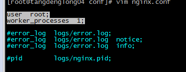
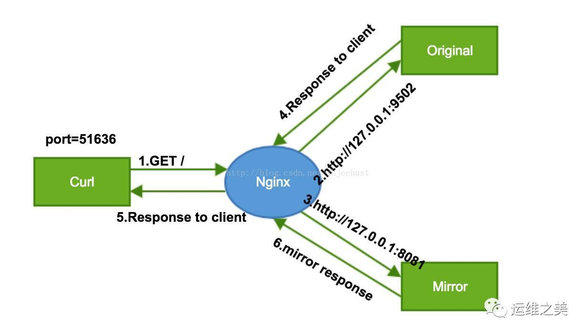

## 访问日志解码请求参数


------

## 打印post请求的请求体信息

默认的日志打印不包含请求体的内容,如果要打印改值,只需要在log_format中添加$request_body 即可,更多日志打印变量参考[官方文档](https://nginx.org/en/docs/http/ngx_http_log_module.html)

另外,即使打印出来请求体,内容不支持中文,都是经过url编码后的字符串.

## 添加或启动新模块

nginx不支持动态安装、加载模块的，所以当你安装第三方模块或者启动nginx本身的新模块功能的时候，都是覆盖nginx的；所以，一定要注意：首先查看你已经安装的nginx模块！然后安装新东西的时候，要把已安装的，再次配置。

1.查看ngnix已经安装的模块`./nginx -V`

2.执行configure和make

```bash
./configure --prefix=/usr/local/nginx \
 --with-http_stub_status_module \
 --with-http_ssl_module --with-http_realip_module \
 --with-http_image_filter_module \
 --add-module=../ngx_pagespeed-master
make
```

3.替换nginx二进制文件

```
cp /root/nginx-1.8.1/objs/nginx /usr/local/nginx/sbin/nginx
```

## X-Forwarded-For 和 X-Real-IP

X-Forwarded-For:被代理服务器使用,用来记录经过的代理服务信息. X-Real-IP:被代理服务器使用,用来记录客户端的真实IP地址.

举例: 现在有ngnix代理服务器A和B,请求先请过A[10.187.144.41],然后B[10.187.112.151],最后到达服务器[10.176.175.149]处理该请求.

A的ngnix配置

```bash
proxy_set_header X-Forwarded-For $proxy_add_x_forwarded_for;
proxy_set_header X-Real-IP $remote_addr;
```

B的ngnix配置

```plain
proxy_set_header X-Forwarded-For $proxy_add_x_forwarded_for;
```

服务器的响应

```plain
x-forwarded-for:114.141.166.125, 10.187.144.41
host:10.176.175.149:8080
connection:close
x-real-ip:114.141.166.125
getRemoteAddr:10.187.112.151
getRemoteHost:10.187.112.151
getServerName:10.176.175.149
```

变动1:如果B的配置也加上proxy_set_header X-Real-IP $remote_addr呢,服务器收到的请求头信息会是神马呢?

```plain
x-real-ip:10.187.144.41
x-forwarded-for:114.141.166.125, 10.187.144.41
host:10.176.175.149:8080
getRemoteAddr:10.187.112.151
getRemoteHost:10.187.112.151
getServerName:10.176.175.149
```

需要注意的是x-forwarded-for并没有把最后一个代理添加上去

我们看到x-real-ip的地址发生改变,不再是真实的客户端ip,而是代理A的ip,说明此时的$remote_addr的值是代理A的IP,如何修改这个值为真实的IP呢? 可以使用ngx_http_realip_module模块

## ngx_http_realip_module模块

安装请参考模块安装,A配置不变,B配置如下:

```plain
set_real_ip_from 10.187.144.41
real_ip_header X-Real-IP ;
proxy_set_header X-Forwarded-For $proxy_add_x_forwarded_for;
proxy_set_header X-Real-IP $remote_addr;
```

set_real_ip_from:指定真实IP的地址是在哪个代理机器上 real_ip_header:真实IP所在的请求头字段

## HttpGeoIP模块

1.安装

```plain
#下载免费的geo_city数据库
wget http://geolite.maxmind.com/download/geoip/database/GeoLiteCity.dat.gz
#下载免费的geo_coundty数据库
wget http://geolite.maxmind.com/download/geoip/database/GeoLiteCountry/GeoIP.dat.gz
#在debian中安装libgeoip:
sudo apt-get install libgeoip-dev
#其它系统，你可以下载并编译一个源文件
wget http://geolite.maxmind.com/download/geoip/api/c/GeoIP.tar.gz
#编译
./configure --with-http_geoip_module
```

2.配置数据源

```plain
http {
    geoip_country  GeoIP.dat; #放在ngnix home目录下面
    geoip_city     GeoLiteCity.dat;
```

3.使用举例

```plain
server {
...
        location / {
            root   /home/vpsee/www;
            if ($geoip_country_code = CN) {
                root /home/vpsee/cn;
            }
            ...
        }
...
}
```

这样，当来自中国的 IP 访问网站后就自动访问到预定的 /home/vpsee/cn 页面

## post_action请求后置处理器

该指令可以在响应完成之后跳转到另外的location上,可用于接口调用统计等.

```plain
server {
        listen  80;
        server_name www.a.com;
        location /aa {
                proxy_set_header Host "www.a-upstream.com";
                proxy_pass http://127.0.0.1:8000;
                post_action @action;
        }
        location @action {
                proxy_set_header Host "www.a-post-action.com";
                proxy_pass http://127.0.0.1:8001;
        }
}
```

上面的aa请求在发送给8000端口之后,也会发送给8001端口一份

## ngx_http_stub_status_module监控ngnix处理的请求数

默认没有开启该模块，需要编译添加，添加之后,在文件中配置:

```plain
location /basic_status {
	stub_status;
}
Active connections: 291
server accepts handled requests
16630948 16630948 31070465
Reading: 6 Writing: 179 Waiting: 106
```

1. Active connections: 活动状态的连接数；
2. accepts：已经接受的客户端握手的总数；accepts和handled相等，代表链接没有丢失
3. handled：已经处理完成的客户端请求的总数；
4. requests：客户端发来的总的请求数；
5. Reading：处于读取客户端请求报文首部的连接的连接数；
6. Writing：处于向客户端发送响应报文过程中的连接数；
7. Waiting：开启keepalive时，处于等待客户端发出请求的空闲连接数；此时连接已经处理完请求，但是并没有关闭，等待下一次请求重用该连接（需要客户端配合才可以）。

## http_random_index_module 随机页面返回

处理以斜杠（'/'）结尾的请求，并从目录中随机选择一个html文件作为返回。 该模块在ngx_http_index_module模块之前进行处理。 默认情况下未构建此模块，应使用—with-http_random_index_module配置参数启用它。

语法

```plain
Syntax:	random_index on | off;
Default:
random_index off;
Context:	location
```

示例

```plain
location / {
    random_index on;
}
```

## http_sub_module 替换响应

ngx_http_sub_module模块是一个过滤器，它通过将一个指定的字符串替换为另一个指定的字符串来修改响应。 默认情况下未构建此模块，应使用—with-http_sub_module配置参数启用它。

### 语法

```plain
Syntax:	sub_filter string replacement;
Default:	—
Context:	http, server, location
```

设置要替换的字符串和替换字符串。 替换忽略大小写。 要替换的字符串和替换字符串可以包含变量。 可以在一个配置级别上指定多个sub_filter伪指令。 当且仅当当前级别上未定义sub_filter指令时，这些指令才从上一级继承。

```plain
Syntax:	sub_filter_once on | off;
Default:
sub_filter_once on;
Context:	http, server, location
```

指示替换匹配的一个还是全部。

```plain
Syntax:	sub_filter_last_modified on | off;
Default:
sub_filter_last_modified off;
Context:	http, server, location
This directive appeared in version 1.5.1.
```

允许在替换期间从原始响应中保留“最后修改的”标头字段，以方便响应缓存。 默认情况下，在处理期间修改响应的内容时，将删除标头字段。

```plain
Syntax:	sub_filter_types mime-type ...;
Default:
sub_filter_types text/html;
Context:	http, server, location
```

除了“ text / html”之外，还可以在具有指定MIME类型的响应中启用字符串替换。 特殊值“ *”与任何MIME类型（0.8.29）匹配。

示例

```plain
location / {
    sub_filter '<a href="http://127.0.0.1:8080/'  '<a href="https://$host/';
    sub_filter '<img src="http://127.0.0.1:8080/' '<img src="https://$host/';
    sub_filter_once on;
}
```

## ngx_http_limit_conn_module限制客户端连接数

ngx_http_limit_conn_module模块用于限制每个已定义key的连接数，特别是来自单个IP地址的连接数.但是，并非所有连接都被计算在内 ，只有在服务器处理了请求并且整个请求头已经被读取的情况下才计算连接。

```plain
Syntax:	limit_conn_zone key zone=name:size;
Default:	—
Context:	http
```

定义内存区域存储客户端的信息，例如指定key的当前连接数， key可以包含文本，变量及其组合。 key值为空的请求不予考虑。下面是一个示例：

```plain
limit_conn_zone $binary_remote_addr zone=addr:10m;
```

客户端IP作为key值，为什么不使用$remote_addr呢？

- $remote_addr大小为7~15byte。
- $binary_remote_addr相对IPV4始终是4个字节，IPV6是16字节。
- 1M的区域可以保留大约3.2万个32字节状态或大约1.6万个64字节状态。 如果区域存储空间已用完，服务器将把错误返回给所有其他请求。

```plain
Syntax:	limit_conn zone number;
Default:	—
Context:	http, server, location
```

设置共享内存区域和最大允许连接数。 当超过此限制时，服务器将返回错误以回复请求。 例如

```plain
limit_conn_zone $binary_remote_addr zone=addr:10m;
server {
    location /download/ {
        limit_conn addr 1;
    }
```

同一时间只允许客户段IP有一个连接。

可能有几个limit_conn指令。 例如，以下配置将限制每个客户端IP与服务器的连接数，并同时限制与虚拟服务器的连接总数：

```plain
limit_conn_zone $binary_remote_addr zone=perip:10m;
limit_conn_zone $server_name zone=perserver:10m;
server {
    ...
    limit_conn perip 10;
    limit_conn perserver 100;
}
```

当且仅当当前级别上没有limit_conn指令时，这些指令才从上一级继承。

```plain
Syntax:	limit_conn_status code;
Default:
limit_conn_status 503;
Context:	http, server, location
This directive appeared in version 1.3.15.
```

连接被拒绝后，nginx的响应状态码。

```plain
Syntax:	limit_conn_log_level info | notice | warn | error;
Default:
limit_conn_log_level error;
Context:	http, server, location
This directive appeared in version 0.8.18.
```

连接被拒绝后，记录该请求的日志级别

```plain
Syntax:	limit_conn_dry_run on | off;
Default:
limit_conn_dry_run off;
Context:	http, server, location
This directive appeared in version 1.17.6.
```

启用空运行模式。 在这种模式下，连接数不受限制，但是，在共享内存区域中，过多连接的数将照常计算。

## http_limit_req_module 限制请求速率

ngx_http_limit_req_module模块用于限制请求处理速率，特别是来自单个IP地址的请求的处理速率。 使用“漏斗”方法完成限制。

```plain
Syntax:	limit_req_zone key zone=name:size rate=rate [sync];
Default:	—
Context:	http
```

定义内存区域存储客户端的信息，例如指定key的当前请求数， key可以包含文本，变量及其组合。 key值为空的请求不予考虑。下面是一个示例：

```plain
limit_req_zone $binary_remote_addr zone=one:10m rate=1r/s;
```

请求速率是每秒一个。

```plain
Syntax:	limit_req zone=name [burst=number] [nodelay | delay=number];
Default:	—
Context:	http, server, location
```

设置共享内存区域和请求的最大突发大小。 如果请求速率超过为区域配置的速率，则会延迟其处理，以便以定义的速率处理请求。 过多的请求将被延迟，直到其数量超过最大突发大小为止，在这种情况下，该请求将因错误而终止。 默认情况下，最大突发大小等于零。 例如，指令

```plain
limit_req_zone $binary_remote_addr zone=one:10m rate=1r/s;
server {
    location /search/ {
        limit_req zone=one burst=5;
    }
```

平均每秒最多允许不超过1个请求，并且突发不超过5个请求。

如果不需要在限制请求时延迟过多的请求，则应使用参数nodelay：

```plain
limit_req zone=one burst=5 nodelay;
```

delay参数指定一个限制，在该限制下，过多的请求将被延迟。 默认值为零，即所有多余的请求都会延迟。

可能有几个limit_req指令。 例如，以下配置将限制来自单个IP地址的请求的处理速度，同时限制虚拟服务器的请求处理速度：

```plain
limit_req_zone $binary_remote_addr zone=perip:10m rate=1r/s;
limit_req_zone $server_name zone=perserver:10m rate=10r/s;
server {
    ...
    limit_req zone=perip burst=5 nodelay;
    limit_req zone=perserver burst=10;
}
Syntax:	limit_req_status code;
Default:
limit_req_status 503;
Context:	http, server, location
This directive appeared in version 1.3.15.
```

请求被拒绝后，nginx的响应状态码。

```plain
Syntax:	limit_req_log_level info | notice | warn | error;
Default:
limit_req_log_level error;
Context:	http, server, location
This directive appeared in version 0.8.18.
```

请求被拒绝后，记录该请求的日志级别

```plain
Syntax:	limit_req_dry_run on | off;
Default:
limit_req_dry_run off;
Context:	http, server, location
This directive appeared in version 1.17.1.
```

启用空运行模式。 在这种模式下，请求数不受限制，但是，在共享内存区域中，过多请求的数将照常计算。

## http_access_module 访问控制

ngx_http_access_module模块允许限制对某些客户端地址的访问。

### 语法

```plain
Syntax:	allow address | CIDR | unix: | all;
Default:	—
Context:	http, server, location, limit_except
```

`允许访问` 指定的网络或地址。 如果指定特殊值unix：，则允许访问所有UNIX域套接字。

```plain
Syntax:	deny address | CIDR | unix: | all;
Default:	—
Context:	http, server, location, limit_except
```

`拒绝访问` 指定的网络或地址。 如果指定了特殊值unix：，则拒绝所有UNIX域套接字的访问。

示例

```plain
location / {
    deny  192.168.1.1;
    allow 192.168.1.0/24;
    allow 10.1.1.0/16;
    allow 2001:0db8::/32;
    deny  all;
}
```

依次检查规则，直到找到第一个匹配项。 在此示例中，仅对IPv4网络 `10.1.1.0/16` 和 `192.168.1.0/24`（地址192.168.1.1除外）和IPv6网络 `2001:0db8::/32` 允许访问。 在有很多规则的情况下，最好使用ngx_http_geo_module模块变量。

|      | 该模块存在一定的局限性，如果应用经过一层代理，则真实IP不可达，需要我们在代理上配置一定规则将真是的IP传递 |
| ---- | ------------------------------------------------------------ |
|      |                                                              |

## http_auth_basic_module 认证用户

ngx_http_auth_basic_module模块允许通过使用“ HTTP基本身份验证”协议验证用户名和密码来限制对资源的访问。

```plain
Syntax:	auth_basic string | off;
Default:
auth_basic off;
Context:	http, server, location, limit_except
```

使用“ HTTP基本认证”协议启用用户名和密码的验证。 指定的参数用作realm。 参数值可以包含变量。 特殊值off允许取消从先前配置级别继承的auth_basic指令的效果。

```plain
Syntax:	auth_basic_user_file file;
Default:	—
Context:	http, server, location, limit_except
```

以以下格式指定保存用户名和密码的文件：

```plain
# comment
name1:password1
name2:password2:comment
name3:password3
```

file名称可以包含变量。 支持一下密码类型：

- 用crypt（）函数加密； 可以使用Apache HTTP Server发行版中的“ htpasswd”实用程序或“ openssl passwd”命令生成。
- 使用基于MD5的密码算法（apr1）的Apache变体进行哈希处理； 可以使用相同的工具生成；
- 由RFC 2307中所述的“ {scheme} data”语法（1.0.3+）指定； 当前实施的方案包括一些软件包使用的PLAIN（不应该使用示例1），SHA（1.3.13）（不应该使用普通SHA-1哈希）和SSHA（盐化的SHA-1哈希）。 OpenLDAP和Dovecot）。

示例

```plain
location / {
    auth_basic           "closed site";
    auth_basic_user_file conf/htpasswd;
}
```

|      | 由于密码认证是通过本地文件，所以速度慢，且不好管理。可以使用Lua脚本来做。 |
| ---- | ------------------------------------------------------------ |
|      |                                                              |

## secure_link_module

## 索引静态目录

```plain
location  /  { #不能是其他路径
  autoindex  on;
}
```

## nginx架构模型

epoll模型 worker_processes 配置 use 配置 connection 配置

format日志变量

## 静态资源

### sendfile

指定是否使用sendfile系统调用来传输文件。 sendfile系统调用在两个文件描述符之间直接传递数据(完全在内核中操作)，从而避免了数据在内核缓冲区和用户缓冲区之间的拷贝，操作效率很高，被称之为零拷贝

### `tcp_nopush` 和 `tcp_nodelay`

### gzip 压缩

```plain
Syntax:	gzip on | off;
Default:
gzip off;
Context:	http, server, location, if in location
```

是否开启gzip压缩

```plain
Syntax:	gzip_buffers number size;
Default:
gzip_buffers 32 4k|16 8k;
Context:	http, server, location
```

设置用于压缩响应的缓冲区的数量和大小。 默认情况下，缓冲区大小等于一个内存页。 根据平台的不同，它可以是4K或8K。建议此项不设置，使用默认值。

```plain
Syntax:	gzip_comp_level level;
Default:
gzip_comp_level 1;
Context:	http, server, location
```

设置压缩比率，最小为1；9为最大压缩比; 压缩比越大，压缩后的文件越小，但是压缩过程比较慢，消耗CPU

```plain
Syntax:	gzip_disable regex ...;
Default:	—
Context:	http, server, location
This directive appeared in version 0.6.23.
```

如果“User-Agent”头字段内容匹配任何指定的正则表达式，则禁用gzip。

```plain
Syntax:	gzip_http_version 1.0 | 1.1;
Default:
gzip_http_version 1.1;
Context:	http, server, location
```

设置压缩响应所需的最低HTTP请求版本。

```plain
Syntax:	gzip_min_length length;
Default:
gzip_min_length 20;
Context:	http, server, location
```

超过该长度的响应会被压缩。 长度仅由“ Content-Length”响应头字段确定。

```plain
Syntax:	gzip_proxied off | expired | no-cache | no-store | private | no_last_modified | no_etag | auth | any ...;
Default:
gzip_proxied off;
Context:	http, server, location
```

根据请求或响应，决定反向代理是否对返回结果进行gzip压缩。是否进行gzip压缩是通过是否存在可变的请求头来决定的。该指令可以接受多个值。

- off:禁用压缩
- expired：如果响应头中包含“ Expires”字段且其值禁用了缓存，则启用压缩；
- no-cache：如果响应头包含带有“Cache-Control: no-cache”字段，则启用压缩；
- no-store: 如果响应头包含带有“Cache-Control: no-store”字段，则启用压缩；
- private: 如果响应头包含带有“Cache-Control: private”字段，则启用压缩；
- no_last_modified: 如果响应头不包含“ Last-Modified”字段，则启用压缩；
- no_etag: 如果响应头不包含“ ETag”字段，则启用压缩；
- auth: 如果请求标头包含“ Authorization”字段，则启用压缩；
- any: 为所有代理请求启用压缩。

```plain
Syntax:	gzip_types mime-type ...;
Default:
gzip_types text/html;
Context:	http, server, location
```

除了“text/html”之外，还对指定的MIME类型启用gzipping响应。 特殊值“*”与任何MIME类型匹配。 始终会压缩“text/html”类型的响应。

```plain
Syntax:	gzip_vary on | off;
Default:
gzip_vary off;
Context:	http, server, location
```

如果指令gzip，gzip_static或gunzip处于活动状态，则启用或禁用插入“Vary：Accept-Encoding”响应标头字段。

### gzip_static_module 模块

ngx_http_gzip_static_module模块允许优先发送扩展名为“.gz”的预压缩文件。简单来说，nginx会先查找相同目录下，是否存在该文件以“.gz”结尾的压缩文件，存在则返回，不存在则使用原文件。默认情况下未构建此模块，应使用—with-http_gzip_static_module配置参数启用它。

```plain
Syntax:	gzip_static on | off | always;
Default:
gzip_static off;
Context:	http, server, location
```

启用（“ on”）或禁用（“ off”）检查是否存在预压缩文件。 还考虑了以下指令：gzip_http_version，gzip_proxied，gzip_disable和gzip_vary。

使用“always”值，在所有情况下都使用压缩文件，而无需检查客户端是否支持它。

可以使用gzip命令或任何其他兼容的命令压缩文件。 建议原始文件和压缩文件的修改日期和时间相同。

### gunzip_module 模块

ngx_http_gunzip_module模块是一个过滤器，用于对不支持“gzip”编码方法的客户端使用“ Content-Encoding：gzip”解压缩后返回响应。 现在的客户端基本都支持，该模块用途很小。

### 缓存

```plain
Syntax:    expires [modified]  time；
           expires epoch|max|off；
Default:   expires off；                 # 静态缓存
Context:   http，server，location，if in location
```

指定过期时间。会在响应头中添加“Expires”（http1.0之前的）和“Cache-Control”（http1.1之后）

time的值是负值，“Cache-Control: no-cache” time的值是正值t: `Cache-Control: max-age=t`

“Expires”字段中的时间计算为当前时间与指令中指定的时间之和。

- epoch参数将“ Expires”设置为值“ Thu，1970年1月1日00:00:01 GMT”，将“ Cache-Control”设置为“ no-cache”。
- max参数将“ Expires”设置为值“ Thu，2037年12月31日23:55:55 GMT”，将“ Cache-Control”设置为10年。
- off参数禁用添加或修改“ Expires”和“ Cache-Control”响应头字段。

### 跨站

```plain
add_header Access-Control-Allow-Origin *;
    add_header Access-Control-Allow-Headers X-Requested-With;
    add_header Access-Control-Allow-Methods GET,POST,OPTIONS;
```

### 防盗链

```plain
Syntax:	valid_referers none | blocked | server_names | string ...;
Default:	—
Context:	server, location
```

匹配请求头中的“Referer”，匹配则 `$valid_referers` 的值为空，否则为1.

- none:请求标头中缺少“ Referer”字段；
- blocked: 请求标头中存在“ Referer”字段，但其值已被防火墙或代理服务器删除； 这些值是不以“ http：//”或“ https：//”开头的字符串；
- server_names: “ Referer”请求标头字段包含任一服务器名称；
- 任意字符串：定义服务器名称和可选的URI前缀。 服务器名称的开头或结尾可以带有“ *”。 在检查过程中，“ Referer”字段中的服务器端口将被忽略；
- 正则：第一个符号应为“〜”。 应当注意，表达式将与“ http：//”或“ https：//”之后的文本匹配。

示例：

```bash
valid_referers none blocked *.source.com source.com;
if ($invalid_referer) {
     return 403 ;
}
```

## 反向代理

### 负载均衡

### 缓存


## 日志文件分割

默认情况下,nginx的日志文件不支持按天或者按大小切分,这对我们排查错误非常不便.这里提供一种在配置文件中分割日志文件的方式(此外还有cron定时切分日志文件的方式):

 

```shell
if ($time_iso8601 ~ "^(\d{4})-(\d{2})-(\d{2})") {
    set $year $1;
    set $month $2;
    set $day $3;
}
access_log /usr/local/nginx/logs/www.ttlsa.com-$year-$month-$day-access.log;
```

此外需要注意的是,默认情况下,ngnix的权限用户并不是root,那么将无法生成日志文件,所有需要指定user为root.例如:



## nginx灰度测试

灰度发布是指在黑与白之间，能够平滑过渡的一种发布方式。AB test就是一种灰度发布方式，让一部分用户继续用A，一部分用户开始用B，如果用户对B没有什么反对意见，那么逐步扩大范围，把所有用户都迁移到B上面来。

灰度发布常见一般有三种方式:

- Nginx+LUA方式
- 根据Cookie实现灰度发布
- 根据来路IP实现灰度发布

本文主要将讲解根据Cookie和来路IP这两种方式实现简单的灰度发布。这两种的实现原理是相同的,这里只介绍一种即可：

```shell
upstream hilinux_01 {
    server 192.168.1.100:8080 max_fails=1 fail_timeout=60;
}

upstream hilinux_02 {
    server 192.168.1.200:8080 max_fails=1 fail_timeout=60;
}

upstream default {
    server 192.168.1.100:8080 max_fails=1 fail_timeout=60;
}

server {
    listen 80;
    server_name  www.hi-linux.com;
    access_log  logs/www.hi-linux.com.log  main;

    #match cookie
    set $group "default";
    if ($http_cookie ~* "version=V1"){
          set $group hilinux_01;
    }

    if ($http_cookie ~* "version=V2"){
          set $group hilinux_02;
    }

    location / {                       
      proxy_pass http://$group;
      proxy_set_header   Host             $host;
      proxy_set_header   X-Real-IP        $remote_addr;
      proxy_set_header   X-Forwarded-For  $proxy_add_x_forwarded_for;
      index  index.html index.htm;
    }
 }
```

## ngx_http_map_module

默认情况下安装 nginx 都会安装该模块。

map 的主要作用是创建自定义变量，通过使用 nginx 的内置变量，去匹配某些特定规则，如果匹配成功则设置某个值给自定义变量。 而这个自定义变量又可以作于他用。

直接看个例子理解起来比较清晰：

场景： 匹配请求 url 的参数，如果参数是 debug 则设置 $foo = 1 ，默认设置 $foo = 0


```shell
map $args $foo {
    default 0;
    debug 1;
}
```

$args 是nginx内置变量，就是获取的请求 url 的参数。 如果 $args 匹配到 debug 那么 $foo 的值会被设为 1 ，如果 $args 一个都匹配不到 $foo 就是default 定义的值，在这里就是 0.


使用map也可以用作灰度测试：

```shell
upstream hilinux_01 {
    server 192.168.1.100:8080 max_fails=1 fail_timeout=60;
}

upstream hilinux_02 {
    server 192.168.1.200:8080 max_fails=1 fail_timeout=60;
}

upstream default {
    server 192.168.1.100:8080 max_fails=1 fail_timeout=60;
}

map $COOKIE_version $group {
    ~*V1$ hilinux_01;
    ~*V2$ hilinux_02;
    default default;
}

server {
  listen 80;
  server_name  www.hi-linux.com;
  access_log  logs/www.hi-linux.com.log  main;

  location / {                       
    proxy_pass http://$group;
    proxy_set_header   Host             $host;
    proxy_set_header   X-Real-IP        $remote_addr;
    proxy_set_header   X-Forwarded-For $proxy_add_x_forwarded_for;
    index  index.html index.htm;
  }
 }
```

## 使用nginx进行AB测试

根据请求的路径来选择路由的首页:

```shell
http {
    split_clients "${remote_addr}AAA" $variant {
                   0.5%               .one;
                   2.0%               .two;
                   *                  "";
    }

    server {
        location / {
            index index${variant}.html;
```

原始字符串的值使用MurmurHash2散列。 在给出的例子中，从0到21474835（0.5％）的散列值对应于$ variant变量的值“.one”，从21474836到107374180（2％）的散列值对应于值“.two”，散列值 从107374181到4294967295的值对应于值“”（一个空字符串）。


## nginx请求镜像

请求镜像就是nginx在接受到客户端请求进行反向代理的时候分别代理到原地址和镜像地址一次。镜像地址的返回结果不会返回到客户端。看下图：


 

利用这一功能我们就可以将线上实时访问流量拷贝至其它环境，基于这些流量可以做版本发布前的预先验证或者进行流量放大后的压测等等。


mirror模块配置分为两部分，源地址和镜像地址配置，配置位置可以为nginx配置文件的http, server, location上下文，配置示例为：

```shell
location /user {
         mirror /mirror ;
         mirror_request_body off;
         proxy_pass http://localhost:8080 ;
 }
location /mirror {
       internal;
       proxy_pass http://127.0.0.1:8081$request_uri;
       proxy_set_header X-Original-URI $request_uri;
}
```

1.original配置


-   location /指定了源uri为/
-   mirror /mirror指定镜像uri为/mirror
-   mirror_request_body off | on 指定是否镜像请求body部分，此选项与proxy_request_buffering、fastcgi_request_buffering、scgi_request_buffering和 uwsgi_request_buffering冲突，一旦开启mirror_request_body为on，则请求自动缓存;

2.mirror配置

-   internal 指定此location只能被“内部的”请求调用，外部的调用请求会返回”Not found” (404)
-   proxy_pass 指定上游server的地址
-   proxy_set_header 设置镜像流量的头部


## rewrite指令

- last： url重写后，马上发起一个新的请求，再次进入server块，重试location匹配，超过10次匹配不到报500错误，地址栏url不变
- break: url重写后，直接使用当前资源，执行location里余下的语句，完成本次请求(不会再次进入server块)，地址栏url不变
- redirect ： 返回302临时重定向，地址栏显示重定向后的url，爬虫不会更新url（因为是临时）
- permanent ： 返回301永久重定向, 地址栏显示重定向后的url，爬虫更新url


nginx 的 rewrite log 是记录在 error log 文件中，而不是access log中。

nginx 开启 rewrite 日志的方法(在server段中添加）:首先，打开 error_log 日志：

```shell
error_log logs/error.log notice;
```

然后打开 rewrite_log 开关:

```shell
rewrite_log on;
```

## nginx文件上传
