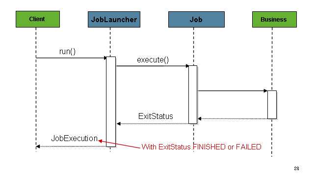
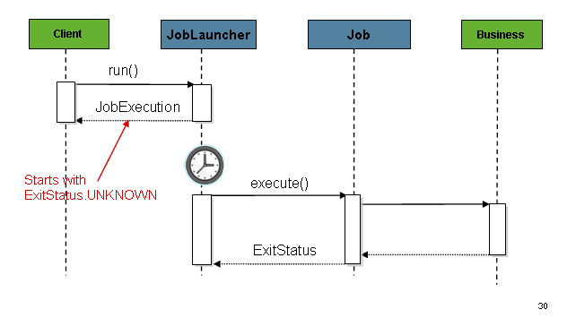
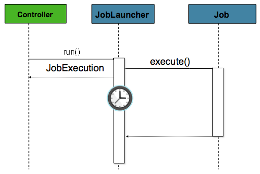
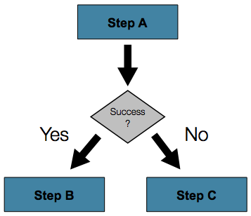

# spring batch


# 核心概念


一个作业有一到多个步骤，每个步骤正好有一个ItemReader、一个ItemProcessor和一个ItemWriter。需要使用JobLauncher启动作业，JobRepository存储关于当前运行作业的元数据。

## 作业（Job）
作业是封装整个批处理过程的实体。是整个层次结构的顶部，如下图所示：


在SpringBatch中，作业只是步骤实例的容器。它将逻辑上属于一个流的多个步骤组合在一起，并允许配置所有步骤的全局属性，例如可重启性。作业配置包含：

* 名称
* 步骤的顺序
* 作业是否需要重启

对于那些使用Java配置的人，SpringBatch以SimpleJob类的形式提供了作业接口的默认实现，它在作业之上创建了一些标准功能。使用基于java的配置时，可以使用构建器集合来实例化作业，如下例所示：

```java
@Bean
public Job footballJob() {
    return this.jobBuilderFactory.get("footballJob")
                     .start(playerLoad())
                     .next(gameLoad())
                     .next(playerSummarization())
                     .build();
}
```
### JobInstance
JobInstance是job运行时的概念，这样说可能有些抽象。假如我们有个作业A，在每天快要结束的时候运行。那么一月一日运行该job就会创建一个JobInstance,一月二日则会创建一个新的JobInstance。

但是，会有这样的情况，一月一日的JobInstance运行失败了，在一月二日会继续运行这个失败的JobInstance,同时一月二日的JobInstance照旧执行。

因此，JobInstacen可能会多次执行（这是后面的`JobExecution概念`）。并且在给定时刻只能运行一个对应于特定作业和JobParameters的JobInstance。

JobInstance的定义与要加载的数据完全没有关系。如何加载数据完全取决于ItemReader实现。使用新的JobInstance意味着“从头开始”，而使用现有实例通常意味着“从您停止的地方开始”。

### JobParameters
如何区分不同的JobInstance呢？答案：JobParameters。JobParameters对象包含一组用于启动批处理作业的参数。它们可用于识别，甚至在运行期间用作参考数据，如下图所示：


> 并非所有作业参数都需要用于标识作业实例。默认情况下，它们会这样做。但是，该框架还允许提交带有不影响JobInstance标识的参数的作业。

### JobExecution
`JobExecution`是指一次尝试运行作业的技术概念。执行可能以失败或成功结束，但对应的JobInstance不会被视为已完成，除非执行成功完成。假如任务A第一次执行失败，此时JobInstance会被标记会失败，当下次继续执行这个失败的JobInstance时，如果成功了，就会变更JobInstance为成功。

Job定义了什么是作业以及如何执行作业，而JobInstance是一个纯粹的组织对象，用于将执行分组在一起，主要是为了实现正确的重启语义。然而，JobExecution是运行期间实际发生的事情的主要存储机制，它包含许多必须控制和持久化的属性，如下表所示：

| 属性              | 定义                                                         |
| ----------------- | ------------------------------------------------------------ |
| Status            | 指示执行状态的BatchStatus对象。<br>运行时，状态为BatchStatus#STARTED。<br>如果失败，则为BatchStatus#FAILED。<br>如果成功完成，则为BatchStatus#COMPLETED |
| startTime         | `java.util.Date` ,表示开始执行的时间，没有执行则为空         |
| endTime           | `java.util.Date,执行结束的时间`                              |
| exitStatus        | 执行的结果，空代表还没有结束                                 |
| createTime        | `java.util.Date,创建的时间`                                  |
| lastUpdated       | `java.util.Date`                                             |
| executionContext  | 属性包，包含在执行之间需要的用户数据。                       |
| failureExceptions | 作业执行期间遇到的异常列表                                   |

这些属性很重要，因为它们是持久化的，可用于完全确定执行状态。例如，如果01-01的EndOfDay作业在晚上9:00执行，但在9:30失败，则在批处理元数据表中创建以下条目：

> 为了清晰和格式，列名可能已被缩写或删除。

**表：BATCH\_JOB\_INSTANCE**

| JOB\_INST\_ID | JOB\_NAME   |
| ------------- | ----------- |
| 1             | EndOfDayJob |

**表：BATCH\_JOB\_EXECUTION\_PARAMS**

| JOB\_EXECUTION\_ID | TYPE\_CD | KEY\_NAME     | DATE\_VAL  | IDENTIFYING |
| ------------------ | -------- | ------------- | ---------- | ----------- |
| 1                  | DATE     | schedule.Date | 2017-01-01 | TRUE        |

**表：BATCH\_JOB\_EXECUTION**

| JOB\_EXEC\_ID | JOB\_INST\_ID | START\_TIME      | END\_TIME        | STATUS |
| ------------- | ------------- | ---------------- | ---------------- | ------ |
| 1             | 1             | 2017-01-01 21:00 | 2017-01-01 21:30 | FAILED |

既然作业失败了，第二天从停止的位置开始，并在9:30成功完成。因为现在是第二天，01-02作业也必须运行，然后在9:31开始，并在10:30以正常的一小时时间完成。没有要求一个jobinstance一个接一个地启动，除非两个作业可能尝试访问相同的数据，从而导致数据库级别的锁定问题。作业何时运行完全取决于调度程序。由于它们是独立的JobInstance，SpringBatch不会试图阻止它们并发运行。（在另一个JobInstance已在运行时尝试运行同一个JobInstance会导致引发JobExecutionAlreadyRunningException）。现在，JobInstance和JobParameters表中都应该有一个新的条目，JobExecution表中应该有两个新的条目，如下表所示：

**表：BATCH\_JOB\_INSTANCE**

| JOB\_INST\_ID | JOB\_NAME   |
| ------------- | ----------- |
| 1             | EndOfDayJob |
| 2             | EndOfDayJob |

**表：BATCH\_JOB\_EXECUTION\_PARAMS**

| JOB\_EXECUTION\_ID | TYPE\_CD | KEY\_NAME     | DATE\_VAL           | IDENTIFYING |
| ------------------ | -------- | ------------- | ------------------- | ----------- |
| 1                  | DATE     | schedule.Date | 2017-01-01 00:00:00 | TRUE        |
| 2                  | DATE     | schedule.Date | 2017-01-01 00:00:00 | TRUE        |
| 3                  | DATE     | schedule.Date | 2017-01-02 00:00:00 | TRUE        |

**表：BATCH\_JOB\_EXECUTION\_PARAMS**

| JOB\_EXEC\_ID | JOB\_INST\_ID | START\_TIME      | END\_TIME        | STATUS    |
| ------------- | ------------- | ---------------- | ---------------- | --------- |
| 1             | 1             | 2017-01-01 21:00 | 2017-01-01 21:30 | FAILED    |
| 2             | 1             | 2017-01-02 21:00 | 2017-01-02 21:30 | COMPLETED |
| 3             | 2             | 2017-01-02 21:31 | 2017-01-02 22:29 |           |

## Step步骤
步骤是封装批处理作业的独立、连续阶段的域对象。因此，每个作业都完全由一个或多个步骤组成。步骤包含定义和控制实际批处理所需的所有信息。这必然是一个模糊的描述，因为任何给定步骤的内容都由编写作业的开发人员自行决定。


### StepExecution
StepExecution表示一次执行步骤的尝试。每次运行一个步骤时都会创建一个新的StepExecution，类似于JobExecution。但是，如果某个步骤由于之前的步骤失败而无法执行，则不会为其保留任何执行记录。步骤执行仅在其步骤实际启动时创建。

每个执行对象都持有对应步骤和JobExecution的引用以及与事务相关的数据，例如提交和回滚计数以及开始和结束时间。此外，每个步骤执行都包含一个ExecutionContext，其中包含开发人员需要在批处理运行期间保留的任何数据，例如重新启动所需的统计信息或状态信息。下表列出了步骤执行的属性：

| Property         | Definition                                                   |
| ---------------- | ------------------------------------------------------------ |
| Status           | 指示执行状态的BatchStatus对象。<br>运行时，状态为BatchStatus#STARTED。<br>如果失败，则为BatchStatus#FAILED。<br>如果成功完成，则为BatchStatus#COMPLETED |
| startTime        | `java.util.Date` ,表示开始执行的时间，没有执行则为空         |
| endTime          | `java.util.Date,执行结束的时间`                              |
| exitStatus       | 执行的结果，空代表还没有结束                                 |
| executionContext | 属性包，包含在执行之间需要的用户数据。                       |
| readCount        | 成功读取的数量                                               |
| writeCount       | 成功写入的数量                                               |
| commitCount      | 成功提交的事务数                                             |
| rollbackCount    | 步骤控制的业务事务已回滚的次数。                             |
| readSkipCount    | 读取失败的次数，导致跳过项。                                 |
| processSkipCount | 进程失败的次数，导致跳过项。                                 |
| filterCount      | 已由ItemProcessor“筛选”的项目数。                            |
| writeSkipCount   | 写入失败的次数，导致跳过项。                                 |

## ExecutionContext
ExecutionContext表示一组键/值对，这些键/值对由框架持久化和控制，以允许开发人员在一个位置存储持久状态，该持久状态的作用域为StepExecution对象或JobExecution对象。对于那些熟悉Quartz的人来说，它与JobDataMap非常相似。最好的用法示例是方便重新启动。以平面文件输入为例，在处理单个行时，框架会定期在提交点持久化ExecutionContext。这样做允许ItemReader存储其状态，以防在运行期间发生致命错误，甚至断电。所需的只是将当前读取的行数放入上下文中，如以下示例所示，框架将完成其余工作：

```java
executionContext.putLong(getKey(LINES_READ_COUNT), reader.getPosition());
```
假如作业EndOfDay有步骤loadData，读取文件数据到数据库。当其运行失败，表数据如下：

**表：BATCH\_JOB\_INSTANCE**

| JOB\_INST\_ID | JOB\_NAME   |
| ------------- | ----------- |
| 1             | EndOfDayJob |

**表：BATCH\_JOB\_EXECUTION\_PARAMS**

| JOB\_INST\_ID | TYPE\_CD | KEY\_NAME     | DATE\_VAL  |
| ------------- | -------- | ------------- | ---------- |
| 1             | DATE     | schedule.Date | 2017-01-01 |

**表：BATCH\_JOB\_EXECUTION**

| JOB\_EXEC\_ID | JOB\_INST\_ID | START\_TIME      | END\_TIME        | STATUS |
| ------------- | ------------- | ---------------- | ---------------- | ------ |
| 1             | 1             | 2017-01-01 21:00 | 2017-01-01 21:30 | FAILED |

**表：BATCH\_STEP\_EXECUTION**

| STEP\_EXEC\_ID | JOB\_EXEC\_ID | STEP\_NAME | START\_TIME      | END\_TIME        | STATUS |
| -------------- | ------------- | ---------- | ---------------- | ---------------- | ------ |
| 1              | 1             | loadData   | 2017-01-01 21:00 | 2017-01-01 21:30 | FAILED |

**表：BATCH\_STEP\_EXECUTION\_CONTEXT**

| STEP\_EXEC\_ID | SHORT\_CONTEXT      |
| -------------- | ------------------- |
| 1              | {piece.count=40321} |

在前面的例子中，该步骤运行了30分钟，处理了40321个“片段”，在这种情况下，这些片段表示文件中的行。该值在框架每次提交之前更新，可以包含多行与ExecutionContext对应的条目。在提交之前会通知StepListener实现（或ItemStream），本指南后面将详细讨论这些实现。

与前面的示例一样，假定作业在第二天重新启动。重新启动时，将从数据库中读取上次运行的ExecutionContext中的值来重新构造。打开ItemReader时，它可以检查上下文中是否有任何存储状态，并从中初始化自身，如以下示例所示：

```java
if (executionContext.containsKey(getKey(LINES_READ_COUNT))) {
    log.debug("Initializing for restart. Restart data is: " + executionContext);

    long lineCount = executionContext.getLong(getKey(LINES_READ_COUNT));

    LineReader reader = getReader();

    Object record = "";
    while (reader.getPosition() < lineCount && record != null) {
        record = readLine();
    }
}
```
上面的例子中，代码会从文件的40,322行继续读取数据。`ExecutionContext` 还可以存储自身运行的统计数据。例如，文件中存储的订单信息可能横跨多行，很有必要存储已经处理了多少个订单，当所有数据处理完成之后，发布通知邮件告诉相关人员处理了多少订单。

还需要注意的是，每个作业执行至少有一个ExecutionContext，每个步骤执行至少有一个ExecutionContext。例如，考虑下面的代码片段：

```java
ExecutionContext ecStep = stepExecution.getExecutionContext();
ExecutionContext ecJob = jobExecution.getExecutionContext();
//ecStep does not equal ecJob
```
## JobRepository
JobRepository是上述所有原型的持久化机制。它为JobLauncher、Job和Step实现提供CRUD操作。首次启动作业时，将从存储库获取作业执行，并且在执行过程中，通过将步骤执行和作业执行实现传递到存储库来持久化它们。

Spring批处理XML命名空间支持使用<job repository>标记配置JobRepository实例，如下例所示：

```Plain Text
<job-repository id="jobRepository"/>
```
在使用Java配置时，@EnableBatchProcessing注释提供了一个JobRepository，作为自动配置的现成组件之一。

## JobLauncher
JobLauncher表示一个简单的接口，用于启动具有给定JobParameters集的作业，如以下示例所示：

```java
public interface JobLauncher {

public JobExecution run(Job job, JobParameters jobParameters)
            throws JobExecutionAlreadyRunningException, JobRestartException,
                   JobInstanceAlreadyCompleteException, JobParametersInvalidException;
}
```
## Item Reader 和 Item Writer
ItemReader是一个抽象，表示一个步骤的输入，一次一个项目。当ItemReader读取到末尾时，它通过返回null来表示这一点。

`ItemWriter` 表示步骤的输出，一次一批。通常情况下，writer不知道自己下次接受的数据有多少条，只知道在其当前调用中传递的项。

各种实现的更多详细信息可以在[Reader和Write](https://docs.spring.io/spring-batch/docs/current/reference/html/readersAndWriters.html#readersAndWriters)r中找到。

## Item Processor
`ItemProcessor` 用来处理的输入数据。处理项目时，确定该项目无效，返回null表示不应写出该项目。

## Batch Namespace
前面列出的许多域概念都需要在Spring ApplicationContext中配置。虽然上述接口的实现可以在标准bean定义中使用，但为了便于配置，提供了一个名称空间，如下例所示：

```xml
<beans:beans xmlns="http://www.springframework.org/schema/batch"
xmlns:beans="http://www.springframework.org/schema/beans"
xmlns:xsi="http://www.w3.org/2001/XMLSchema-instance"
xsi:schemaLocation="
   http://www.springframework.org/schema/beans
   https://www.springframework.org/schema/beans/spring-beans.xsd
   http://www.springframework.org/schema/batch
   https://www.springframework.org/schema/batch/spring-batch.xsd">

<job id="ioSampleJob">
    <step id="step1">
        <tasklet>
            <chunk reader="itemReader" writer="itemWriter" commit-interval="2"/>
        </tasklet>
    </step>
</job>

</beans:beans>
```


# 作业
## 配置作业
job接口有多种实现，但我们不建议直接创建实体类，而是通过建造者创建：

```java
@Bean
public Job footballJob() {
    return this.jobBuilderFactory.get("footballJob")
                     .start(playerLoad())
                     .next(gameLoad())
                     .next(playerSummarization())
                     .build();
}
```
作业依赖JobRepository，使用`BatchConfigurer配置。`

上面的例子中，配置了三个步骤。和作业相关的builder还可以配置并行（Split）、声明式流程控制（Decision）、外部流程定义（Flow）.

### 可重启
执行批处理作业时的一个关键问题是作业重新启动时的行为。如果特定JobInstance已存在JobExecution，则启动作业被视为“重新启动”。理想情况下，所有工作都应该能够在结束后重新启动，但在某些情况下这是不可能的。开发人员完全可以确保在此场景中创建新的JobInstance。然而，SpringBatch确实提供了一些帮助。如果作业永远不应重新启动，但应始终作为新作业实例的一部分运行，则restartable属性可能设置为“false”：

```java
@Bean
public Job footballJob() {
    return this.jobBuilderFactory.get("footballJob")
                     .preventRestart()
                     ...
                     .build();
}
```
换句话说，将restartable设置为false意味着“此作业不支持再次启动”。重新启动不可重启的作业会引发JobRestartException:

```java
Job job = new SimpleJob();
job.setRestartable(false);

JobParameters jobParameters = new JobParameters();

JobExecution firstExecution = jobRepository.createJobExecution(job, jobParameters);
jobRepository.saveOrUpdate(firstExecution);

try {
    jobRepository.createJobExecution(job, jobParameters);
    fail();
}
catch (JobRestartException e) {
    // expected
}
```
### 拦截作业的执行
在作业的执行过程中，通知其生命周期中的各种事件可能很有用，以便可以执行自定义代码。SimpleJob通过在适当的时间调用JobListener来实现这一点：

```java
public interface JobExecutionListener {

    void beforeJob(JobExecution jobExecution);

    void afterJob(JobExecution jobExecution);

}
```
通过在作业上设置侦听器，可以将作业侦听器添加到SimpleJob:

```java
@Bean
public Job footballJob() {
    return this.jobBuilderFactory.get("footballJob")
                     .listener(sampleListener())
                     ...
                     .build();
}
```
应该注意的是，不管作业成功与否，都会调用afterJob方法。如果需要确定成功或失败，可以从`JobExecution`中获得，如下所示：

```java
public void afterJob(JobExecution jobExecution){
    if (jobExecution.getStatus() == BatchStatus.COMPLETED ) {
        //job success
    }
    else if (jobExecution.getStatus() == BatchStatus.FAILED) {
        //job failure
    }
}
```
与此接口对应的注解包括：

* @BeforeJob
* @AfterJob

### job参数验证
你可以验证作业的参数信息，有一个DefaultJobParametersValidator，可用于约束简单强制参数和可选参数的组合，对于更复杂的约束，您可以自己实现接口。

```java
@Bean
public Job job1() {
    return this.jobBuilderFactory.get("job1")
                     .validator(parametersValidator())
                     ...
                     .build();
}
```
## @EnableBatchProcessing
@EnableBatchProcessing为构建批处理作业提供基本配置，创建以下bean：

* `JobRepository`: bean name "jobRepository"
* `JobLauncher`: bean name "jobLauncher"
* `JobRegistry`: bean name "jobRegistry"
* `PlatformTransactionManager`: bean name "transactionManager"
* `JobBuilderFactory`: bean name "jobBuilders"
* `StepBuilderFactory`: bean name "stepBuilders"
此配置的核心接口是BatchConfigurer。默认实现提供了上面提到的bean，并且需要一个数据源作为要提供的上下文中的bean。该数据源被JobRepository使用。您可以通过创建BatchConfigurer接口的自定义实现来自定义这些bean中的任何一个。通常，扩展DefaultBatchConfigurer（在找不到BatchConfigurer时提供）并覆盖所需的getter就足够了。下面是一个示例：

```java
@Bean
public BatchConfigurer batchConfigurer(DataSource dataSource) {
	return new DefaultBatchConfigurer(dataSource) {
		@Override
		public PlatformTransactionManager getTransactionManager() {
			return new MyTransactionManager();
		}
	};
}
```
一旦配置了@EnableBatchProcessing注解，你就可以使用`JobBuilderFactory和`StepBuilderFactory：

```java
@Configuration
@EnableBatchProcessing
@Import(DataSourceConfiguration.class)
public class AppConfig {

    @Autowired
    private JobBuilderFactory jobs;

    @Autowired
    private StepBuilderFactory steps;

    @Bean
    public Job job(@Qualifier("step1") Step step1, @Qualifier("step2") Step step2) {
        return jobs.get("myJob").start(step1).next(step2).build();
    }

    @Bean
    protected Step step1(ItemReader<Person> reader,
                         ItemProcessor<Person, Person> processor,
                         ItemWriter<Person> writer) {
        return steps.get("step1")
            .<Person, Person> chunk(10)
            .reader(reader)
            .processor(processor)
            .writer(writer)
            .build();
    }

    @Bean
    protected Step step2(Tasklet tasklet) {
        return steps.get("step2")
            .tasklet(tasklet)
            .build();
    }
}
```
## 配置JobRepository
使用了@EnableBatchProcessing注解之后，会帮我们自动配置`JobRepository。`

如前所述，JobRepository用于Spring批处理中各种持久化域对象的基本CRUD操作，如JobExecution和StepExecution。许多主要框架功能都需要它，例如JobLauncher、Job和Step。

如果提供了数据源，则提供现成的基于JDBC的数据源，如果没有，则提供基于map的数据源。但是，您可以通过实现BatchConfigurer接口自定义JobRepository的配置:

```java
...
// This would reside in your BatchConfigurer implementation
@Override
protected JobRepository createJobRepository() throws Exception {
    JobRepositoryFactoryBean factory = new JobRepositoryFactoryBean();
    factory.setDataSource(dataSource);
    factory.setTransactionManager(transactionManager);
    factory.setIsolationLevelForCreate("ISOLATION_SERIALIZABLE");
    factory.setTablePrefix("BATCH_");
    factory.setMaxVarCharLength(1000);
    return factory.getObject();
}
...
```
除了dataSource和transactionManager之外，上面列出的配置选项都不是必需的。如果未设置，将使用上面显示的默认值。以上所示为了解目的。max varchar length默认为2500，这是示例架构脚本中长varchar列的长度。

### 事务配置
如果使用了名称空间或提供的FactoryBean，则会在存储库事务切面。这是为了确保批处理元数据（包括故障后重新启动所需的状态）正确持久化。

create\*方法属性中的隔离级别是单独指定的，以确保在启动作业时，如果两个进程试图同时启动同一作业，则只有一个成功。该方法的默认隔离级别是SERIALIZABLE，这是非常激进的。READ\_COMMITTED也可以。如果两个进程不太可能以这种方式发生冲突，READ\_UNCOMMITTED就可以了。但是，由于对create\*方法的调用非常短，只要数据库平台支持，序列化就不太可能导致问题。但是，这可以被覆盖。

```java
@Override
protected JobRepository createJobRepository() throws Exception {
    JobRepositoryFactoryBean factory = new JobRepositoryFactoryBean();
    factory.setDataSource(dataSource);
    factory.setTransactionManager(transactionManager);
    factory.setIsolationLevelForCreate("ISOLATION_REPEATABLE_READ");
    return factory.getObject();
}
```
如果未使用名称空间或工厂bean，那么使用AOP配置存储库的事务行为也很重要。

```java
@Bean
public TransactionProxyFactoryBean baseProxy() {
	TransactionProxyFactoryBean transactionProxyFactoryBean = new TransactionProxyFactoryBean();
	Properties transactionAttributes = new Properties();
	transactionAttributes.setProperty("*", "PROPAGATION_REQUIRED");
	transactionProxyFactoryBean.setTransactionAttributes(transactionAttributes);
	transactionProxyFactoryBean.setTarget(jobRepository());
	transactionProxyFactoryBean.setTransactionManager(transactionManager());
	return transactionProxyFactoryBean;
}
```
### 更改表的前缀
JobRepository的另一个可修改属性是元数据表的前缀。默认情况下，它们都以BATCH\_开头。更改表前缀：

```java
@Override
protected JobRepository createJobRepository() throws Exception {
    JobRepositoryFactoryBean factory = new JobRepositoryFactoryBean();
    factory.setDataSource(dataSource);
    factory.setTransactionManager(transactionManager);
    factory.setTablePrefix("SYSTEM.TEST_");
    return factory.getObject();
}
```
### 基于内存的Repository
在某些情况下，您可能不希望将域对象持久化到数据库。一个原因可能是速度；在每个提交点存储域对象需要额外的时间。另一个原因可能是您不需要为特定的工作保持状态。因此，SpringBatch提供了作业存储库的内存map版本。

```java
// This would reside in your BatchConfigurer implementation
@Override
protected JobRepository createJobRepository() throws Exception {
    MapJobRepositoryFactoryBean factory = new MapJobRepositoryFactoryBean();
    factory.setTransactionManager(transactionManager);
    return factory.getObject();
}
```
请注意，内存中的存储库是易失性的，因此不允许在JVM实例之间重新启动。它也不能保证同时启动具有相同参数的两个作业实例，并且不适合在多线程作业或本地分区步骤中使用。

但是，它确实需要定义事务管理器，因为存储库中有回滚语义，而且业务逻辑可能仍然是事务性的（例如RDBMS访问）。出于测试目的，许多人认为ResourceleStransActionManager很有用。

## 配置JobLauncher
配置@EnableBatchProcessing后，`JobRegistry` 开箱即用。JobLauncher接口的最基本实现是SimpleJobLauncher。它唯一需要的依赖项是JobRepository。

```java
...
// This would reside in your BatchConfigurer implementation
@Override
protected JobLauncher createJobLauncher() throws Exception {
	SimpleJobLauncher jobLauncher = new SimpleJobLauncher();
	jobLauncher.setJobRepository(jobRepository);
	jobLauncher.afterPropertiesSet();
	return jobLauncher;
}
...
```
获得JobLauncher后，它将传递给Job的execute方法，最终将JobExecution返回给调用方，如下图所示：



该序列非常简单，从调度器启动时效果良好。但是，尝试从HTTP请求启动时会出现问题。在这种情况下，启动需要异步完成，以便SimpleZoblancher立即返回到其调用者：



通过配置TaskExecutor，可以将`SimpleJobLauncher`配置为允许此场景：

```java
@Bean
public JobLauncher jobLauncher() {
	SimpleJobLauncher jobLauncher = new SimpleJobLauncher();
	jobLauncher.setJobRepository(jobRepository());
	jobLauncher.setTaskExecutor(new SimpleAsyncTaskExecutor());
	jobLauncher.afterPropertiesSet();
	return jobLauncher;
}
```
spring TaskExecutor接口的任何实现都可以用来控制如何异步执行作业。

## 运行作业
启动批处理作业至少需要两件事：要启动的作业和JobLauncher。两者可以包含在相同的上下文或不同的上下文中。例如，如果从命令行启动作业，将为每个作业实例化一个新的JVM，因此每个作业都有自己的JobLauncher。但是，如果在HttpRequest范围内的web容器中运行，通常会有一个配置为异步作业启动的JobLauncher，多个请求将调用同一个JobLauncher来启动它们的作业。

### 命令行启动
对于希望从企业级调度程序运行作业的用户，命令行是主要界面。这是因为大多数调度器（Quartz除外，除非使用NativeJob）直接与操作系统进程一起工作，主要由shell脚本启动。除了shell脚本（如Perl、Ruby）之外，还有许多方法可以启动Java进程，甚至还有“构建工具”（如ant或maven）。但是，因为大多数人都熟悉shell脚本，所以本例将重点介绍它们。

#### CommandLineJobRunner
因为启动作业的脚本必须启动Java虚拟机，所以需要有一个具有main方法的类作为主要入口点。Spring批处理提供了一个实现，它正好满足这个目的：CommandLineJobRunner。CommandLineJobRunner执行四项任务：

* 加载适当的ApplicationContext
* 将命令行参数解析为JobParameters

* 根据参数找到适当的作业
* 使用应用程序上下文中提供的JobLauncher启动作业。

所有这些任务都只使用传入的参数来完成。以下是必需的参数：

| jobPath | 将用于创建ApplicationContext的XML文件的位置。<br>此文件应包含运行完整作业所需的所有内容 |
| ------- | ------------------------------------------------------------ |
| jobName | 要运行的作业的名称。                                         |

这些参数之后的所有参数都被视为作业参数，将转换为JobParameters对象，并且必须采用“name=value”格式。

```bash
java CommandLineJobRunner io.spring.EndOfDayJobConfiguration endOfDay schedule.date(date)=2007/05/05

```
默认情况下，CommandLineJobRunner使用DefaultJobParametersConverter，它隐式地将键/值对转换为作业参数。但是，可以通过分别在作业参数前面加上+或-来明确指定哪些是作业参数，哪些不是作业参数。`可以使用自定义JobParametersConverter覆盖此行为`。

```java
java CommandLineJobRunner io.spring.EndOfDayJobConfiguration endOfDay \
                                 +schedule.date(date)=2007/05/05 -vendor.id=123
```
大多数情况下，你希望使用jar包中的manifest申明你的main class.

上面的例子中：

* 第一个参数：`io.spring.EndOfDayJobConfiguration` 它是包含作业的配置类的完全限定类名
* 第二个参数：endOfDay，表示job的名称
* 最后一个参数： schedule.date(date)=2007/05/05，被转换成`JobParameters`

配置类的内容：

```java
@Configuration
@EnableBatchProcessing
public class EndOfDayJobConfiguration {

    @Autowired
    private JobBuilderFactory jobBuilderFactory;

    @Autowired
    private StepBuilderFactory stepBuilderFactory;

    @Bean
    public Job endOfDay() {
        return this.jobBuilderFactory.get("endOfDay")
    				.start(step1())
    				.build();
    }

    @Bean
    public Step step1() {
        return this.stepBuilderFactory.get("step1")
    				.tasklet((contribution, chunkContext) -> null)
    				.build();
    }
}
```
#### ExitCodes
从命令行启动批处理作业时，通常使用企业级调度程序。大多数调度程序相当愚蠢，只在流程级别工作。这意味着他们只知道一些操作系统进程，比如他们正在调用的shell脚本。在这种情况下，向调度程序反馈作业成功或失败的唯一方法是通过返回代码。返回代码是进程返回给调度程序的数字，指示运行的结果。

在最简单的情况下：0表示成功，1表示失败。但是，可能存在更复杂的情况：如果作业A返回4开始作业B,作业B返回5开始作业C.这种类型的行为是在调度程序级别配置的。在Spring批处理中，这被封装在ExitStatus中。ExitStatus有一个exit code属性，该属性由框架（或开发人员）设置，并作为JobLauncher返回的JobExecution的一部分返回。CommandLineJobRunner使用ExitCodeMapper接口将此字符串值转换为数字：

```java
public interface ExitCodeMapper {

    public int intValue(String exitCode);

}
```
ExitCodeMapper的默认实现是SimpleJvmExitCodeMapper，它返回0表示完成，1表示一般错误，2表示任何作业运行程序错误，例如无法在提供的上下文中找到作业。如果需要比上述3个值更复杂的内容，则必须提供ExitCodeMapper接口的自定义实现。由于CommandLineJobRunner是创建ApplicationContext的类，因此不能自动发现定义的`ExitCodeMapper` ，需要你将其绑定到CommandLineJobRunner的上下文中。

### web容器运行作业
过去，脱机处理（如批处理作业）是从命令行启动的，如上所述。然而，在许多情况下，从HttpRequest启动是一个更好的选择。许多这样的用例包括报告、临时作业运行和web应用程序支持。由于批处理作业定义为长时间运行，因此最重要的问题是确保异步启动作业：



控制器使用配置为异步启动的JobLauncher启动作业，该程序立即返回JobExecution。作业可能仍在运行，但是，这种非阻塞行为允许控制器立即返回，这是处理HttpRequest时所必需的。一个例子如下：

```java
@Controller
public class JobLauncherController {

    @Autowired
    JobLauncher jobLauncher;

    @Autowired
    Job job;

    @RequestMapping("/jobLauncher.html")
    public void handle() throws Exception{
        jobLauncher.run(job, new JobParameters());
    }
}
```
## 高级元数据使用
到目前为止，已经讨论了JobLauncher和JobRepository接口。它们一起表示作业的简单启动，以及批处理域对象的基本CRUD操作：


JobLauncher使用JobRepository创建新的JobExecution对象并运行它们。作业和步骤实现稍后将使用相同的作业存储库在作业运行期间对相同的执行进行基本更新。基本操作仅适用于简单场景，但在具有数百个批处理作业和复杂调度要求的大型批处理环境中，需要更高级的元数据访问：


JobExplorer和JobOperator接口（将在下面讨论）添加了用于查询和控制元数据的附加功能。

### 查询存储库
在使用任何高级功能之前，最基本的需求是能够查询存储库中现有的执行情况。此功能由JobExplorer接口提供：

```java
public interface JobExplorer {

    List<JobInstance> getJobInstances(String jobName, int start, int count);

    JobExecution getJobExecution(Long executionId);

    StepExecution getStepExecution(Long jobExecutionId, Long stepExecutionId);

    JobInstance getJobInstance(Long instanceId);

    List<JobExecution> getJobExecutions(JobInstance jobInstance);

    Set<JobExecution> findRunningJobExecutions(String jobName);
}
```
从上面的方法签名可以明显看出，JobExplorer是JobRepository的只读版本，与JobRepository一样，它可以通过使用factory bean轻松配置：

```java
...
// This would reside in your BatchConfigurer implementation
@Override
public JobExplorer getJobExplorer() throws Exception {
	JobExplorerFactoryBean factoryBean = new JobExplorerFactoryBean();
	factoryBean.setDataSource(this.dataSource);
	return factoryBean.getObject();
}
...
```
> 在本章前面，我们注意到可以修改JobRepository的表前缀，以允许不同的版本或模式。因为JobExplorer使用相同的表，所以它也需要设置前缀的功能。 

```java
...
// This would reside in your BatchConfigurer implementation
@Override
public JobExplorer getJobExplorer() throws Exception {
	JobExplorerFactoryBean factoryBean = new JobExplorerFactoryBean();
	factoryBean.setDataSource(this.dataSource);
	factoryBean.setTablePrefix("SYSTEM.");
	return factoryBean.getObject();
}
...
```
### JobRegistry
JobRegistry（及其父接口JobLocator）不是必需的，但如果您想跟踪上下文中有哪些作业，它可能很有用。自定义JobRegistry实现还可用于操作已注册作业的名称和其他属性。该框架只提供了一个实现，它基于从作业名称到作业实例的简单映射。

```java
...
// This is already provided via the @EnableBatchProcessing but can be customized via
// overriding the getter in the SimpleBatchConfiguration
@Override
@Bean
public JobRegistry jobRegistry() throws Exception {
	return new MapJobRegistry();
}
...
```
有两种方法可以自动填充JobRegistry：使用bean后处理器和注册器生命周期组件。以下章节将介绍这两种机制。

### JobRegistryBeanPostProcessor
这是一个bean后处理器，可以在创建作业时注册所有作业。以下示例显示如何为Java中定义的作业包含JobRegistryBeanPostProcessor：

```java
@Bean
public JobRegistryBeanPostProcessor jobRegistryBeanPostProcessor() {
    JobRegistryBeanPostProcessor postProcessor = new JobRegistryBeanPostProcessor();
    postProcessor.setJobRegistry(jobRegistry());
    return postProcessor;
}
```
虽然这不是严格必需的，但示例中的后处理器已被赋予一个id，以便它可以包含在子上下文中（例如，作为父bean定义），并使在那里创建的所有作业也自动注册。

### AutomaticJobRegistrar
这是一个生命周期组件，用于创建子上下文，并在创建作业时从这些上下文中注册作业。这样做的一个优点是，虽然子上下文中的作业名称在注册表中仍然必须是全局唯一的，但它们的依赖项可以具有“自然”名称。例如，您可以创建一组XML配置文件，每个文件只有一个作业，但所有文件都具有相同bean名称的ItemReader的不同定义，例如“reader”。如果所有这些文件都导入到同一上下文中，读取器定义将发生冲突并相互覆盖，但使用自动注册器可以避免这种情况。这使得集成从应用程序的不同模块提供的作业变得更容易。

```java
@Bean
public AutomaticJobRegistrar registrar() {

    AutomaticJobRegistrar registrar = new AutomaticJobRegistrar();
    registrar.setJobLoader(jobLoader());
    registrar.setApplicationContextFactories(applicationContextFactories());
    registrar.afterPropertiesSet();
    return registrar;

}
```
注册器有两个必需属性，一个是ApplicationContextFactory数组（这里是从方便的工厂bean创建的），另一个是JobLoader。JobLoader负责管理子上下文的生命周期，并在JobRegistry中注册作业。

ApplicationContextFactory负责创建子上下文，最常见的用法是如上所述使用ClassPathXmlApplicationContextFactory。此工厂的一个特性是，默认情况下，它将一些配置从父上下文向下复制到子上下文。例如，如果属性PlaceHolderConfigure或AOP配置应与父级相同，则不必在子级中重新定义属性PlaceHolderConfigure或AOP配置。

如果需要，AutomaticObjRegister可以与JobRegistryBeanPostProcessor结合使用（只要同时使用DefaultJobLoader）。例如，如果在主父上下文以及子位置中定义了作业，则这可能是可取的。

### JobOperator
如前所述，JobRepository对元数据提供CRUD操作，而JobExplorer对元数据提供只读操作。但是，这些操作在一起用于执行常见的监视任务（如停止、重新启动或汇总作业）时最有用，这通常是由JobOperator完成的。Spring Batch通过JobOperator界面提供以下类型的操作：

```java
public interface JobOperator {

    List<Long> getExecutions(long instanceId) throws NoSuchJobInstanceException;

    List<Long> getJobInstances(String jobName, int start, int count)
          throws NoSuchJobException;

    Set<Long> getRunningExecutions(String jobName) throws NoSuchJobException;

    String getParameters(long executionId) throws NoSuchJobExecutionException;

    Long start(String jobName, String parameters)
          throws NoSuchJobException, JobInstanceAlreadyExistsException;

    Long restart(long executionId)
          throws JobInstanceAlreadyCompleteException, NoSuchJobExecutionException,
                  NoSuchJobException, JobRestartException;

    Long startNextInstance(String jobName)
          throws NoSuchJobException, JobParametersNotFoundException, JobRestartException,
                 JobExecutionAlreadyRunningException, JobInstanceAlreadyCompleteException;

    boolean stop(long executionId)
          throws NoSuchJobExecutionException, JobExecutionNotRunningException;

    String getSummary(long executionId) throws NoSuchJobExecutionException;

    Map<Long, String> getStepExecutionSummaries(long executionId)
          throws NoSuchJobExecutionException;

    Set<String> getJobNames();

}
```
上述操作表示来自许多不同接口的方法，如JobLauncher、JobRepository、JobExplorer和JobRegistry。因此，提供的JobOperator实现SimpleJobOperator具有许多依赖性。

以下示例显示了Java中SimpleJoboOperator的典型bean定义：

```java
 /**
  * All injected dependencies for this bean are provided by the @EnableBatchProcessing
  * infrastructure out of the box.
  */
 @Bean
 public SimpleJobOperator jobOperator(JobExplorer jobExplorer,
                                JobRepository jobRepository,
                                JobRegistry jobRegistry) {

	SimpleJobOperator jobOperator = new SimpleJobOperator();

	jobOperator.setJobExplorer(jobExplorer);
	jobOperator.setJobRepository(jobRepository);
	jobOperator.setJobRegistry(jobRegistry);
	jobOperator.setJobLauncher(jobLauncher);

	return jobOperator;
 }
```
### JobParametersIncrementer
JobOperator上的大多数方法都是自解释的。然而，startnexistance方法值得注意。此方法将始终启动作业的新实例。如果作业执行中存在严重问题，并且需要从头开始重新启动作业，则此功能非常有用。不过，与JobLauncher不同，JobLauncher需要一个新的JobParameters对象，如果参数与以前的任何一组参数不同，该对象将触发一个新的JobInstance，StartEndistance方法将使用绑定到作业的JobParametersIncrementer强制作业到一个新实例：

```java
public interface JobParametersIncrementer {

    JobParameters getNext(JobParameters parameters);

}
```
JobParametersIncrementer的约定是，给定一个JobParameters对象，它将通过递增可能包含的任何必要值来返回“下一个”JobParameters对象。此策略很有用，因为框架无法知道对JobParameters的哪些更改使其成为“下一个”实例。例如，如果JobParameters中的唯一值是日期，并且应该创建下一个实例，那么该值是否应该增加一天？或者一周（例如，如果工作是每周的）？对于有助于识别作业的任何数值也可以这样说，如下所示：

```java
public class SampleIncrementer implements JobParametersIncrementer {

    public JobParameters getNext(JobParameters parameters) {
        if (parameters==null || parameters.isEmpty()) {
            return new JobParametersBuilder().addLong("run.id", 1L).toJobParameters();
        }
        long id = parameters.getLong("run.id",1L) + 1;
        return new JobParametersBuilder().addLong("run.id", id).toJobParameters();
    }
}
```
在本例中，键为“run”的值。“id”用于区分作业实例。如果传入的JobParameters为null，则可以假定该作业以前从未运行过，因此可以返回其初始状态。但是，如果没有，则获取旧值，并将其递增1，然后返回。

对于Java中定义的作业，可以通过构建器中提供的incrementer方法将incrementer与“作业”关联，如下所示：

```java
@Bean
public Job footballJob() {
    return this.jobBuilderFactory.get("footballJob")
    				 .incrementer(sampleIncrementer())
    				 ...
                     .build();
}
```
### stop作业
JobOperator最常见的用例之一是优雅地停止作业：

```java
Set<Long> executions = jobOperator.getRunningExecutions("sampleJob");
jobOperator.stop(executions.iterator().next());
```
关闭不是立即的，因为没有办法强制立即关闭，特别是如果当前在框架无法控制的开发人员代码中执行，例如业务服务。但是，一旦控制权返回框架，它就会将当前StepExecution的状态设置为BatchStatus.STOPPED，保存它，然后在完成之前对JobExecution执行相同的操作。

### 中断作业
失败的作业执行可以重新启动（如果作业可重新启动）。状态为`ABANDONED`的作业执行不会被框架重新启动。`ABANDONED`状态还用于步骤执行，以在重新启动的作业执行中将其标记为可跳过：如果作业正在执行，并且遇到在上一次失败的作业执行中已标记为`ABANDONED`的步骤，则它将继续执行下一步（由作业流定义和步骤执行退出状态确定）。

如果进程死亡（“kill-9”或服务器故障），作业当然不会运行，但JobRepository无法知道，因为在进程死亡之前没有人告诉它。您必须手动告诉它，您知道执行失败或应被视为中止（将其状态更改为失败或放弃）-这是一个业务决策，无法实现自动化。仅当无法重新启动或知道重新启动数据有效时，才将状态更改为“失败”。Spring Batch Admin JobService中有一个用于中止作业执行的实用程序。

# 步骤
## 面向块的批处理
SpringBatch在其最常见的实现中使用“面向块”的处理风格。面向块的处理是指一次读取一个数据并创建在事务边界内写出的“块”。一旦读取的项目数等于提交间隔，ItemWriter就会写出整个区块，然后提交事务。下图显示了该过程：


下面是对应的伪代码：

```java
List items = new Arraylist();
for(int i = 0; i < commitInterval; i++){
    Object item = itemReader.read();
    if (item != null) {
        items.add(item);
    }
}
itemWriter.write(items);
```
面向块的步骤还可以配置可选的ItemProcessor，以便在将项目传递给ItemWriter之前对其进行处理。下图显示了在步骤中注册ItemProcessor时的过程：


下面是对应的伪代码：

```java
List items = new Arraylist();
for(int i = 0; i < commitInterval; i++){
    Object item = itemReader.read();
    if (item != null) {
        items.add(item);
    }
}

List processedItems = new Arraylist();
for(Object item: items){
    Object processedItem = itemProcessor.process(item);
    if (processedItem != null) {
        processedItems.add(processedItem);
    }
}

itemWriter.write(processedItems);
```
## 配置步骤
```java
/**
 * Note the JobRepository is typically autowired in and not needed to be explicitly
 * configured
 */
@Bean
public Job sampleJob(JobRepository jobRepository, Step sampleStep) {
    return this.jobBuilderFactory.get("sampleJob")
    			.repository(jobRepository)
                .start(sampleStep)
                .build();
}

/**
 * Note the TransactionManager is typically autowired in and not needed to be explicitly
 * configured
 */
@Bean
public Step sampleStep(PlatformTransactionManager transactionManager) {
	return this.stepBuilderFactory.get("sampleStep")
				.transactionManager(transactionManager)
				.<String, String>chunk(10)
				.reader(itemReader())
				.writer(itemWriter())
				.build();
}
```
步骤读取和写入项，使用提供的PlatformTransactionManager定期提交。提交间隔为1时，它会在写入每个单独的项后提交。这在许多情况下都不太理想，因为开始和提交事务的成本很高。我们建议批量提交。例如上面的例子中，每次处理10条数据后提交。

### 配置可重启
```java
@Bean
public Step step1() {
	return this.stepBuilderFactory.get("step1")
				.<String, String>chunk(10)
				.reader(itemReader())
				.writer(itemWriter())
				.startLimit(1)
				.build();
}
```
上面的例子配置只运行一次，再次运行会抛出`StartLimitExceededException。` 注意，默认值是Integer.MAX\_VALUE


重启对步骤有很多影响，因此可能需要一些特定的配置。

在许多情况下，您可能希望控制步骤的启动次数。例如，可能需要对特定步骤进行配置，使其只运行一次，因为它会使某些资源失效，而在重新运行之前，必须手动修复这些资源。这在步骤级别上是可配置的，因为不同的步骤可能有不同的要求。只能执行一次的步骤可以与可以无限运行的步骤作为同一作业的一部分存在。

在可重启作业的情况下，可能有一个或多个步骤应该始终运行，无论它们第一次是否成功。例如，验证步骤或在处理之前清理资源的步骤。在重新启动作业的正常处理过程中，将跳过状态为“COMPLETED”的任何步骤，即该步骤已成功完成。将allow-start-if-complete设置为“true”将覆盖此设置，以便该步骤始终运行：

```java
@Bean
public Step step1() {
	return this.stepBuilderFactory.get("step1")
				.<String, String>chunk(10)
				.reader(itemReader())
				.writer(itemWriter())
				.allowStartIfComplete(true)
				.build();
}
```
### 配置跳过逻辑
在许多情况下，处理过程中遇到的错误不应导致步骤失败，而应跳过。这通常是必须由了解数据本身及其含义的人做出的决定。例如，财务数据可能不可跳过，因为它会导致资金转移，这需要完全准确。另一方面，加载供应商列表可能会允许跳过。如果供应商由于格式不正确或缺少必要信息而未加载，则可能没有问题。通常，这些不良记录也会被记录下来，这将在以后讨论。

```java
@Bean
public Step step1() {
	return this.stepBuilderFactory.get("step1")
				.<String, String>chunk(10)
				.reader(flatFileItemReader())
				.writer(itemWriter())
				.faultTolerant()
				.skipLimit(10)
				.skip(FlatFileParseException.class)
				.build();
}
```
在前面的示例中，使用了FlatFileItemReader。如果在任何时候抛出FlatFileParseException，则跳过该项并根据总跳过限制10进行计数。声明的异常（及其子类）可能会在块处理的任何阶段（读、处理、写）抛出，但在步骤执行过程中，对读、处理和写的跳过进行单独计数，但限制适用于所有跳过。一旦达到跳过限制，发现的下一个异常将导致步骤失败。换句话说，第十一次跳过触发异常，而不是第十次.

前面示例的一个问题是，除了FlatFileParseException之外的任何其他异常都会导致作业失败。在某些情况下，这可能是正确的行为。但是，在其他场景中，可能更容易确定哪些异常会导致失败，并跳过其他所有其他异常：

```java
@Bean
public Step step1() {
	return this.stepBuilderFactory.get("step1")
				.<String, String>chunk(10)
				.reader(flatFileItemReader())
				.writer(itemWriter())
				.faultTolerant()
				.skipLimit(10)
				.skip(Exception.class)
				.noSkip(FileNotFoundException.class)
				.build();
}
```
### 配置重试逻辑
有些时候，某些异常重试一下，可能就不存在了，例如DeadlockLoserDataAccessException，这表示当前进程试图更新另一进程持有锁定的记录。等待再尝试可能会成功。

```java
@Bean
public Step step1() {
	return this.stepBuilderFactory.get("step1")
				.<String, String>chunk(2)
				.reader(itemReader())
				.writer(itemWriter())
				.faultTolerant()
				.retryLimit(3)
				.retry(DeadlockLoserDataAccessException.class)
				.build();
}
```
### 控制回滚
默认情况下，无论重试还是跳过，ItemWriter引发的任何异常都会导致该步骤控制的事务回滚。如果按前面所述配置skip，则ItemReader引发的异常不会导致回滚。但是，在许多情况下，ItemWriter引发的异常不应导致回滚，因为没有执行使事务无效的操作。因此，可以使用不应导致回滚的异常列表配置该步骤：

```java
@Bean
public Step step1() {
	return this.stepBuilderFactory.get("step1")
				.<String, String>chunk(2)
				.reader(itemReader())
				.writer(itemWriter())
				.faultTolerant()
				.noRollback(ValidationException.class)
				.build();
}
```
### 事务读
ItemReader的基本约定是它只向前。该步骤缓冲读取器输入，以便在回滚的情况下，不需要从读取器重新读取项目。但是，在某些场景中，读取器构建在事务资源（如JMS队列）之上。在这种情况下，由于队列绑定到回滚的事务，因此从队列中提取的消息将被放回。因此，可以将步骤配置为不缓冲项目。

```java
@Bean
public Step step1() {
	return this.stepBuilderFactory.get("step1")
				.<String, String>chunk(2)
				.reader(itemReader())
				.writer(itemWriter())
				.readerIsTransactionalQueue()
				.build();
}
```
### 事务属性
事务属性可用于控制隔离、传播和超时设置。关于设置事务属性的更多信息可以在Spring核心文档中找到。

```java
@Bean
public Step step1() {
	DefaultTransactionAttribute attribute = new DefaultTransactionAttribute();
	attribute.setPropagationBehavior(Propagation.REQUIRED.value());
	attribute.setIsolationLevel(Isolation.DEFAULT.value());
	attribute.setTimeout(30);

	return this.stepBuilderFactory.get("step1")
				.<String, String>chunk(2)
				.reader(itemReader())
				.writer(itemWriter())
				.transactionAttribute(attribute)
				.build();
}
```
### 使用步骤注册ItemStream
步骤必须在其生命周期中的必要点处理ItemStream回调。如果一个步骤失败并且可能需要重新启动，这一点至关重要，因为ItemStream接口是步骤获取持久状态的地方。

如果ItemReader、ItemProcessor或ItemWriter本身实现了ItemStream接口，则会自动注册这些接口。任何其他流都需要单独注册。这通常是将间接依赖项（如委托）注入读写器的情况。可以通过“stream”元素在步骤上注册流。

```java
@Bean
public Step step1() {
	return this.stepBuilderFactory.get("step1")
				.<String, String>chunk(2)
				.reader(itemReader())
				.writer(compositeItemWriter())
				.stream(fileItemWriter1())
				.stream(fileItemWriter2())
				.build();
}

/**
 * In Spring Batch 4, the CompositeItemWriter implements ItemStream so this isn't
 * necessary, but used for an example.
 */
@Bean
public CompositeItemWriter compositeItemWriter() {
	List<ItemWriter> writers = new ArrayList<>(2);
	writers.add(fileItemWriter1());
	writers.add(fileItemWriter2());

	CompositeItemWriter itemWriter = new CompositeItemWriter();

	itemWriter.setDelegates(writers);

	return itemWriter;
}
```
在上面的示例中，CompositeItemWriter不是ItemStream，但它的两个委托都是。因此，两个委托编写器都必须显式注册为流，以便框架正确处理它们。ItemReader不需要显式注册为流，因为它是步骤的直接属性。该步骤现在可以重新启动，并且读写器的状态在发生故障时正确保持。

### 拦截步骤的执行
实现`StepListener` 接口监听事件：

```java
@Bean
public Step step1() {
	return this.stepBuilderFactory.get("step1")
				.<String, String>chunk(10)
				.reader(reader())
				.writer(writer())
				.listener(chunkListener())
				.build();
}
```
除了StepListener接口之外，还提供了注解来解决同样的问题。

#### StepExecutionListener
StepExecutionListener表示步骤执行的最通用侦听器。它允许在步骤开始之前和结束之后发出通知，无论是正常结束还是失败，如以下示例所示：

```java
public interface StepExecutionListener extends StepListener {

    void beforeStep(StepExecution stepExecution);

    ExitStatus afterStep(StepExecution stepExecution);

}
```
ExitStatus是afterStep的返回类型，以便侦听器有机会修改执行结果的状态。

对应的注解：

* @BeforeStep


* @AfterStep

#### ChunkListener
提交事务时，在每个提交间隔提交一个“块”。ChunkListener可用于在区块开始处理之前或区块成功完成之后执行逻辑，如以下接口定义所示：

```java
public interface ChunkListener extends StepListener {

    void beforeChunk(ChunkContext context);
    void afterChunk(ChunkContext context);
    void afterChunkError(ChunkContext context);

}
```
beforeChunk方法在事务启动后调用，但在ItemReader上调用read之前调用。相反，afterChunk在提交块后调用（如果存在回滚，则根本不调用）。对应的注解：

* @BeforeChunk
* @AfterChunk
* @AfterChunkError

#### ItemReadListener
在前面讨论跳过逻辑时，提到跳过的记录以后处理。在读取错误的情况下，可以使用ItemReaderListener执行此操作，如以下接口定义所示：

```java
public interface ItemReadListener<T> extends StepListener {

    void beforeRead();
    void afterRead(T item);
    void onReadError(Exception ex);

}
```
每次调用ItemReader读取之前，都会调用beforeRead方法。每次成功调用read后都会调用afterRead方法，并将读取的项传递给它。如果读取时出错，则调用onReadError方法。提供遇到的异常，以便记录它。对应的注解：

* @BeforeRead
* @AfterRead
* @OnReadError

#### ItemProcessListener
与ItemReadListener一样，可以“侦听”项的处理，如以下接口定义所示：

```java
public interface ItemProcessListener<T, S> extends StepListener {

    void beforeProcess(T item);
    void afterProcess(T item, S result);
    void onProcessError(T item, Exception e);

}
```
beforeProcess方法在ItemProcessor上的处理前调用，并将要处理的项传递给它。成功处理项目后，将调用afterProcess方法。如果处理时出错，则调用onProcessError方法。将提供遇到的异常和尝试处理的项目，以便记录它们。对应的注解：

* @BeforeProcess
* @AfterProcess
* @OnProcessError

#### ItemWriteListener
可以使用ItemWriteListener“监听”项的写入，如以下接口定义所示：

```java
public interface ItemWriteListener<S> extends StepListener {

    void beforeWrite(List<? extends S> items);
    void afterWrite(List<? extends S> items);
    void onWriteError(Exception exception, List<? extends S> items);

}
```
在ItemWriter上写入之前调用beforeWrite方法，并向其传递已写入的项列表。成功写入项目后，将调用afterWrite方法。如果写入时出错，则调用onWriteError方法。将提供遇到的异常和尝试写入的项目，以便记录它们。对应的注解：

* @BeforeWrite


* @AfterWrite


* @OnWriteError

#### SkipListener
ItemReadListener、ItemProcessListener和ItemWriteListener都提供了接收错误通知的机制，但没有任何机制通知您记录实际上已被跳过。例如，即使项目重试并成功，也会调用onWriteError。因此，有一个单独的接口用于跟踪跳过的项，如以下接口定义所示：

```java
public interface SkipListener<T,S> extends StepListener {

    void onSkipInRead(Throwable t);
    void onSkipInProcess(T item, Throwable t);
    void onSkipInWrite(S item, Throwable t);

}
```
每当在读取时跳过项时，都会调用onSkipInRead。应该注意，回滚可能会导致同一项注册为跳过多次。在写入时跳过项时调用onSkipInWrite。由于已成功读取（且未跳过）该项，因此还将该项本身作为参数提供。对应的注解：

* @OnSkipInRead


* @OnSkipInWrite


* @OnSkipInProcess

SkipListener最常见的用例之一是注销跳过的项目，以便使用另一个批处理过程甚至人工过程来评估和修复导致跳过的问题。因为在许多情况下原始事务可能会回滚，Spring Batch提供了两个保证：

* 每个项只调用一次相应的跳过方法（取决于错误发生的时间）。
* 始终在提交事务之前调用SkipListener。这是为了确保侦听器的任何事务性资源调用不会因ItemWriter中的故障而回滚。

## TaskletStep
面向块的处理不是在一个步骤中处理的唯一方法。如果一个步骤必须由一个简单的存储过程调用组成，该怎么办？您可以将调用实现为ItemReader，并在过程完成后返回null。然而，这样做有点不自然，因为需要一个无操作的ItemWriter。SpringBatch为此场景提供了TaskletStep。

Tasklet是一个简单的接口，它有一个方法execute，TaskletStep会重复调用该方法，直到返回RepeatStatus。已完成或引发异常。对Tasklet的每次调用都包装在一个事务中。Tasklet实现者可以调用存储过程、脚本或简单的SQL update语句。

要在Java中创建TaskletStep，传递给构建器tasklet方法的bean应该实现tasklet接口。构建TaskletStep时不应调用`chunk`。以下示例显示了一个简单的tasklet：

```java
@Bean
public Step step1() {
    return this.stepBuilderFactory.get("step1")
    			.tasklet(myTasklet())
    			.build();
}
```
与ItemReader和ItemWriter接口的其他适配器一样，Tasklet接口包含一个实现，TaskletAdapter:

```java
@Bean
public MethodInvokingTaskletAdapter myTasklet() {
	MethodInvokingTaskletAdapter adapter = new MethodInvokingTaskletAdapter();

	adapter.setTargetObject(fooDao());
	adapter.setTargetMethod("updateFoo");

	return adapter;
}
```
许多批处理作业包含必须在主处理开始前完成的步骤，以便设置各种资源，或在处理完成后清理这些资源。对于大量处理文件的作业，通常需要在将某些文件成功上载到其他位置后在本地删除这些文件。以下示例（取自Spring Batch samples项目）是一个Tasklet实现，具有这样的职责：

```java
public class FileDeletingTasklet implements Tasklet, InitializingBean {

    private Resource directory;

    public RepeatStatus execute(StepContribution contribution,
                                ChunkContext chunkContext) throws Exception {
        File dir = directory.getFile();
        Assert.state(dir.isDirectory());

        File[] files = dir.listFiles();
        for (int i = 0; i < files.length; i++) {
            boolean deleted = files[i].delete();
            if (!deleted) {
                throw new UnexpectedJobExecutionException("Could not delete file " +
                                                          files[i].getPath());
            }
        }
        return RepeatStatus.FINISHED;
    }

    public void setDirectoryResource(Resource directory) {
        this.directory = directory;
    }

    public void afterPropertiesSet() throws Exception {
        Assert.notNull(directory, "directory must be set");
    }
}
```
前面的tasklet实现删除给定目录中的所有文件。应该注意，execute方法只调用一次。剩下的就是引用步骤中的tasklet。

```java
@Bean
public Job taskletJob() {
	return this.jobBuilderFactory.get("taskletJob")
				.start(deleteFilesInDir())
				.build();
}

@Bean
public Step deleteFilesInDir() {
	return this.stepBuilderFactory.get("deleteFilesInDir")
				.tasklet(fileDeletingTasklet())
				.build();
}

@Bean
public FileDeletingTasklet fileDeletingTasklet() {
	FileDeletingTasklet tasklet = new FileDeletingTasklet();

	tasklet.setDirectoryResource(new FileSystemResource("target/test-outputs/test-dir"));

	return tasklet;
}
```
## 控制步骤执行流程
### 顺序流程


使用next方法：

```java
@Bean
public Job job() {
	return this.jobBuilderFactory.get("job")
				.start(stepA())
				.next(stepB())
				.next(stepC())
				.build();
}
```
在上面的场景中，“步骤A”首先运行，因为它是列出的第一个步骤。如果“步骤A”正常完成，则“步骤B”运行，依此类推。但是，如果“步骤A”失败，则整个作业失败，“步骤B”不会执行。

### 条件流程


JavaAPI提供了一组流畅的方法，允许您指定流程以及在步骤失败时执行的操作。以下示例显示了如何指定一个步骤（步骤A），然后根据步骤A是否成功，继续执行两个不同步骤（步骤B和步骤C）中的任何一个：

```java
@Bean
public Job job() {
	return this.jobBuilderFactory.get("job")
				.start(stepA())
				.on("*").to(stepB())
				.from(stepA()).on("FAILED").to(stepC())
				.end()
				.build();
}
```
当使用java配置时，on（）方法使用一个简单的模式匹配方案来匹配执行步骤所产生的ExitStatus。

模式中只允许使用两个特殊字符：

* “\*”匹配零个或多个字符
* "?" 正好匹配一个字符

虽然步骤上的转换元素数量没有限制，但如果步骤执行导致元素未覆盖的ExitStatus，那么框架将抛出异常，作业将失败。框架会自动对从最特定到最不特定的转换进行排序。这意味着，即使在上面的示例中，排序被替换为“stepA”，ExitStatus“FAILED”仍将转到“stepC”。

#### 批处理状态与退出状态
