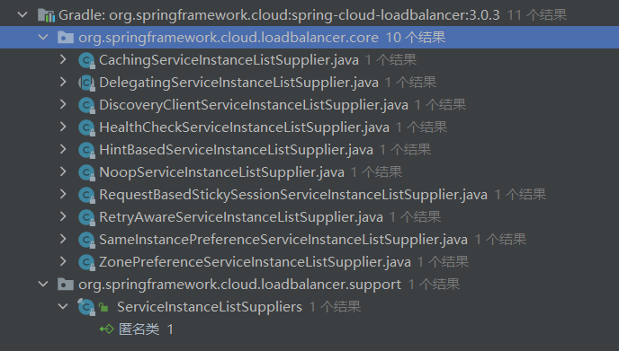

Spring Cloud 提供了自己的客户端负载均衡器抽象和实现。 对于负载均衡机制，添加了 ReactiveLoadBalancer 接口，从响应式的ServiceInstanceListSupplier 中选择实例，并为其提供了基于 Round 和 Random 的实现。  目前，我们支持基于服务发现的ServiceInstanceListSupplier，该实现使用类路径中可用的发现发现客户端检索可用实例。

# 如何切换负载均衡算法

默认使用的 ReactiveLoadBalancer 实现是 RoundRobinLoadBalancer。 要为选定的服务或所有服务切换到不同的实现，您可以使用自定义 LoadBalancer 配置机制。

例如，可以通过@LoadBalancerClient的configuration 属性配置RandomLoadBalancer：

```java
public class CustomLoadBalancerConfiguration { //注意不要添加 @Configuration 

    @Bean
    ReactorLoadBalancer<ServiceInstance> randomLoadBalancer(Environment environment,
            LoadBalancerClientFactory loadBalancerClientFactory) {
        String name = environment.getProperty(LoadBalancerClientFactory.PROPERTY_NAME);
        return new RandomLoadBalancer(loadBalancerClientFactory
                .getLazyProvider(name, ServiceInstanceListSupplier.class),
                name);
    }
}
```


# 如何集成负载均衡客户端


为了方便使用 Spring Cloud LoadBalancer，我们提供了可与 WebClient 一起使用的 ReactorLoadBalancerExchangeFilterFunction 和与 RestTemplate 一起使用的 BlockingLoadBalancerClient。 您可以在以下部分中查看更多信息和用法示例：


## `RestTemplate` 

```java
@Configuration
public class MyConfiguration {

    @LoadBalanced
    @Bean
    RestTemplate restTemplate() {
        return new RestTemplate();
    }
}

public class MyClass {
    @Autowired
    private RestTemplate restTemplate;

    public String doOtherStuff() {
        String results = restTemplate.getForObject("http://stores/stores", String.class);
        return results;
    }
}
```

URI 需要使用虚拟主机名（即服务名，而不是主机名）。 BlockingLoadBalancerClient 用于创建完整的物理地址。


### 多个实例的情况

```java
@Configuration
public class MyConfiguration {

    @LoadBalanced
    @Bean
    RestTemplate loadBalanced() {
        return new RestTemplate();
    }

    @Primary
    @Bean
    RestTemplate restTemplate() {
        return new RestTemplate();
    }
}

public class MyClass {
@Autowired
private RestTemplate restTemplate;

    @Autowired
    @LoadBalanced
    private RestTemplate loadBalanced;

    public String doOtherStuff() {
        return loadBalanced.getForObject("http://stores/stores", String.class);
    }

    public String doStuff() {
        return restTemplate.getForObject("http://example.com", String.class);
    }
}
```

## `WebClient` 

```java
@Configuration
public class MyConfiguration {

    @Bean
    @LoadBalanced
    public WebClient.Builder loadBalancedWebClientBuilder() {
        return WebClient.builder();
    }
}

public class MyClass {
    @Autowired
    private WebClient.Builder webClientBuilder;

    public Mono<String> doOtherStuff() {
        return webClientBuilder.build().get().uri("http://stores/stores")
                        .retrieve().bodyToMono(String.class);
    }
}
```

URI 需要使用虚拟主机名（即服务名，而不是主机名）。 Spring Cloud LoadBalancer 用于创建完整的物理地址。


### 多个实例的情况

```java
@Configuration
public class MyConfiguration {

    @LoadBalanced
    @Bean
    WebClient.Builder loadBalanced() {
        return WebClient.builder();
    }

    @Primary
    @Bean
    WebClient.Builder webClient() {
        return WebClient.builder();
    }
}

public class MyClass {
    @Autowired
    private WebClient.Builder webClientBuilder;

    @Autowired
    @LoadBalanced
    private WebClient.Builder loadBalanced;

    public Mono<String> doOtherStuff() {
        return loadBalanced.build().get().uri("http://stores/stores")
                        .retrieve().bodyToMono(String.class);
    }

    public Mono<String> doStuff() {
        return webClientBuilder.build().get().uri("http://example.com")
                        .retrieve().bodyToMono(String.class);
    }
}
```


Spring WebFlux 可以使用反应式和非反应式 WebClient 配置.


您可以将 WebClient 配置为使用 ReactiveLoadBalancer。 如果您将 Spring Cloud LoadBalancer starter 添加到您的项目中并且如果 spring-webflux 在类路径上，则 ReactorLoadBalancerExchangeFilterFunction 是自动配置的。 以下示例显示了如何配置 WebClient 以使用反应式负载均衡器：

```java
public class MyClass {
    @Autowired
    private ReactorLoadBalancerExchangeFilterFunction lbFunction;

    public Mono<String> doOtherStuff() {
        return WebClient.builder().baseUrl("http://stores")
            .filter(lbFunction)
            .build()
            .get()
            .uri("/stores")
            .retrieve()
            .bodyToMono(String.class);
    }
}
```

URI 需要使用虚拟主机名（即服务名，而不是主机名）。 ReactorLoadBalancer 用于创建完整的物理地址。


如果 spring-webflux 在类路径上，LoadBalancerExchangeFilterFunction 是自动配置的。 但是请注意，这在后台使用了一个非反应式客户端。 以下示例显示如何配置 WebClient 以使用负载均衡器：

```java
public class MyClass {
    @Autowired
    private LoadBalancerExchangeFilterFunction lbFunction;

    public Mono<String> doOtherStuff() {
        return WebClient.builder().baseUrl("http://stores")
            .filter(lbFunction)
            .build()
            .get()
            .uri("/stores")
            .retrieve()
            .bodyToMono(String.class);
    }
}
```

URI 需要使用虚拟主机名（即服务名，而不是主机名）。 LoadBalancerClient 用于创建完整的物理地址。


# 

# ServiceInstanceListSupplier


## 缓存实例信息的负载均衡器

实现类：CachingServiceInstanceListSupplier


除了在每次必须选择实例时，通过 DiscoveryClient 检索实例的 ServiceInstanceListSupplier 实现之外，我们还提供了两个缓存实现。


- Caffeine-based实现：需要com.github.ben-manes.caffeine:caffeine在classpath。
- DefaultLoadBalancerCache： 默认使用


spring.cloud.loadbalancer.cache.ttl 设置缓存的过期时间，默认35s

spring.cloud.loadbalancer.cache.capacity 设置缓存的初始容量。默认256

spring.cloud.loadbalancer.cache.enabled： 是否启用缓存。


尽管基本的非缓存实现对于原型设计和测试很有用，但它的效率远低于缓存版本，因此我们建议始终在生产中使用缓存版本。


## zone-based 的负载均衡


为了启用基于区域的负载平衡，我们提供了 ZonePreferenceServiceInstanceListSupplier。 我们使用 DiscoveryClient 特定的区域配置（例如，eureka.instance.metadata-map.zone）来选择滤可用服务实例的。

您还可以通过设置 spring.cloud.loadbalancer.zone 属性的值来覆盖特定于 DiscoveryClient 的区域设置。目前仅支持Eureka 


ZonePreferenceServiceInstanceListSupplier 过滤检索到的实例并只返回同一区域内的实例。 如果该区域为空或同一区域内没有实例，则返回所有检索到的实例。


为了使用基于区域的负载平衡方法，您必须在自定义配置中实例化 ZonePreferenceServiceInstanceListSupplier bean。


我们使用委托来处理 ServiceInstanceListSupplier bean。 我们建议在 ZonePreferenceServiceInstanceListSupplier 的构造函数中传递一个 DiscoveryClientServiceInstanceListSupplier 委托，然后用 CachingServiceInstanceListSupplier 包装后者以利用 LoadBalancer 缓存机制。


```java
public class CustomLoadBalancerConfiguration {

    @Bean
    public ServiceInstanceListSupplier discoveryClientServiceInstanceListSupplier(
            ConfigurableApplicationContext context) {
        return ServiceInstanceListSupplier.builder()
                    .withDiscoveryClient()
                    .withZonePreference()
                    .withCaching()
                    .build(context);
    }
}

@Configuration
@LoadBalancerClient(value = "stores", configuration = CustomLoadBalancerConfiguration.class)
public class MyConfiguration {

    @Bean
    @LoadBalanced
    public WebClient.Builder loadBalancedWebClientBuilder() {
        return WebClient.builder();
    }
}
```

配置多个：

```java
@Configuration
@LoadBalancerClients({@LoadBalancerClient(value = "stores", configuration = StoresLoadBalancerClientConfiguration.class), @LoadBalancerClient(value = "customers", configuration = CustomersLoadBalancerClientConfiguration.class)})
public class MyConfiguration {

    @Bean
    @LoadBalanced
    public WebClient.Builder loadBalancedWebClientBuilder() {
        return WebClient.builder();
    }
}
```

# 

## 负载均衡的健康检查

可以为 LoadBalancer 启用计划的 HealthCheck。 为此提供了 HealthCheckServiceInstanceListSupplier。 它会定期验证ServiceInstanceListSupplier 提供的实例是否仍然存在并且只返回健康的实例。


这种机制在使用 SimpleDiscoveryClient 时特别有用。 对于由实际 Service Registry 支持的客户端，没有必要使用，因为我们在查询外部 ServiceDiscovery 后已经获得了健康的实例。


HealthCheckServiceInstanceListSupplier 使用以 spring.cloud.loadbalancer.health-check 为前缀的属性。 您可以为调度程序设置 initialDelay 和interval 。 您可以通过设置 spring.cloud.loadbalancer.health-check.path.default 属性的值来设置健康检查 URL 的默认路径。 您还可以通过设置 spring.cloud.loadbalancer.health-check.path.[SERVICE_ID] 属性的值，将 [SERVICE_ID] 替换为您的服务的正确 ID，为任何给定服务设置特定值。 如果未设置路径，则默认使用 /actuator/health。


为了使用健康检查调度程序方法，您必须在自定义配置中实例化 HealthCheckServiceInstanceListSupplier bean。

我们使用委托来处理 ServiceInstanceListSupplier bean。 我们建议在 HealthCheckServiceInstanceListSupplier 的构造函数中传递一个 DiscoveryClientServiceInstanceListSupplier 委托。

您可以使用此示例配置进行设置：

```java
public class CustomLoadBalancerConfiguration {

    @Bean
    public ServiceInstanceListSupplier discoveryClientServiceInstanceListSupplier(
            ConfigurableApplicationContext context) {
        return ServiceInstanceListSupplier.builder()
                    .withDiscoveryClient()
                    .withHealthChecks()
                    .build(context);
        }
    }
```


## 具有粘性的负载均衡器

您可以设置 LoadBalancer，使其更喜欢先前选择的实例（如果该实例可用）。

为此，您需要使用 SameInstancePreferenceServiceInstanceListSupplier。 您可以通过将 spring.cloud.loadbalancer.configurations 的值设置为 same-instance-preference 或提供您自己的 ServiceInstanceListSupplier bean — 来配置它，例如：

```java
public class CustomLoadBalancerConfiguration {

    @Bean
    public ServiceInstanceListSupplier discoveryClientServiceInstanceListSupplier(
            ConfigurableApplicationContext context) {
        return ServiceInstanceListSupplier.builder()
                    .withDiscoveryClient()
                    .withSameInstancePreference()
                    .build(context);
        }
    }
```

## session粘性的负载均衡器


您可以设置 LoadBalancer，使其更喜欢在请求 cookie 中提供 instanceId 的实例。 请求通过 ClientRequestContext 或 ServerHttpRequestContext 传递给 LoadBalancer，达到负载目的，SC LoadBalancer 交换过滤器组件和过滤器使用它们。

为此，您需要使用 RequestBasedStickySessionServiceInstanceListSupplier。 您可以通过将 spring.cloud.loadbalancer.configurations 的值设置为 request-based-sticky-session 或通过提供您自己的 ServiceInstanceListSupplier bean — 来配置它，例如：

```java
public class CustomLoadBalancerConfiguration {

    @Bean
    public ServiceInstanceListSupplier discoveryClientServiceInstanceListSupplier(
            ConfigurableApplicationContext context) {
        return ServiceInstanceListSupplier.builder()
                    .withDiscoveryClient()
                    .withRequestBasedStickySession()
                    .build(context);
        }
    }
```

对于该功能，在转发请求之前更新选定的服务实例（如果原始请求 cookie 不可用，则该实例可能与原始请求 cookie 中的实例不同）很有用。 为此，请将 spring.cloud.loadbalancer.sticky-session.add-service-instance-cookie 的值设置为 true。


默认情况下，cookie 的名称是 sc-lb-instance-id。 您可以通过更改 spring.cloud.loadbalancer.instance-id-cookie-name 属性的值来修改它。


## 根据请求信息选择负载均衡器

Spring Cloud LoadBalancer 允许你在request对象中传递提示字符串，被`ReactiveLoadBalancer` 获取并使用。


通过spring.cloud.loadbalancer.hint.default为所有服务设置

`通过spring.cloud.loadbalancer.hint.[SERVICE_ID]` 为具体服务设置


HintBasedServiceInstanceListSupplier实现了该功能。HintBasedServiceInstanceListSupplier 检查提示请求标头（默认标头名称为 X-SC-LB-Hint，但您可以通过更改 spring.cloud.loadbalancer.hint-header-name 属性的值来修改它），如果是 找到一个提示请求头，使用头中传递的提示值过滤服务实例。


如果没有添加提示头，HintBasedServiceInstanceListSupplier 使用属性中的提示值来过滤服务实例。


如果头或属性没有设置提示，则返回委托提供的所有服务实例。


在过滤时，HintBasedServiceInstanceListSupplier 查找在其 metadataMap 中的hint key下设置了匹配值的服务实例。 如果没有找到匹配的实例，则返回委托提供的所有实例。


```java
public class CustomLoadBalancerConfiguration {

    @Bean
    public ServiceInstanceListSupplier discoveryClientServiceInstanceListSupplier(
            ConfigurableApplicationContext context) {
        return ServiceInstanceListSupplier.builder()
                    .withDiscoveryClient()
                    .withHints()
                    .withCaching()
                    .build(context);
    }
}
```

# 失败重试

负载均衡的 RestTemplate 可以配置为重试失败的请求。 默认情况下，此逻辑被禁用。 对于非响应式版本（使用 RestTemplate），您可以通过将 Spring Retry 添加到应用程序的类路径来启用它。 对于响应式版本（使用 WebTestClient），您需要设置 `spring.cloud.loadbalancer.retry.enabled=true ` 。


如果您想在类路径上使用 Spring Retry 或 Reactive Retry 禁用重试逻辑，您可以设置 spring.cloud.loadbalancer.retry.enabled=false。


对于非响应式实现，如果您想在重试中实现 BackOffPolicy，您需要创建一个 LoadBalancedRetryFactory 类型的 bean 并覆盖 createBackOffPolicy() 方法。


对于反应式实现，您只需要通过将 spring.cloud.loadbalancer.retry.backoff.enabled 设置为 false 来启用它。


- spring.cloud.loadbalancer.retry.maxRetriesOnSameServiceInstance - 指示应在同一个 ServiceInstance 上重试请求的次数（为每个选定的实例单独计数）
- spring.cloud.loadbalancer.retry.maxRetriesOnNextServiceInstance - 指示应重试新选择的 ServiceInstance 请求的次数
- spring.cloud.loadbalancer.retry.retryableStatusCodes - 始终重试失败请求的状态代码。


响应式还有另外的属性：

- spring.cloud.loadbalancer.retry.backoff.minBackoff：设置最小退避持续时间（默认为 5 毫秒） 
- spring.cloud.loadbalancer.retry.backoff.maxBackoff： 设置最大退避持续时间（默认情况下，最大长度值为毫秒） 
- spring.cloud.loadbalancer.retry.backoff.jitter：- 设置用于计算每次调用的实际退避持续时间的抖动（默认为 0.5）。


对于反应式实现，您还可以实现自己的 LoadBalancerRetryPolicy 以更详细地控制负载平衡的调用重试。

```java
@Configuration
public class MyConfiguration {
    @Bean
    LoadBalancedRetryFactory retryFactory() {
        return new LoadBalancedRetryFactory() {
            @Override
            public BackOffPolicy createBackOffPolicy(String service) {
                return new ExponentialBackOffPolicy();
            }
        };
    }
}
```

对于负载平衡重试，默认情况下，我们使用 RetryAwareServiceInstanceListSupplier 包装 ServiceInstanceListSupplier bean，以从先前选择的实例中选择一个不同的实例（如果可用）。 您可以通过将 spring.cloud.loadbalancer.retry.avoidPreviousInstance 的值设置为 false 来禁用此行为。


如果您想将一个或多个 RetryListener 实现添加到您的重试功能中，您需要创建一个 LoadBalancedRetryListenerFactory 类型的 bean 并返回您想用于给定服务的 RetryListener 数组，如以下示例所示：

```java
@Configuration
public class MyConfiguration {
    @Bean
    LoadBalancedRetryListenerFactory retryListenerFactory() {
        return new LoadBalancedRetryListenerFactory() {
            @Override
            public RetryListener[] createRetryListeners(String service) {
                return new RetryListener[]{new RetryListener() {
                    @Override
                    public <T, E extends Throwable> boolean open(RetryContext context, RetryCallback<T, E> callback) {
                        //TODO Do you business...
                        return true;
                    }

                    @Override
                     public <T, E extends Throwable> void close(RetryContext context, RetryCallback<T, E> callback, Throwable throwable) {
                        //TODO Do you business...
                    }

                    @Override
                    public <T, E extends Throwable> void onError(RetryContext context, RetryCallback<T, E> callback, Throwable throwable) {
                        //TODO Do you business...
                    }
                }};
            }
        };
    }
}
```

个人心得： 建议开启失败重试，重试的次数为1 ，对timeout、网络异常、服务异常等错误开启切换到不同的服务重试。其他类型的异常不要开启重试。另外，post请求需要慎重重试。


思考： 服务实例发生异常之后，该服务实例会从Supply中删除吗？ 答案是没有。spring 没有提供相关机制，只有服务实例不在线的时候，才会不去请求该服务。

# 对负载的请求进行转换


您可以使用选定的 ServiceInstance 来转换负载均衡的 HTTP 请求。

对于 RestTemplate，需要实现和定义 LoadBalancerRequestTransformer 如下：

```java
@Bean
public LoadBalancerRequestTransformer transformer() {
    return new LoadBalancerRequestTransformer() {
        @Override
        public HttpRequest transformRequest(HttpRequest request, ServiceInstance instance) {
            return new HttpRequestWrapper(request) {
                @Override
                public HttpHeaders getHeaders() {
                    HttpHeaders headers = new HttpHeaders();
                    headers.putAll(super.getHeaders());
                    headers.add("X-InstanceId", instance.getInstanceId());
                    return headers;
                }
            };
        }
    };
}
```

对于WebClient，需要实现和定义LoadBalancerClientRequestTransformer如下：

```java
@Bean
public LoadBalancerClientRequestTransformer transformer() {
    return new LoadBalancerClientRequestTransformer() {
        @Override
        public ClientRequest transformRequest(ClientRequest request, ServiceInstance instance) {
            return ClientRequest.from(request)
                    .header("X-InstanceId", instance.getInstanceId())
                    .build();
        }
    };
}
```

如果定义了多个转换器，它们将按照定义 Bean 的顺序应用。 或者，您可以使用 LoadBalancerRequestTransformer.DEFAULT_ORDER 或 LoadBalancerClientRequestTransformer.DEFAULT_ORDER 来指定顺序。


# 负载均衡的生命周期方法

`LoadBalancerLifecycle` 提供了生命周期的回调方法：

```java
onStart(Request<RC> request), 
onStartRequest(Request<RC> request, Response<T> lbResponse) 
onComplete(CompletionContext<RES, T, RC> completionContext)
supports(Class requestContextClass, Class responseClass, Class serverTypeClass)
```

- Request包含服务实例数据，传递给下游的请求
- completionContext： 包含 LoadBalancer 响应，包括选定的服务实例、针对该服务实例执行的请求的状态和（如果可用）返回到下游客户端的响应，以及（如果发生异常）相应的 Throwable。


我们提供了一个名为 MicrometerStatsLoadBalancerLifecycle 的 LoadBalancerLifecycle bean，它使用 Micrometer 为负载平衡调用提供统计信息。


为了将此 bean 添加到您的应用程序上下文中，请将 spring.cloud.loadbalancer.stats.micrometer.enabled 的值设置为 true 并使用 MeterRegistry（例如，通过将 Spring Boot Actuator 添加到您的项目中）。注册的指标：

- loadbalancer.requests.active：允许您监控任何服务实例的当前活动请求数量的gauge （服务实例数据可通过标签获得）；
- loadbalancer.requests.success：一个计时器，用于测量已结束将响应传递给底层客户端的任何负载平衡请求的执行时间；
- loadbalancer.requests.failed：一个计时器，用于测量以异常结束的任何负载平衡请求的执行时间；
- loadbalancer.requests.discard：一个计数器，用于测量被丢弃的负载平衡请求的数量，即负载均衡器尚未检索到运行请求的服务实例的请求。


只要可用，有关服务实例、请求数据和响应数据的附加信息就会通过标签添加到指标中。


# 源码


```java
@FunctionalInterface
public interface Supplier<T> {
    T get();
}
public interface ServiceInstanceListSupplier extends Supplier<Flux<List<ServiceInstance>>> {

    //获取服务的ID
	String getServiceId();

    //扩展无参数的get方法，使其可以根据请求选择服务实例
	default Flux<List<ServiceInstance>> get(Request request) {
		return get();
	}

    //构建ServiceInstanceListSupplier实例
	static ServiceInstanceListSupplierBuilder builder() {
		return new ServiceInstanceListSupplierBuilder();
	}

}
```

具体的实现类：



我们来看DiscoveryClientServiceInstanceListSupplier的具体实现：

```java
	public static final String SERVICE_DISCOVERY_TIMEOUT = "spring.cloud.loadbalancer.service-discovery.timeout";

	private static final Log LOG = LogFactory.getLog(DiscoveryClientServiceInstanceListSupplier.class);

	private Duration timeout = Duration.ofSeconds(30);

	private final String serviceId;

	private final Flux<List<ServiceInstance>> serviceInstances;

	public DiscoveryClientServiceInstanceListSupplier(DiscoveryClient delegate, Environment environment) {
		this.serviceId = environment.getProperty(PROPERTY_NAME);
		resolveTimeout(environment);
		this.serviceInstances = Flux.defer(() -> Flux.just(delegate.getInstances(serviceId)))
				.subscribeOn(Schedulers.boundedElastic()).timeout(timeout, Flux.defer(() -> {
					logTimeout();
					return Flux.just(new ArrayList<>());
				})).onErrorResume(error -> {
					logException(error);
					return Flux.just(new ArrayList<>());
				});
	}

	@Override
	public String getServiceId() {
		return serviceId;
	}

	@Override
	public Flux<List<ServiceInstance>> get() {
		return serviceInstances;
	}
```

- spring.cloud.loadbalancer.service-discovery.timeout是 loadblancer调用DiscoveryClient获取服务实例列表的超时时间，超时则返回空的服务实例列表
