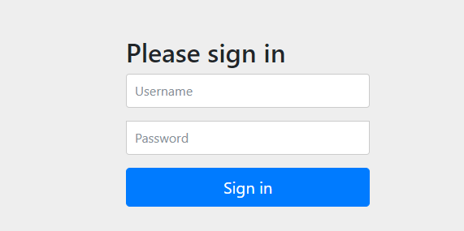
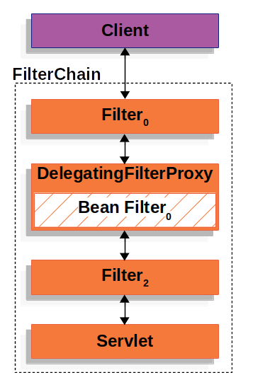
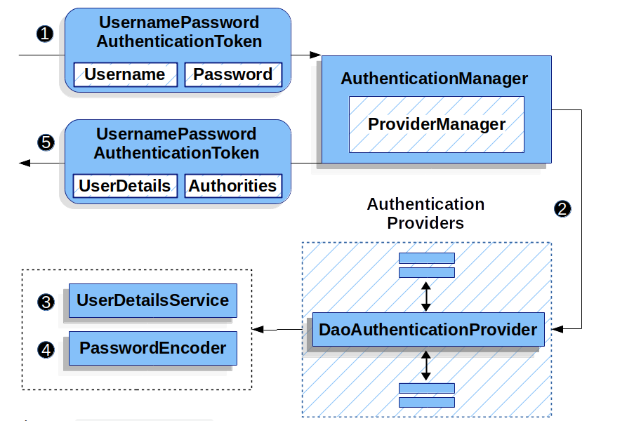

# 快速入门

### 第一步：依赖

```xml
        <dependency>
            <groupId>org.springframework.boot</groupId>
            <artifactId>spring-boot-starter-security</artifactId>
        </dependency>
        <dependency>
            <groupId>org.springframework.boot</groupId>
            <artifactId>spring-boot-starter-web</artifactId>
        </dependency>
```

### 第二步：编写测试controller

```java
@RestController
@RequestMapping("/hello")
public class HelloController {

    @GetMapping
    public String hello() {
        return "hello";
    }
}
```

### 第三步启动并测试

1. 浏览器中输入： http://localhost:8080/hello
2. 浏览器会呈现登录页，如下：



用户名是 `user` ，密码在启动的控制台中打印。


至此，一个安全的web应用就产生了。接下来，我们来看一下spring默认的配置。

## spring boot 自动配置


- 启用 Spring Security 的默认配置，它创建一个 servlet 过滤器（名为 springSecurityFilterChain 的 bean）。 此 bean 负责应用程序中的所有安全性（保护应用程序 URL、验证提交的用户名和密码、重定向到登录表单等）。
- 使用用户名 user 和随机生成的密码创建一个 UserDetailsService bean，该密码登录到控制台。
- 使用名为 springSecurityFilterChain 的 bean 向 Servlet 容器注册过滤器。


Spring Boot 配置的并不多，但是却做了很多。 功能摘要如下：


- 需要经过身份验证的用户才能与应用程序进行任何交互
- 为您生成默认登录表单
- 让用户名 user 和登录到控制台的密码的用户使用基于表单的身份验证进行身份验证
- 使用 BCrypt 保护密码存储
- 让用户登出
- CSRF 攻击预防
- 会话固定保护
- 安全标头集成

- - 用于安全请求的 HTTP 严格传输安全
  - X-Content-Type-Options 集成
  - 缓存控制（稍后可以由您的应用程序覆盖以允许缓存静态资源）
  - X-XSS-保护集成
  - X-Frame-Options 集成有助于防止点击劫持

- 与以下 Servlet API 方法集成：

- - `HttpServletRequest#getRemoteUser()`
  - `HttpServletRequest.html#getUserPrincipal()`
  - `HttpServletRequest.html#isUserInRole(java.lang.String)`
  - [`HttpServletRequest.html#login(java.lang.String, java.lang.String)`](https://docs.oracle.com/javaee/6/api/javax/servlet/http/HttpServletRequest.html#login(java.lang.String, java.lang.String))
  - `HttpServletRequest.html#logout()`

## 架构


客户端向应用程序发送请求，spring容器创建一个 FilterChain，该FilterChain包含多个Filters和一个处理请求的 `Servlet `。 在 Spring MVC 应用程序中，该`Servlet `是 `DispatcherServlet `的一个实例。其中的一个Filter实现是DelegatingFilterProxy ，`DelegatingFilterProxy` 从spring 容器中查找 filter bean 并调用。 伪代码如下：

```java
public void doFilter(ServletRequest request, ServletResponse response, FilterChain chain) {
    // Lazily get Filter that was registered as a Spring Bean
    // For the example in DelegatingFilterProxy delegate is an instance of Bean Filter0
    Filter delegate = getFilterBean(someBeanName);
    // delegate work to the Spring Bean
    delegate.doFilter(request, response);
}
```


Servlet 容器在启动的时候注册Filter，但此时，spring容器还未启动，自然不知道 Spring 定义的 filter Bean。 DelegatingFilterProxy使用延时加载将spring中实现的filter绑定到Servlet 容器生命周期（不是servlet中的注册Filter）。




[DelegatingFilterProxy](https://docs.spring.io/spring-security/site/docs/current/reference/html5/#servlet-delegatingfilterproxy) 本身并不工作，他委托给`SecurityFilterChain（Filter的一个实例），`SecurityFilterChain将请求传递到filter 链路中

 


FilterChainProxy 使用 SecurityFilterChain 来确定应为此请求调用哪些 Spring 安全过滤器。


事实上，FilterChainProxy 可以用来确定应该使用哪个 SecurityFilterChain。 这允许为应用程序的不同部分提供完全独立的配置。


图中，FilterChainProxy 决定应该使用哪个 SecurityFilterChain。 只会调用匹配的第一个 SecurityFilterChain。 如果请求 /api/messages/ 的 URL，它将首先匹配 SecurityFilterChain0 的 /api/ **模式，即使它也匹配 SecurityFilterChain****n****，也只会调用 SecurityFilterChain****0****。 如果请求 /messages/ 的 URL，它与 SecurityFilterChain****0** **的 /api/** 模式不匹配，因此 FilterChainProxy 将继续尝试每个 SecurityFilterChain。 假设没有其他与 SecurityFilterChainn 匹配的 ，SecurityFilterChainn  实例将被调用。


那么spring security到底提供了那些Filter供我们使用呢？


以下是 Spring Security Filter 排序的完整列表：

- ChannelProcessingFilter
- WebAsyncManagerIntegrationFilter
- SecurityContextPersistenceFilter
- HeaderWriterFilter
- CorsFilter
- CsrfFilter
- LogoutFilter
- OAuth2AuthorizationRequestRedirectFilter
- Saml2WebSsoAuthenticationRequestFilter
- X509AuthenticationFilter
- AbstractPreAuthenticatedProcessingFilter
- CasAuthenticationFilter
- OAuth2LoginAuthenticationFilter
- Saml2WebSsoAuthenticationFilter
- `UsernamePasswordAuthenticationFilter`
- OpenIDAuthenticationFilter
- DefaultLoginPageGeneratingFilter
- DefaultLogoutPageGeneratingFilter
- ConcurrentSessionFilter
- `DigestAuthenticationFilter`
- BearerTokenAuthenticationFilter
- `BasicAuthenticationFilter`
- RequestCacheAwareFilter
- SecurityContextHolderAwareRequestFilter
- JaasApiIntegrationFilter
- RememberMeAuthenticationFilter
- AnonymousAuthenticationFilter
- OAuth2AuthorizationCodeGrantFilter
- SessionManagementFilter
- `ExceptionTranslationFilter`
- `FilterSecurityInterceptor`
- SwitchUserFilter


## 常用的Filter

### ExceptionTranslationFilter 


ExceptionTranslationFilter 允许将 AccessDeniedException 和 AuthenticationException 转换为 HTTP 响应。


1. ExceptionTranslationFilter 调用 FilterChain.doFilter(request, response) 来调用应用程序的其余部分。
2. 如果用户未通过身份验证或者是 AuthenticationException，则启动身份验证。

- - SecurityContextHolder 被清除
  - HttpServletRequest 保存在 RequestCache 中。 当用户认证成功时，RequestCache 用于重放原始请求。
  - AuthenticationEntryPoint 用于向客户端请求身份凭据。 例如，它可能会重定向到登录页面或发送 WWW-Authenticate 标头。

1. 否则，如果它是 AccessDeniedException，则拒绝访问。 调用 AccessDeniedHandler 来处理拒绝访问。


# 认证

下面是认证相关的组件：

- [SecurityContextHolder](https://docs.spring.io/spring-security/site/docs/current/reference/html5/#servlet-authentication-securitycontextholder) ：SecurityContextHolder 是 Spring Security 存储认证人员详细信息的地方。
- [SecurityContext](https://docs.spring.io/spring-security/site/docs/current/reference/html5/#servlet-authentication-securitycontext) ：从 SecurityContextHolder 获取并包含当前已验证用户的身份验证。
- [Authentication](https://docs.spring.io/spring-security/site/docs/current/reference/html5/#servlet-authentication-authentication) ：，存储用户的具体信息，例如用户名和权限信息。
- [GrantedAuthority](https://docs.spring.io/spring-security/site/docs/current/reference/html5/#servlet-authentication-granted-authority) ：授予主体的权限（即角色、范围等）
- [AuthenticationManager](https://docs.spring.io/spring-security/site/docs/current/reference/html5/#servlet-authentication-authenticationmanager) ：Spring Security 的filter 使用该组件验证用户的身份信息。
- [ProviderManager](https://docs.spring.io/spring-security/site/docs/current/reference/html5/#servlet-authentication-providermanager) ：AuthenticationManager 最常见的实现。
- [AuthenticationProvider](https://docs.spring.io/spring-security/site/docs/current/reference/html5/#servlet-authentication-authenticationprovider) ：由 ProviderManager 用于执行特定类型的身份验证。
- `AuthenticationEntryPoint` ：向客户端请求凭据（即重定向到登录页面、发送 WWW-Authenticate 响应等）
- [AbstractAuthenticationProcessingFilter](https://docs.spring.io/spring-security/site/docs/current/reference/html5/#servlet-authentication-abstractprocessingfilter) ：用于身份验证的基本过滤器。 可以查看该类了解身份验证流程以及各个组件如何协同工作。

## SecurityContextHolder


SecurityContextHolder 存储所有已认证用户的信息。下面是SecurityContextHolder 设置用户信息的API

```java
SecurityContext context = SecurityContextHolder.createEmptyContext(); 
Authentication authentication =
    new TestingAuthenticationToken("username", "password", "ROLE_USER"); 
context.setAuthentication(authentication);

SecurityContextHolder.setContext(context); 
```


```java
SecurityContext context = SecurityContextHolder.getContext();
Authentication authentication = context.getAuthentication();
String username = authentication.getName();
Object principal = authentication.getPrincipal();
Collection<? extends GrantedAuthority> authorities = authentication.getAuthorities();
```


默认情况下，SecurityContextHolder 使用 ThreadLocal 来存储这些详细信息，这意味着 SecurityContext 始终可用于同一线程中的方法，即使 SecurityContext 没有作为参数显式传递给这些方法。 如果在处理当前主体的请求后清除线程，以这种方式使用 ThreadLocal 是非常安全的。 Spring Security 的 FilterChainProxy 确保始终清除 SecurityContext。


某些应用程序并不完全适合使用 ThreadLocal，因为它们使用线程的特定方式。  可以在启动时使用策略配置 SecurityContextHolder 以指定您希望如何存储上下文。

-  对于独立应用程序，您可以使用 SecurityContextHolder.MODE_GLOBAL 策略。
-  其他应用程序可能希望安全线程产生的线程也采用相同的安全身份。 这是通过使用 SecurityContextHolder.MODE_INHERITABLETHREADLOCAL 实现的。


 您可以通过两种方式更改策略。 第一个是设置系统属性，第二个是调用 SecurityContextHolder 上的静态方法。

## SecurityContext


## Authentication

Authentication 在 Spring Security 中有两个主要目的：

- 作为AuthenticationManager 的输入，用于用户身份验证的凭据。 在这种情况下，isAuthenticated() 返回 false。
- 代表当前经过身份验证的用户。 当前的身份验证可以从 SecurityContext 中获取。

`Authentication`包含：

- principal：- 识别用户。 当使用用户名/密码进行身份验证时，这通常是 UserDetails 的一个实例。
- credentials：通常是密码。 在许多情况下，这将在用户通过身份验证后被清除，以确保它不会泄露。
- authorities：- GrantedAuthoritys 是授予用户的高级权限。 一些示例是角色或范围。

## GrantedAuthority

GrantedAuthoritys 可以从 Authentication.getAuthorities() 方法获得。 此方法提供了 GrantedAuthority 对象的集合。 毫无疑问，GrantedAuthority 是授予主体的权限。 此类权限通常是“角色”，例如 ROLE_ADMINISTRATOR 或 ROLE_HR_SUPERVISOR。  当使用基于用户名/密码的身份验证时，GrantedAuthoritys 通常由 UserDetailsService 加载。


通常 GrantedAuthority 是说用户对应用程序的权限。 它们并不特定于给定的域对象（数据权限）。 因此，您不可能有一个 GrantedAuthority 来表示对 Employee 对象编号 54 的权限，因为如果有数千个这样的权限，您将很快耗尽内存。 

## AuthenticationManager

AuthenticationManager 是定义 Spring Security 的过滤器如何执行身份验证的 API。 控制器（spring security filter）调用 AuthenticationManager 认证用户，返回 Authentication，然后设置 在SecurityContextHolder 中。AuthenticationManager 最常见的实现是 ProviderManager。

## ProviderManager

 ProviderManager 支持多种类型的身份验证，他委托 AuthenticationProvider 列表工作。 每个 AuthenticationProvider 执行特定的身份验证，都有机会表明身份验证应该成功、失败或表明它无法做出决定并允许下游 AuthenticationProvider 做出决定。 如果配置的 AuthenticationProvider列表都无法进行身份验证，则身份验证将失败并显示 ProviderNotFoundException，这是一个特殊的 AuthenticationException。


ProviderManager 还允许配置一个可选的父 AuthenticationManager，在没有 AuthenticationProvider 可以执行身份验证的情况下咨询它。 parent 可以是任何类型的 AuthenticationManager，但它通常是 ProviderManager 的实例。


事实上，多个 ProviderManager 实例可能共享同一个父 AuthenticationManager。 这在有多个 SecurityFilterChain 实例具有一些共同的身份验证（共享父 AuthenticationManager）但也有不同的身份验证机制（不同的 ProviderManager 实例）的情况下很常见。


默认情况下，ProviderManager 将尝试从成功的身份验证请求返回的 Authentication 对象中清除任何敏感凭据信息。 这可以防止密码等信息在 HttpSession 中保留的时间超过所需时间。

## AuthenticationProvider


## `AuthenticationEntryPoint`


客户端没有登录，访问未经身份验证的请求时，AuthenticationEntryPoint 实现会执行重定向到登录页面，使用 WWW-Authenticate 标头等进行响应。

## AbstractAuthenticationProcessingFilter


1. 当用户提交他们的凭据时，AbstractAuthenticationProcessingFilter 从 HttpServletRequest 创建一个 Authentication 以进行身份验证。 创建的身份验证类型取决于 AbstractAuthenticationProcessingFilter 的子类。 例如，UsernamePasswordAuthenticationFilter 根据在 HttpServletRequest 中提交的用户名和密码创建一个 UsernamePasswordAuthenticationToken。
2. 接下来，将 Authentication 传递到 AuthenticationManager 进行身份验证。
3. 如果身份验证失败，则失败

- - SecurityContextHolder 被清除。
  - 调用 RememberMeServices.loginFail。 如果记住我没有配置，这是一个空操作。
  - AuthenticationFailureHandler 被调用。

1. 如果身份验证成功，则成功。

- - SessionAuthenticationStrategy 收到新登录通知。
  - 身份验证是在 SecurityContextHolder 上设置的。 稍后 SecurityContextPersistenceFilter 将 SecurityContext 保存到 HttpSession。
  - 调用 RememberMeServices.loginSuccess 。 如果记住我没有配置，这是一个空操作。
  - ApplicationEventPublisher 发布 InteractiveAuthenticationSuccessEvent。
  - AuthenticationSuccessHandler 被调用。


## 用户密码认证


Spring Security 提供了以下内置机制来从 HttpServletRequest 读取用户名和密码：

- [Form Login](https://docs.spring.io/spring-security/site/docs/current/reference/html5/#servlet-authentication-form)
- [Basic Authentication](https://docs.spring.io/spring-security/site/docs/current/reference/html5/#servlet-authentication-basic)
- [Digest Authentication](https://docs.spring.io/spring-security/site/docs/current/reference/html5/#servlet-authentication-digest)


### 表单登录


- 首先，用户向其未授权的资源 /private 发出未经身份验证的请求。
- Spring Security 的 FilterSecurityInterceptor 通过抛出 AccessDeniedException 指示未经身份验证的请求被拒绝。
- 由于用户未通过身份验证，ExceptionTranslationFilter 启动启动身份验证并使用已配置的 AuthenticationEntryPoint 将重定向发送到登录页面。 在大多数情况下，AuthenticationEntryPoint 是 LoginUrlAuthenticationEntryPoint 的一个实例。
- 然后浏览器将请求它重定向到的登录页面。
- 呈现登录页面


提交用户名和密码后，UsernamePasswordAuthenticationFilter 会验证用户名和密码。 UsernamePasswordAuthenticationFilter 扩展了 AbstractAuthenticationProcessingFilter。

# 

1. 当用户提交他们的用户名和密码时，UsernamePasswordAuthenticationFilter 通过从 HttpServletRequest 中提取用户名和密码来创建一个 UsernamePasswordAuthenticationToken，这是一种Authentication。
2. 接下来，将 UsernamePasswordAuthenticationToken 传递到 AuthenticationManager 进行身份验证。 AuthenticationManager 的详细信息取决于用户信息的存储方式。
3.  如果身份验证失败，则失败

- - SecurityContextHolder 被清除。
  - 调用 RememberMeServices.loginFail。如果记住我没有配置，这是一个空操作。
  - AuthenticationFailureHandler 被调用。

1. 如果身份验证成功，则成功。

- - SessionAuthenticationStrategy 收到新登录通知。
  - 身份验证是在 SecurityContextHolder 上设置的。
  - 调用 RememberMeServices.loginSuccess 。如果记住我没有配置，这是一个空操作。
  - ApplicationEventPublisher 发布 InteractiveAuthenticationSuccessEvent。
  - AuthenticationSuccessHandler 被调用。通常，这是一个 SimpleUrlAuthenticationSuccessHandler，当我们重定向到登录页面时，它将重定向到 ExceptionTranslationFilter 保存的请求。


默认情况下启用 Spring Security 表单登录。 但是，一旦提供了任何基于 servlet 的配置，就必须明确提供基于表单的登录。 可以在下面找到一个最小的、显式的 Java 配置：

```java
protected void configure(HttpSecurity http) {
    http
        // ...
        .formLogin(withDefaults());
}
```

下面的配置演示了如何提供自定义登录表单:

```java
protected void configure(HttpSecurity http) throws Exception {
    http
        // ...
        .formLogin(form -> form
            .loginPage("/login")
            .permitAll()
        );
}
```

上面配置的登录页面如下：

```html
<!DOCTYPE html>
<html xmlns="http://www.w3.org/1999/xhtml" xmlns:th="https://www.thymeleaf.org">
    <head>
        <title>Please Log In</title>
    </head>
    <body>
        <h1>Please Log In</h1>
        <div th:if="${param.error}">
            Invalid username and password.</div>
        <div th:if="${param.logout}">
            You have been logged out.</div>
        <form th:action="@{/login}" method="post">
            <div>
            <input type="text" name="username" placeholder="Username"/>
            </div>
            <div>
            <input type="password" name="password" placeholder="Password"/>
            </div>
            <input type="submit" value="Log in" />
        </form>
    </body>
</html>
```

- 表单应提交到 /login 的
- 该表单包含一个由 Thymeleaf 自动包含的 CSRF 令牌。
- 表单应在名为 username 的参数中指定用户名
- 表单应在名为 password 的参数中指定密码
- 如果发现HTTP参数错误，说明用户未能提供有效的用户名/密码
- 如果找到 HTTP 参数 logout，则表示用户已成功注销


许多用户只需要自定义登录页面即可。 但是，如果需要，以上所有内容都可以通过其他配置进行自定义。


### Basic  认证


1. 首先，用户向其未授权的资源 /private 发出未经身份验证的请求。
2. Spring Security 的 FilterSecurityInterceptor 通过抛出 AccessDeniedException 指示未经身份验证的请求被拒绝。
3. 由于用户未通过身份验证，ExceptionTranslationFilter处理异常。 配置的 AuthenticationEntryPoint 是 BasicAuthenticationEntryPoint 的一个实例，它发送 WWW-Authenticate 标头。 RequestCache 通常是一个 NullRequestCache，它不保存请求，因为客户端能够重放它最初请求的请求。


当客户端收到 WWW-Authenticate 标头时，它知道它应该使用用户名和密码重试。


默认情况下启用 Spring Security 的 HTTP 基本身份验证支持。 但是，一旦提供了任何基于 servlet 的配置，就必须明确提供 HTTP Basic。


### Digest 认证


您不应使用摘要式身份验证，因为它被认为是不安全的。 最明显的问题是您必须以明文、加密或 MD5 格式存储密码。 所有这些存储格式都被认为是不安全的。 相反，您应该使用摘要式身份验证不支持的单向自适应密码哈希（即 bCrypt、PBKDF2、SCrypt 等）存储密码。


摘要式身份验证尝试解决basic身份验证的许多弱点，特别是以非明文形式通过网络发送凭据。 许多浏览器都支持摘要式身份验证。摘要式身份验证的核心是“nonce”, 这是服务器生成的值。 Spring Security 的 nonce 采用以下格式：

```shell
base64(expirationTime + ":" + md5Hex(expirationTime + ":" + key))
```

- expirationTime:nonce 过期的日期和时间，以毫秒表示
- key:防止修改 nonce 令牌的私钥

```java
@Autowired
UserDetailsService userDetailsService;

DigestAuthenticationEntryPoint entryPoint() {
    DigestAuthenticationEntryPoint result = new DigestAuthenticationEntryPoint();
    result.setRealmName("My App Relam");
    result.setKey("3028472b-da34-4501-bfd8-a355c42bdf92");
}

DigestAuthenticationFilter digestAuthenticationFilter() {
    DigestAuthenticationFilter result = new DigestAuthenticationFilter();
    result.setUserDetailsService(userDetailsService);
    result.setAuthenticationEntryPoint(entryPoint());
}

protected void configure(HttpSecurity http) throws Exception {
    http
        // ...
        .exceptionHandling(e -> e.authenticationEntryPoint(authenticationEntryPoint()))
        .addFilterBefore(digestFilter());
}
```

### 内存存储认证信息

 InMemoryUserDetailsManager 实现了 UserDetailsService 以提供在内存中检索的基于用户名/密码的身份验证的支持。 InMemoryUserDetailsManager 通过实现 UserDetailsManager 接口提供对 UserDetails 的管理。 当 Spring Security 配置为接受用户名/密码进行身份验证时，将使用基于 UserDetails 的身份验证。

```java
@Bean
public UserDetailsService users() {
    UserDetails user = User.builder()
        .username("user")
        .password("{bcrypt}$2a$10$GRLdNijSQMUvl/au9ofL.eDwmoohzzS7.rmNSJZ.0FxO/BTk76klW")
        .roles("USER")
        .build();
    UserDetails admin = User.builder()
        .username("admin")
        .password("{bcrypt}$2a$10$GRLdNijSQMUvl/au9ofL.eDwmoohzzS7.rmNSJZ.0FxO/BTk76klW")
        .roles("USER", "ADMIN")
        .build();
    return new InMemoryUserDetailsManager(user, admin);
}
```

### JDBC存储认证信息


JdbcDaoImpl 实现了 UserDetailsService 以提供对使用 JDBC 检索的基于用户名/密码的身份验证的支持。 JdbcUserDetailsManager 继承 JdbcDaoImpl 并实现UserDetailsManager 接口提供对 UserDetails 的管理。 当 Spring Security 配置为接受用户名/密码进行身份验证时，将使用基于 UserDetails 的身份验证。


默认的SQL:

```sql
create table users(
    username varchar_ignorecase(50) not null primary key,
    password varchar_ignorecase(500) not null,
    enabled boolean not null
);

create table authorities (
    username varchar_ignorecase(50) not null,
    authority varchar_ignorecase(50) not null,
    constraint fk_authorities_users foreign key(username) references users(username)
);
create unique index ix_auth_username on authorities (username,authority);


create table groups (
    id bigint generated by default as identity(start with 0) primary key,
    group_name varchar_ignorecase(50) not null
);

create table group_authorities (
    group_id bigint not null,
    authority varchar(50) not null,
    constraint fk_group_authorities_group foreign key(group_id) references groups(id)
);

create table group_members (
    id bigint generated by default as identity(start with 0) primary key,
    username varchar(50) not null,
    group_id bigint not null,
    constraint fk_group_members_group foreign key(group_id) references groups(id)
);
```

java配置如下：

```java
@Bean
UserDetailsManager users(DataSource dataSource) {
    UserDetails user = User.builder()
        .username("user")
        .password("{bcrypt}$2a$10$GRLdNijSQMUvl/au9ofL.eDwmoohzzS7.rmNSJZ.0FxO/BTk76klW")
        .roles("USER")
        .build();
    UserDetails admin = User.builder()
        .username("admin")
        .password("{bcrypt}$2a$10$GRLdNijSQMUvl/au9ofL.eDwmoohzzS7.rmNSJZ.0FxO/BTk76klW")
        .roles("USER", "ADMIN")
        .build();
    JdbcUserDetailsManager users = new JdbcUserDetailsManager(dataSource);
    users.createUser(user);
    users.createUser(admin);
    return users;
}
```

### UserDetails


UserDetails 由 UserDetailsService 返回。 DaoAuthenticationProvider 验证 UserDetails，然后返回具有主体的Authentication ，该主体是配置的 UserDetailsService 返回的 UserDetails。


### UserDetailsService


DaoAuthenticationProvider 使用 UserDetailsService 来检索用户名、密码和其他属性，以使用用户名和密码进行身份验证。 Spring Security 提供了 UserDetailsService 的内存和 JDBC 实现。


您可以通过将自定义 UserDetailsService 公开为 bean 来定义自定义身份验证。 例如，假设 CustomUserDetailsService 实现 UserDetailsService，以下将自定义身份验证：

```java
@Bean
CustomUserDetailsService customUserDetailsService() {
    return new CustomUserDetailsService();
}
```


### PasswordEncoder

Spring Security 的 servlet 通过与 PasswordEncoder 集成来支持安全存储密码。 可以通过公开 PasswordEncoder Bean 来自定义 Spring Security 使用的 PasswordEncoder 实现。

### DaoAuthenticationProvider


DaoAuthenticationProvider 是一个 AuthenticationProvider 实现，它利用 UserDetailsService 和 PasswordEncoder 来验证用户名和密码。


我们来看看 DaoAuthenticationProvider 在 Spring Security 中是如何工作的。 该图详细说明了来自读取用户名和密码的图中的 AuthenticationManager 如何工作。




1. 来自读取用户名和密码的身份验证过滤器将 UsernamePasswordAuthenticationToken 传递给由 ProviderManager 实现的 AuthenticationManager。
2. ProviderManager 被配置为使用 DaoAuthenticationProvider 类型的 AuthenticationProvider。
3. DaoAuthenticationProvider 从 UserDetailsService 中查找 UserDetails。
4. DaoAuthenticationProvider 然后使用 PasswordEncoder 验证上一步返回的 UserDetails 上的密码。
5. 当身份验证成功时，返回的身份验证类型为 UsernamePasswordAuthenticationToken 并且具有一个主体，即配置的 UserDetailsService 返回的 UserDetails。 最终，返回的 UsernamePasswordAuthenticationToken 将由身份验证过滤器在 SecurityContextHolder 上设置。

# 授权


GrantedAuthority 代表主体的权限信息，由 AuthenticationManager 插入到 Authentication 对象中，稍后在做出授权决定时由 AccessDecisionManager 读取。GrantedAuthority是一个接口：

```java
String getAuthority();
```

此方法允许 AccessDecisionManager 获得表示权限的精确字符串。 大多数权限都可以使用字符串表示，极少部分复杂的权限不能用是字符串表示，此时 getAuthority() 必须返回 null。


SimpleGrantedAuthority是具体的 GrantedAuthority 实现。 这允许将任何用户指定的字符串转换为 GrantedAuthority。 架构中包含的所有 AuthenticationProvider 都使用 SimpleGrantedAuthority 来填充 Authentication 对象。


## AccessDecisionManager

Spring Security 提供拦截器来控制对安全对象的访问，例如方法调用或 Web 请求。 AccessDecisionManager 做出关于是否允许调用继续进行的调用前决定。


AccessDecisionManager 由 AbstractSecurityInterceptor 调用，负责做出最终的访问控制决策。AccessDecisionManager 接口包含三个方法：

```java
int vote(Authentication authentication, Object object, Collection<ConfigAttribute> attrs);

boolean supports(ConfigAttribute attribute);

boolean supports(Class clazz);
```

- AccessDecisionManager 的decide方法传递了它需要的所有相关信息，以便做出授权决定。 object传递安全对象，例如此时对方法进行鉴权，此时的object是MethodInvocation，可以很轻松的获取方法上的信息，和实际入参。
- Supports(ConfigAttribute) 方法在启动时被 AbstractSecurityInterceptor 调用，以确定 AccessDecisionManager 是否可以处理传递的 ConfigAttribute。 
- supports(Class) 方法由security interceptor实现调用，以确保配置的 AccessDecisionManager 支持secure object 类型。


### 基于投票的 AccessDecisionManager 实现

虽然用户可以实现他们自己的 AccessDecisionManager 来控制授权的所有方面，但 Spring Security 包括几个基于投票的 AccessDecisionManager 实现。


使用这种方法，一系列 AccessDecisionVoter 实现被轮询授权决策。 AccessDecisionManager 评估投票结果决定是否抛出 AccessDeniedException。`AccessDecisionVoter` 接口如下：

```java
int vote(Authentication authentication, Object object, Collection<ConfigAttribute> attrs);

boolean supports(ConfigAttribute attribute);

boolean supports(Class clazz);
```

vote方法返回的int值是ACCESS_ABSTAIN、`ACCESS_DENIED` 和ACCESS_GRANTED。 如果对授权决定没有意见，投票实现将返回 ACCESS_ABSTAIN。 如果它确实有意见，则必须返回 ACCESS_DENIED 或 ACCESS_GRANTED。


`AccessDecisionManager` 有三个具体的实现：

- `ConsensusBased` ：排除ACCESS_ABSTAIN票，统计ACCESS_DENIED 和 ACCESS_GRANTED票数授权。此外，提供属性以控制票数相等或所有票数都弃权时的行为。
- `AffirmativeBased` ：只要收到一个ACCESS_GRANTED，则同意授权。同样，提供参数控制当所有都弃权时的决定。
- `UnanimousBased` ：只要有ACCESS_DENIED ，则授权不通过。同样，提供参数控制当所有都弃权时的决定。


可以实现自定义的 AccessDecisionManager 来计算投票。 例如，来自特定 AccessDecisionVoter 的投票可能会获得额外的权重，而来自特定选民的拒绝投票可能具有否决权。


**RoleVoter**


RoleVoter是最常用的`AccessDecisionVoter` ，配置是角色名称，用户拥有该角色，则授权通过。ConfigAttribute 以 `ROLE_` 开头，则进行投票，否则丢弃，视为弃权。


**AuthenticatedVoter**


可用于区分匿名、完全身份验证和记住我身份验证的用户。 许多站点允许在记住我身份验证下进行某些有限访问，但要求用户通过登录以获取完全访问权限来确认其身份。当我们使用属性 IS_AUTHENTICATED_ANONYMOUSLY 授予匿名访问权限时，该属性正在由 AuthenticatedVoter 处理。


[自定义投票器](https://spring.io/blog/2009/01/03/spring-security-customization-part-2-adjusting-secured-session-in-real-time)


虽然 AccessDecisionManager 在安全对象调用之前由 AbstractSecurityInterceptor 调用，但一些应用程序需要一种修改安全对象调用实际返回的对象的方法。 虽然您可以轻松实现自己的 AOP 关注来实现这一点，但 Spring Security 提供了一个方便的钩子，它具有几个与其 ACL 功能集成的具体实现。


AfterInvocationManager 有一个具体的实现 AfterInvocationProviderManager，它轮询 AfterInvocationProvider 的列表。 允许每个 AfterInvocationProvider 修改返回对象或抛出 AccessDeniedException。前一个提供者修改后的结果被传递到列表中的下一个。


应用程序中的特定角色应该自动“包含”其他角色是一个常见的要求。 例如，在具有“管理员”和“用户”角色概念的应用程序中，您可能希望管理员能够执行普通用户可以执行的所有操作。 为此，您可以确保所有管理员用户也都被分配了“用户”角色。 如果您的应用程序中有很多不同的角色，这会变得非常复杂。


角色层次结构的使用允许您配置哪些角色（或权限）应该包括其他角色（或权限）。  RoleVoter 的扩展版本 RoleHierarchyVoter 配置了 RoleHierarchy，从中获取分配给用户的所有“可访问权限”。 典型的配置可能如下所示：

```xml
<bean id="roleVoter" class="org.springframework.security.access.vote.RoleHierarchyVoter">
    <constructor-arg ref="roleHierarchy" />
</bean>
<bean id="roleHierarchy"
        class="org.springframework.security.access.hierarchicalroles.RoleHierarchyImpl">
    <property name="hierarchy">
        <value>
            ROLE_ADMIN > ROLE_STAFF
            ROLE_STAFF > ROLE_USER
            ROLE_USER > ROLE_GUEST
        </value>
    </property>
</bean>
```

这里我们在层次结构中有四个角色 ROLE_ADMIN ⇒ ROLE_STAFF ⇒ ROLE_USER ⇒ ROLE_GUEST。 当针对使用上述 RoleHierarchyVoter 配置的 AccessDecisionManager 评估安全约束时，使用 ROLE_ADMIN 进行身份验证的用户将表现得好像他们拥有所有四个角色。 > 符号可以被认为是“包括”的意思。


## web权限控制

FilterSecurityInterceptor 为 HttpServletRequests 提供授权。 它作为安全过滤器之一插入到 FilterChainProxy 中


1. 首先，FilterSecurityInterceptor 从 SecurityContextHolder 获得一个 Authentication。
2. 其次，根据传递到 FilterSecurityInterceptor 的 HttpServletRequest、HttpServletResponse 和 FilterChain 创建一个 FilterInvocation。
3. 接下来，它将 FilterInvocation 传递给 SecurityMetadataSource 以获取 ConfigAttributes。
4. 最后，它将 Authentication、FilterInvocation 和 ConfigAttributes 传递给 AccessDecisionManager。
5. 如果授权被拒绝，则抛出 AccessDeniedException。 在这种情况下，ExceptionTranslationFilter 处理 AccessDeniedException。
6. 如果访问被授予，FilterSecurityInterceptor 将继续使用 FilterChain，这允许应用程序正常处理。


默认情况下，Spring Security 的授权将要求对所有请求进行身份验证。 显式配置如下所示：

```java
protected void configure(HttpSecurity http) throws Exception {
    http
        // ...
        .authorizeRequests(authorize -> authorize
            .anyRequest().authenticated()
        );
}
```

我们可以通过按优先顺序添加更多规则来配置 Spring Security 以具有不同的规则:

```java
protected void configure(HttpSecurity http) throws Exception {
    http
        // ...
        .authorizeRequests(authorize -> authorize                                  
            .mvcMatchers("/resources/**", "/signup", "/about").permitAll()         
            .mvcMatchers("/admin/**").hasRole("ADMIN")                             
            .mvcMatchers("/db/**").access("hasRole('ADMIN') and hasRole('DBA')")   
            .anyRequest().denyAll()                                                
        );
}
```

## 

## 

## 权限表达式


使用EL表达式来支持权限控制。表达式根对象的基类是 SecurityExpressionRoot。 这提供了一些在 Web 和方法安全中都可用的常用表达式。

| Expression                                                   | Description                                                  |
| ------------------------------------------------------------ | ------------------------------------------------------------ |
| `hasRole(String role)`                                       | 如果当前主体具有指定的角色，则返回 `true`。例如，`hasRole('admin')`默认情况下，如果提供的角色不以 'ROLE_' 开头，它将被添加。 这可以通过修改 `DefaultWebSecurityExpressionHandler` 上的 `defaultRolePrefix` 来自定义。 |
| `hasAnyRole(String… roles)`                                  | 如果当前主体具有任何提供的角色（以逗号分隔的字符串列表形式给出），则返回 `true`。例如，`hasAnyRole('admin', 'user')`默认情况下，如果提供的角色未启动 带有“ROLE_”，它将被添加。 这可以通过修改 `DefaultWebSecurityExpressionHandler` 上的 `defaultRolePrefix` 来自定义。 |
| `hasAuthority(String authority)`                             | 如果当前主体具有指定的权限，则返回 `true`。例如，`hasAuthority('read')` |
| `hasAnyAuthority(String… authorities)`                       | 如果当前主体具有任何提供的权限（以逗号分隔的字符串列表形式给出），则返回 `true` 例如，`hasAnyAuthority('read', 'write')` |
| `principal`                                                  | 允许直接访问代表当前用户的主体对象                           |
| `authentication`                                             | 允许直接访问从“SecurityContext”获得的当前“Authentication”对象 |
| `permitAll`                                                  | 始终评估为“true”                                             |
| `denyAll`                                                    | 始终评估为“false”                                            |
| `isAnonymous()`                                              | 如果当前主体是匿名用户，则返回 `true`                        |
| `isRememberMe()`                                             | 如果当前主体是记住我的用户，则返回 `true`                    |
| `isAuthenticated()`                                          | 如果用户不是匿名的，则返回 `true`                            |
| `isFullyAuthenticated()`                                     | 如果用户不是匿名用户或记住我的用户，则返回 `true`            |
| `hasPermission(Object target, Object permission)`            | 如果用户有权访问给定权限的提供目标，则返回 `true`。 例如，`hasPermission(domainObject, 'read')` |
| `hasPermission(Object targetId, String targetType, Object permission)` | 如果用户有权访问给定权限的提供目标，则返回 `true`。 例如，`hasPermission(1, 'com.example.domain.Message', 'read')` |

如果您希望扩展更多的表达式，您可以轻松引用您公开的任何 Spring Bean。 例如，假设您有一个名为 webSecurity 的 Bean，其中包含以下方法签名：

```java
public class WebSecurity {
        public boolean check(Authentication authentication, HttpServletRequest request) {
                ...
        }
}
```

您可以使用以下方式引用该方法：

```java
http
    .authorizeRequests(authorize -> authorize
        .antMatchers("/user/**").access("@webSecurity.check(authentication,request)")
        ...
    )
```

有时，能够在 URL 中引用路径变量是件好事。 例如，考虑一个 RESTful 应用程序，它通过格式 /user/{userId} 的 URL 路径中的 id 查找用户。

您可以通过将它放在模式中来轻松引用路径变量。 例如，如果您有一个名为 webSecurity 的 Bean，其中包含以下方法签名：

```java
http
    .authorizeRequests(authorize -> authorize
        .antMatchers("/user/{userId}/**").access("@webSecurity.checkUserId(authentication,#userId)")
        ...
    );
```

## 方法上的安全表达式


方法安全性比简单的允许或拒绝规则要复杂一些。 Spring Security 3.0 引入了一些新的注解，以便全面支持表达式的使用。


### [@Pre ]() and [@Post ]()

有四个注解支持表达式属性，以允许调用前和调用后授权检查，并支持过滤提交的集合参数或返回值。 它们是@PreAuthorize、@PreFilter、[@PostAuthorize ]() 和@PostFilter。 它们的使用是通过 global-method-security 命名空间元素启用的： 

```java
@PreAuthorize("hasRole('USER')")
public void create(Contact contact);
```

这意味着只有具有“ROLE_USER”角色的用户才能访问。

```java
@PreAuthorize("hasPermission(#contact, 'admin')")
public void deletePermission(Contact contact, Sid recipient, Permission permission);
```

在这里，我们实际上使用方法参数作为表达式的一部分来确定当前用户是否具有给定Contact的“admin”权限。 内置 hasPermission() 表达式通过应用程序上下文链接到 Spring Security ACL 模块，我们将在下面看到。 您可以按名称作为表达式变量访问任何方法参数。


Spring Security 可以通过多种方式解析方法参数。 Spring Security 使用 DefaultSecurityParameterNameDiscoverer 来发现参数名称。 默认情况下，对整个方法尝试以下选项。


如果 Spring Security 的 @P 注释存在于该方法的单个参数上，则将使用该值。 这对于使用 JDK 8 之前的 JDK 编译的接口非常有用，这些接口不包含任何有关参数名称的信息。 例如：

```java
import org.springframework.security.access.method.P;
...
@PreAuthorize("#c.name == authentication.name")
public void doSomething(@P("c") Contact contact);
```


在幕后，这是使用 AnnotationParameterNameDiscoverer 实现的.


如果 Spring Data 的 [@Param ]() 注释存在于该方法的至少一个参数上，则将使用该值。 这对于使用 JDK 8 之前的 JDK 编译的接口非常有用，这些接口不包含任何有关参数名称的信息。 例如： 

```java
import org.springframework.data.repository.query.Param;
...
@PreAuthorize("#n == authentication.name")
Contact findContactByName(@Param("n") String name);
```


在幕后，这是使用 AnnotationParameterNameDiscoverer 实现的


如果使用 JDK 8 编译带有 -parameters 参数的源代码并且使用 Spring 4+，则使用标准 JDK 反射 API 来发现参数名称。 这适用于类和接口。


最后，如果代码是用debug符号编译的，参数名称将使用调试符号被发现。 这不适用于接口，因为它们没有关于参数名称的调试信息。 对于接口，必须使用注释或 JDK 8 方法。


表达式中可以使用任何 Spring-EL 功能，因此您还可以访问参数上的属性。 例如，如果你想要一个特定的方法只允许访问用户名与联系人匹配的用户，你可以写:

```java
@PreAuthorize("#contact.name == authentication.name")
public void doSomething(Contact contact);
```


这里我们访问另一个内置表达式，authentication，它是存储在安全上下文中的 Authentication。 您还可以使用表达式 principal 直接访问其“principal”属性。 该值通常是一个 UserDetails 实例，因此您可以使用诸如 principal.username 或 principal.enabled 之类的表达式。


不太常见的是，您可能希望在调用方法后执行访问控制检查。 这可以使用[@PostAuthorize ]() 注释来实现。 要访问方法的返回值，请在表达式中使用内置名称 returnObject。 


### [@PreFilter ]() and [@PostFilter ]()


Spring Security 支持使用表达式过滤集合、数组、映射和流。 这通常在方法的返回值上执行。 例如：

```java
@PreAuthorize("hasRole('USER')")
@PostFilter("hasPermission(filterObject, 'read') or hasPermission(filterObject, 'admin')")
public List getAll();
```

使用 [@PostFilter ]() 注释时，Spring Security 会遍历返回的集合或map，并删除表达式为 false 的元素。 对于数组，将返回一个包含过滤元素的新数组实例。 名称 filterObject 指的是集合中的当前对象。 如果使用map，它将引用当前的 Map.Entry 对象，该对象允许在表达式中使用 filterObject.key 或 filterObject.value。 您还可以在方法调用之前使用 [@PreFilter ]() 进行过滤，尽管这是一个不太常见的要求。 语法是一样的，但是如果有多个参数是集合类型，那么您必须使用此注释的 filterTarget 属性按名称选择一个。 


请注意，过滤显然不能替代调整您的数据检索查询。 如果您要过滤大型集合并删除许多条目，那么这可能效率低下。


有一些特定于方法安全性的内置表达式，我们已经在上面使用过。 filterTarget 和 returnValue 值很简单，但是 hasPermission() 表达式的使用值得仔细研究。


hasPermission() 表达式被委托给 PermissionEvaluator 的一个实例。 它旨在在表达式系统和 Spring Security 的 ACL 系统之间架起桥梁，允许您根据抽象权限指定对域对象的授权约束。 它对 ACL 模块没有显式依赖，因此您可以根据需要将其替换为替代实现。 该接口有两种方法：

```java
boolean hasPermission(Authentication authentication, Object targetDomainObject,
Object permission);
boolean hasPermission(Authentication authentication, Serializable targetId,
String targetType, Object permission);
```

第一种用于访问被控制的域对象已经加载的情况。 如果当前用户对该对象具有给定的权限，则表达式将返回 true。 第二个版本用于未加载对象但其标识符已知的情况。 还需要域对象的抽象“类型”说明符，以允许加载正确的 ACL 权限。 这在传统上是对象的 Java 类，但只要与加载权限的方式一致，就不必如此。


### @Secured

我们可以在任何 @Configuration 实例上使用 @EnableGlobalMethodSecurity 启用基于注解的安全性。 例如，以下将启用 Spring Security 的 @Secured 注解。

```java
@EnableGlobalMethodSecurity(securedEnabled = true)
public class MethodSecurityConfig {
// ...
}
```

向方法（在类或接口上）添加注释将相应地限制对该方法的访问。 Spring Security 的原生注解支持为该方法定义了一组属性。 这些将传递给 AccessDecisionManager 以供其做出实际决定：

```java
public interface BankService {

@Secured("IS_AUTHENTICATED_ANONYMOUSLY")
public Account readAccount(Long id);

@Secured("IS_AUTHENTICATED_ANONYMOUSLY")
public Account[] findAccounts();

@Secured("ROLE_TELLER")
public Account post(Account account, double amount);
}
```

这些是基于标准的，允许应用简单的基于角色的约束，但没有 Spring Security 的原生注释的能力。 要使用新的基于表达式的语法，您可以使用:

```java
@EnableGlobalMethodSecurity(prePostEnabled = true)
public class MethodSecurityConfig {
// ...
}
public interface BankService {

@PreAuthorize("isAnonymous()")
public Account readAccount(Long id);

@PreAuthorize("isAnonymous()")
public Account[] findAccounts();

@PreAuthorize("hasAuthority('ROLE_TELLER')")
public Account post(Account account, double amount);
}
```

# 加密

## 加密历史

多年来，存储密码的标准机制不断发展。起初，密码以纯文本形式存储。密码被认为是安全的，因为密码被保存在访问它所需的凭据中。但是，恶意用户能够使用 SQL 注入等攻击获取大量用户名和密码的方法。随着越来越多的用户凭证泄露，我们意识到我们需要做更多的工作来保护用户的密码。

然后鼓励开发人员通过单向哈希（例如 SHA-256）加密后存储密码。当用户尝试进行身份验证时，散列密码将与他们键入的密码的散列进行比较。这意味着系统只需要存储密码的单向哈希。如果发生违规，则仅暴漏密码的一种散列方式。由于散列是一种方式，并且在给定散列的情况下猜测密码在计算上很困难，因此不值得努力找出系统中的每个密码。为了打败这个新系统，恶意用户决定创建称为彩虹表的查找表。他们不是每次都猜测每个密码，而是计算一次密码并将其存储在查找表中。

为了降低 Rainbow Tables 的有效性，鼓励开发人员使用加盐密码。不是只使用密码作为散列函数的输入，而是会为每个用户的密码生成随机字节（称为盐）。盐和用户的密码将通过哈希函数运行，产生唯一的哈希值。盐将以明文形式与用户密码一起存储。然后，当用户尝试进行身份验证时，散列密码将与存储的盐和他们键入的密码的散列进行比较。独特的盐意味着彩虹表不再有效，因为每个盐和密码组合的哈希值都不同。

在现代，我们意识到加密哈希（如 SHA-256）不再安全。原因是使用现代硬件，我们可以每秒执行数十亿次哈希计算。这意味着我们可以轻松地单独破解每个密码。

现在鼓励开发人员利用自适应单向函数来存储密码。使用自适应单向函数验证密码会过多占用资源（即 CPU、内存等）的。自适应单向函数允许配置“工作系数”，该系数可以随着硬件的改进而增长。建议将“工作系数”调整为大约需要 1 秒来验证系统上的密码。这种权衡是为了让攻击者难以破解密码，但成本不会高到给您自己的系统带来过大的负担。 Spring Security 试图为“工作系数”提供一个良好的起点，但鼓励用户为他们自己的系统定制“工作系数”，因为性能会因系统而异。应该使用的自适应单向函数的示例包括 bcrypt、PBKDF2、scrypt 和 argon2。

由于自适应单向函数有意占用大量资源，因此为每个请求验证用户名和密码将显着降低应用程序的性能。 Spring Security（或任何其他库）无法加速密码验证，因为通过使验证资源密集型来获得安全性。鼓励用户将长期凭据（即用户名和密码）交换为短期凭据（即会话、OAuth 令牌等）。短期凭证可以快速验证，而不会造成任何安全损失。


## DelegatingPasswordEncoder

Spring Security 的 PasswordEncoder 接口用于执行密码的单向转换，以允许安全地存储密码。 鉴于 PasswordEncoder 是一种单向转换，不能反向解密。 PasswordEncoder还提供了比较密码功能。


Spring Security 默认使用 DelegatingPasswordEncoder。 但是，这可以通过将 PasswordEncoder 公开为 Spring bean 来定制。


在 Spring Security 5.0 之前，默认的 PasswordEncoder 是 NoOpPasswordEncoder，它不对密码进行加密。 根据 Password History 部分，您可能期望默认 PasswordEncoder 是 BCryptPasswordEncoder。 然而，这忽略了三个问题：

- 有许多应用程序使用无法轻松迁移的旧密码编码
- 密码存储的最佳做法将再次改变。
- 作为一个框架，Spring Security 不能频繁地进行重大更改

Spring Security 引入了 DelegatingPasswordEncoder，它通过以下方式解决了所有问题：

- 确保使用当前的密码存储建议对密码进行编码
- 允许验证现代和传统格式的密码
- 允许将来升级编码


创建默认的实例：


```java
PasswordEncoder passwordEncoder =
    PasswordEncoderFactories.createDelegatingPasswordEncoder();
```


你也可以自定义：


```java
String idForEncode = "bcrypt";
Map encoders = new HashMap<>();
encoders.put(idForEncode, new BCryptPasswordEncoder());
encoders.put("noop", NoOpPasswordEncoder.getInstance());
encoders.put("pbkdf2", new Pbkdf2PasswordEncoder());
encoders.put("scrypt", new SCryptPasswordEncoder());
encoders.put("sha256", new StandardPasswordEncoder());

PasswordEncoder passwordEncoder =
    new DelegatingPasswordEncoder(idForEncode, encoders);
```


### 密码存储的格式


**DelegatingPasswordEncoder** 存储的格式：`{id}encodedPassword`


这样 id 是用于查找应该使用哪个 PasswordEncoder 的标识符，encodedPassword 是所选 PasswordEncoder 编码后的密码。 id 必须在密码的开头，以 { 开头，以 } 结尾。 如果找不到 id，则 id 将为空。 例如，以下可能是使用不同 id 编码的密码列表。 所有原始密码都是“password”。

```shell
{bcrypt}$2a$10$dXJ3SW6G7P50lGmMkkmwe.20cQQubK3.HZWzG3YB1tlRy.fqvM/BG 
{noop}password 
{pbkdf2}5d923b44a6d129f3ddf3e3c8d29412723dcbde72445e8ef6bf3b508fbf17fa4ed4d6b99ca763d8dc 
{scrypt}$e0801$8bWJaSu2IKSn9Z9kM+TPXfOc/9bdYSrN1oD9qfVThWEwdRTnO7re7Ei+fUZRJ68k9lTyuTeUp4of4g24hHnazw==$OAOec05+bXxvuu/1qZ6NUR+xQYvYv7BeL1QxwRpY5Pc=  
{sha256}97cde38028ad898ebc02e690819fa220e88c62e0699403e94fff291cfffaf8410849f27605abcbc0
```


一些用户可能会担心存储格式可能为潜在的黑客利用。 这不是问题，因为密码的存储不依赖于算法是秘密。 此外，攻击者无需前缀即可轻松找出大多数格式。 例如，BCrypt 密码通常以  开头。

匹配是基于 {id} 和 id 对应的 PasswordEncoder 来完成的。  默认情况下，使用密码和未映射的id（包括空id）调用matches(CharSequence, String)的结果将导致IllegalArgumentException。 可以使用 DelegatingPasswordEncoder.setDefaultPasswordEncoderForMatches(PasswordEncoder) 自定义此行为。


慎重选择加密方式，密码哈希的设计使得没有简单的方法来恢复明文。 由于无法恢复明文，因此很难迁移密码。


默认存储加密器：


- bcrypt - `BCryptPasswordEncoder` (Also used for encoding)
- ldap - `LdapShaPasswordEncoder`
- MD4 - `Md4PasswordEncoder`
- MD5 - `new MessageDigestPasswordEncoder("MD5")`
- noop - `NoOpPasswordEncoder`
- pbkdf2 - `Pbkdf2PasswordEncoder`
- scrypt - `SCryptPasswordEncoder`
- SHA-1 - `new MessageDigestPasswordEncoder("SHA-1")`
- SHA-256 - `new MessageDigestPasswordEncoder("SHA-256")`
- sha256 - `StandardPasswordEncoder`


# 漏洞保护


## 跨站请求伪造 (CSRF)


假设您的银行网站提供了一个表单，允许将资金从当前登录的用户转移到另一个银行账户。 例如，转账表格可能如下所示：


```xml
<form method="post"    action="/transfer"><input type="text"    name="amount"/><input type="text"    name="routingNumber"/><input type="text"    name="account"/><input type="submit"    value="Transfer"/></form>
```


HTTP请求如下：


```shell
POST /transfer HTTP/1.1Host: bank.example.comCookie: JSESSIONID=randomidContent-Type: application/x-www-form-urlencodedamount=100.00&routingNumber=1234&account=9876
```


现在假设您对银行网站进行了身份验证，然后在不注销的情况下访问一个邪恶的网站。 该邪恶网站包含一个 HTML 页面，其格式如下：


```xml
<form method="post"    action="https://bank.example.com/transfer"><input type="hidden"    name="amount"    value="100.00"/><input type="hidden"    name="routingNumber"    value="evilsRoutingNumber"/><input type="hidden"    name="account"    value="evilsAccountNumber"/><input type="submit"    value="Win Money!"/></form>
```


你喜欢赢钱，所以你点击提交按钮。 在此过程中，您无意中向恶意用户转移了 100 美元。 发生这种情况的原因是，虽然恶意网站无法看到您的 cookie，但与您的银行关联的 cookie 仍会随请求一起发送。


最糟糕的是，这整个过程本可以使用 JavaScript 实现自动化。 这意味着您甚至不需要单击按钮。 此外，在访问作为 XSS 攻击受害者的诚实站点时，它也很容易发生。 那么我们如何保护我们的用户免受此类攻击呢？


### 如果防止CSRF


之所以可能发生CSRF攻击，是因为受害者网站的HTTP请求和攻击者网站的请求完全相同。  为了防止 CSRF 攻击，我们需要确保请求中存在恶意站点无法提供的内容，以便我们可以区分这两个请求。


Spring 提供了两种机制来防止 CSRF 攻击：


- 同步器令牌模式
- 在会话 cookie 上指定 SameSite 属性


为了使针对 CSRF 的保护起作用，应用程序必须确保“安全”的 HTTP 方法是幂等的。 这意味着使用 HTTP 方法 GET、HEAD、OPTIONS 和 TRACE 的请求不应更改应用程序的状态。


**同步器令牌模式**


防止 CSRF 攻击的主要和最全面的方法是使用同步器令牌模式。 该解决方案是HTTP 请求中必须存在一个安全的随机生成值，称为 CSRF 令牌。


提交 HTTP 请求时，服务器必须查找预期的 CSRF 令牌并将其与 HTTP 请求中的实际 CSRF 令牌进行比较。 如果值不匹配，则应拒绝 HTTP 请求。


让我们看看我们的示例在使用 Synchronizer Token Pattern 时会发生什么变化。 假设实际的 CSRF 令牌需要位于名为 _csrf 的 HTTP 参数中。 我们应用程序如下所示：


```xml
<form method="post"    action="/transfer"><input type="hidden"    name="_csrf"    value="4bfd1575-3ad1-4d21-96c7-4ef2d9f86721"/><input type="text"    name="amount"/><input type="text"    name="routingNumber"/><input type="hidden"    name="account"/><input type="submit"    value="Transfer"/></form>
```


该表单现在包含一个带有 CSRF 令牌值的隐藏输入。 外部站点无法读取 CSRF 令牌，因为同源策略确保恶意站点无法读取。


```shell
POST /transfer HTTP/1.1
Host: bank.example.com
Cookie: JSESSIONID=randomid
Content-Type: application/x-www-form-urlencoded

amount=100.00&routingNumber=1234&account=9876&_csrf=4bfd1575-3ad1-4d21-96c7-4ef2d9f86721
```


一种防止 CSRF 攻击的新兴方法是在 cookie 上指定 SameSite 属性。 服务器可以在设置 cookie 时指定 SameSite 属性，以指示当来自外部站点时不应发送 cookie。


Spring Security 不直接控制会话 cookie 的创建，因此它不提供对 SameSite 属性的支持。 Spring Session 为基于 servlet 的应用程序中的 SameSite 属性提供支持。 Spring Framework 的 CookieWebSessionIdResolver 为基于 WebFlux 的应用程序中的 SameSite 属性提供开箱即用的支持。


例如，具有 SameSite 属性的 HTTP 响应标头可能如下所示：


```shell
Set-Cookie: JSESSIONID=randomid; Domain=bank.example.com; Secure; HttpOnly; SameSite=Lax
```


SameSite 属性的有效值为：


- Strict - 指定时，来自同一站点的任何请求都将包含 cookie。 否则，cookie 将不会包含在 HTTP 请求中。
- Lax - 当来自同一站点或请求来自顶级导航并且该方法是幂等的时，将发送指定的 cookie。 否则，cookie 将不会包含在 HTTP 请求中。


将 SameSite 属性设置为 Strict 可提供更强大的防御，但可能会使用户感到困惑。 考虑一个用户保持登录到托管在 https://social.example.com 的社交媒体网站。 用户在 https://email.example.org 收到一封电子邮件，其中包含指向社交媒体网站的链接。 如果用户点击链接，他们理所当然地希望通过社交媒体网站的身份验证。 但是，如果 SameSite 属性为 Strict，则不会发送 cookie，因此不会对用户进行身份验证。


### 什么时候使用CSRF 防护


一个常见的问题是“我是否需要保护 javascript 发出的 JSON 请求？” 简短的回答是，视情况而定。 但是，您必须非常小心，因为存在可能影响 JSON 请求的 CSRF 漏洞。 例如，恶意用户可以使用以下形式使用 JSON 创建 CSRF：


```xml
<form action="https://bank.example.com/transfer" method="post" enctype="text/plain">    <input name='{"amount":100,"routingNumber":"evilsRoutingNumber","account":"evilsAccountNumber", "ignore_me":"' value='test"}' type='hidden'>    <input type="submit"        value="Win Money!"/></form>
```


提交的json如下：


```json
{ "amount": 100,"routingNumber": "evilsRoutingNumber","account": "evilsAccountNumber","ignore_me": "=test"}
```


如果应用程序没有验证 Content-Type，那么它就会暴露在这个漏洞中。 根据设置，验证 Content-Type 的 Spring MVC 应用程序仍然可以通过更新 URL 后缀以 .json 结尾来利用，如下所示：


```xml
<form action="https://bank.example.com/transfer.json" method="post" enctype="text/plain">    <input name='{"amount":100,"routingNumber":"evilsRoutingNumber","account":"evilsAccountNumber", "ignore_me":"' value='test"}' type='hidden'>    <input type="submit"        value="Win Money!"/></form>
```


### CSRF注意事项


**登录**


为了防止[伪造登录请求](https://en.wikipedia.org/wiki/Cross-site_request_forgery#Forging_login_requests)，应保护 HTTP 请求中的登录免受 CSRF 攻击。 防止伪造登录请求是必要的，以便恶意用户无法读取受害者的敏感信息。 攻击执行如下：


- 恶意用户使用恶意用户的凭据执行 CSRF 登录。 受害者现在被认证为恶意用户。
- 恶意用户然后诱骗受害者访问受感染的网站并输入敏感信息
- 该信息与恶意用户的帐户相关联，因此恶意用户可以使用自己的凭据登录并查看受害者的敏感信息


**登出**


为了防止伪造注销请求，注销 HTTP 请求应该受到保护以防止 CSRF 攻击。 防止伪造注销请求是必要的，这样恶意用户就无法读取受害者的敏感信息。 有关攻击的详细信息，请参阅此[文章](https://docs.spring.io/spring-security/site/docs/current/reference/html5/#csrf-considerations-timeouts)。


**CSRF** **和会话超时**


通常，预期的 CSRF 令牌存储在会话中。 这意味着一旦会话过期，服务器将找不到预期的 CSRF 令牌并拒绝 HTTP 请求。 有许多选项可以解决超时问题，每个选项都需要权衡。


- 缓解超时的最佳方法是使用 JavaScript 在表单提交时请求 CSRF 令牌。 然后使用 CSRF 令牌更新表单并提交。
- 另一种选择是使用一些 JavaScript 来让用户知道他们的会话即将到期。 用户可以单击按钮继续并刷新会话。
- 最后，预期的 CSRF 令牌可以存储在 cookie 中。 这允许预期的 CSRF 令牌比会话更长。


有人可能会问，为什么预期的 CSRF 令牌默认没有存储在 cookie 中。 这是因为存在一些已知的漏洞，其中标头（例如，指定 cookie）可以由另一个域设置。 这与当标头 X-Requested-With 存在时 Ruby on Rails 不再跳过 CSRF 检查的原因相同。 有关如何漏洞利用的详细信息，请参阅此  [webappsec.org](https://web.archive.org/web/20210221120355/https://lists.webappsec.org/pipermail/websecurity_lists.webappsec.org/2011-February/007533.html) 。 另一个缺点是，通过删除状态（即超时），如果令牌泄露，您将失去强制使令牌无效的能力。


### 文件上传


保护多部分请求（文件上传）免受 CSRF 攻击会导致鸡和蛋的问题。 为了防止 CSRF 攻击的发生，必须读取 HTTP 请求的正文以获取实际的 CSRF 令牌。 但是，读取正文意味着文件将被上传，这意味着外部站点可以上传文件。


对 multipart/form-data 使用 CSRF 保护有两种选择。 每个选项都有其权衡。


- 在正文中放置 CSRF 令牌： 通过将 CSRF 令牌放在正文中，将在执行授权之前读取正文。 这意味着任何人都可以在您的服务器上放置临时文件。 但是，只有授权用户才能提交由您的应用程序处理的文件。 一般来说，这是推荐的方法，因为临时文件上传对大多数服务器的影响可以忽略不计。
- 在 URL 中放置 CSRF Token：如果不允许未经授权的用户上传临时文件，另一种方法是在表单的 action 属性中包含预期的 CSRF 令牌作为查询参数。 这种方法的缺点是查询参数可能会泄露。 更一般地说，最好的做法是将敏感数据放在正文或标题中，以确保不会泄露。 其他信息可以在 RFC 2616 第 [15.1.3](https://www.w3.org/Protocols/rfc2616/rfc2616-sec15.html#sec15.1.3) 节在 URI 中编码敏感信息中找到。


## 安全的http响应头


有许多 HTTP 响应头可用于提高 Web 应用程序的安全性。 本节专门介绍 Spring Security 提供明确支持的各种 HTTP 响应标头。 如有必要，还可以配置 Spring Security 以提供自定义标头。


### 默认的Security Headers


Spring Security 提供了一组默认的与安全相关的 HTTP 响应头来提供安全的默认值。Spring Security 的默认值是包含以下标头：


```http
Cache-Control: no-cache, no-store, max-age=0, must-revalidatePragma: no-cacheExpires: 0X-Content-Type-Options: nosniffStrict-Transport-Security: max-age=31536000 ; includeSubDomainsX-Frame-Options: DENYX-XSS-Protection: 1; mode=block
```


Strict-Transport-Security 仅添加到 HTTPS 请求上


如果默认值不能满足您的需要，您可以轻松地从这些默认值中删除、修改或添加。 有关这些标题中的每一个的更多详细信息，请参阅相应的部分.


### Cache Control


Spring Security 的默认设置是禁用缓存以保护用户的内容。


如果用户通过身份验证查看敏感信息然后注销，我们不希望恶意用户能够点击后退按钮查看敏感信息。 默认发送的缓存控制头是：


```http
Cache-Control: no-cache, no-store, max-age=0, must-revalidatePragma: no-cacheExpires: 0
```


为了安全，Spring Security 默认添加这些标头。 但是，如果您的应用程序提供了自己的缓存控制标头，则 Spring Security 将退出。 这允许应用程序确保可以缓存 CSS 和 JavaScript 等静态资源。


### Content Type


从历史上看，包括 Internet Explorer 在内的浏览器会尝试使用内容嗅探来猜测请求的内容类型。 这允许浏览器通过猜测未指定内容类型的资源的内容类型来改善用户体验。 例如，如果浏览器遇到没有指定内容类型的 JavaScript 文件，它可以猜测内容类型然后运行它。


内容嗅探的问题在于，这允许恶意用户使用多语言（例如文件上传的类型）来执行 XSS 攻击。 例如，某些站点可能允许用户向网站提交有效的 postscript 文档并进行查看。 恶意用户可能会创建一个 postscript 文档，该文档也是一个有效的 JavaScript 文件，并使用它执行 XSS 攻击。


默认情况下，Spring Security 通过向 HTTP 响应添加以下标头来禁用内容嗅探：


```http
X-Content-Type-Options: nosniff
```


### HTTP 严格传输安全 (HSTS)


当您输入银行网站时，您是输入 mybank.example.com 还是输入 https://mybank.example.com？ 如果省略 https 协议，则可能容易受到中间人攻击。 即使网站执行重定向到 https://mybank.example.com，恶意用户也可以拦截初始 HTTP 请求并操纵响应（例如重定向到 https://mibank.example.com 并窃取他们的凭据）。


许多用户省略了 https 协议，这就是创建 HTTP 严格传输安全 (HSTS) 的原因。 一旦将 mybank.example.com 添加为 HSTS 主机，浏览器就可以提前知道对 mybank.example.com 的任何请求都应被解释为 https://mybank.example.com。 这大大降低了中间人攻击发生的可能性。


根据 RFC6797，HSTS 标头仅注入到 HTTPS 响应中。 为了让浏览器确认标头，浏览器必须首先信任签署用于建立连接的 SSL 证书（不仅仅是 SSL 证书）的 CA。


将站点标记为 HSTS 主机的一种方法是将主机预加载到浏览器中。 另一种方法是将 Strict-Transport-Security 标头添加到响应中。 例如，Spring Security 的默认行为是添加以下标头，指示浏览器将域视为 HSTS 主机一年（一年大约有 31536000 秒）：


```http
Strict-Transport-Security: max-age=31536000 ; includeSubDomains ; preload
```


可选的 includeSubDomains 指令指示浏览器子域（例如 secure.mybank.example.com）也应被视为 HSTS 域。


可选的 preload 指令指示浏览器应该将域作为 HSTS 域预加载到浏览器中。 有关 HSTS 预加载的更多详细信息，请参阅 https://hstspreload.org。


### HTTP 公钥固定 (HPKP)


HTTP 公钥锁定 (HPKP) 向 Web 客户端指定与特定 Web 服务器一起使用的公钥，以防止使用伪造证书的中间人 (MITM) 攻击。 如果使用得当，HPKP 可以增加额外的保护层，防止证书受损。 然而，由于 HPKP 的复杂性，许多专家不再推荐使用它，Chrome 甚至取消了对它的支持。


有关不再推荐 HPKP 的更多详细信息，请阅读 HTTP 公钥锁定是否[已死](https://blog.qualys.com/ssllabs/2016/09/06/is-http-public-key-pinning-dead)？ 我要[放弃 HPKP](https://scotthelme.co.uk/im-giving-up-on-hpkp/)。


### X-Frame-Options


允许将您的网站添加到frame 可能是一个安全问题。 例如，使用巧妙的 CSS 样式用户可能会被诱骗点击他们不想要的东西。 例如，登录银行的用户可能会单击授予其他用户访问权限的按钮。 这种攻击被称为点击劫持。


有多种方法可以缓解点击劫持攻击。 例如，为了保护旧浏览器免受点击劫持攻击，您可以使用断帧代码。 虽然不完美，但对于旧版浏览器，断帧代码是您可以做的最好的事情。


解决点击劫持的更现代方法是使用 X-Frame-Options 标头。 默认情况下，Spring Security 使用以下标头禁用 iframe 中的渲染页面：


```http
X-Frame-Options: DENY
```


### X-XSS-Protection


一些浏览器内置过滤 XSS 攻击的支持。 这绝不是万无一失的，但确实有助于 XSS 保护。


过滤通常默认启用，因此添加标头通常只是确保启用它并指示浏览器在检测到 XSS 攻击时执行什么操作。 例如，过滤器可能会尝试以侵入性最小的方式更改内容以仍然呈现所有内容。 有时，这种类型的替换本身就可能成为 XSS 漏洞。 相反，最好阻止内容而不是尝试修复它。 默认情况下，Spring Security 使用以下标头阻止内容：


```http
X-XSS-Protection: 1; mode=block
```


### 内容安全策略 (CSP)


内容安全策略 (CSP) 是一种机制，Web 应用程序可以利用它来缓解内容注入漏洞，例如跨站点脚本 (XSS)。 CSP 是一种声明性策略，它为 Web 应用程序作者提供了一种工具，可以声明并最终通知客户端（用户代理）Web 应用程序期望加载资源的来源。


内容安全策略并非旨在解决所有内容注入漏洞。 相反，可以利用 CSP 来帮助减少内容注入攻击造成的危害。 作为第一道防线，Web 应用程序作者应该验证他们的输入并对他们的输出进行编码。


Web 应用程序可以通过在响应中包含以下 HTTP 标头之一来使用 CSP：


- `Content-Security-Policy`
- `Content-Security-Policy-Report-Only`


这些标头中的每一个都用作向客户端提供安全策略的机制。 安全策略包含一组安全策略指令，每个指令负责声明对特定资源表示的限制。


例如，Web 应用程序可以声明它希望从特定的、受信任的来源加载脚本，方法是在响应中包含以下标头：


```http
Content-Security-Policy: script-src https://trustedscripts.example.com
```


用户代理将阻止从其他源加载脚本的尝试。 此外，如果在安全策略中声明了 report-uri 指令，则用户代理将向声明的 URL 报告违规行为。


例如，如果 Web 应用程序违反了声明的安全策略，以下响应头将指示用户代理将违规报告发送到策略的 report-uri 指令中指定的 URL。


```http
Content-Security-Policy: script-src https://trustedscripts.example.com; report-uri /csp-report-endpoint/
```


[违规报告](https://www.w3.org/TR/CSP2/#violation-reports)是标准的 JSON 结构，可以由 Web 应用程序自己的 API 或公共托管的 CSP 违规报告服务（例如 https://report-uri.com/）捕获。


Content-Security-Policy-Report-Only 标头为 Web 应用程序作者和管理员提供了监控安全策略的能力，而不是强制执行它们。 此标头通常用于为站点试验和/或开发安全策略时。 当一个策略被认为有效时，它可以通过使用 Content-Security-Policy 头字段来强制执行。


给定以下响应标头，该策略声明可以从两个可能来源之一加载脚本。


```http
Content-Security-Policy-Report-Only: script-src 'self' https://trustedscripts.example.com; report-uri /csp-report-endpoint/
```


如果站点违反此策略，尝试从 evil.com 加载脚本，用户代理将向由 report-uri 指令指定的声明 URL 发送违规报告，但仍然允许加载违规资源。


将内容安全策略应用于 Web 应用程序通常是一项非常重要的任务。 以下资源可以为您的站点制定有效的安全策略提供进一步的帮助。


[An Introduction to Content Security Policy](https://www.html5rocks.com/en/tutorials/security/content-security-policy/)


[CSP Guide - Mozilla Developer Network](https://developer.mozilla.org/en-US/docs/Web/Security/CSP)


[W3C Candidate Recommendation](https://www.w3.org/TR/CSP2/)


### Referrer Policy


Referrer 策略是一种机制，Web 应用程序可以利用该机制来管理Referrer 字段，该字段包含用户所在的最后一个页面。


Spring Security 的做法是使用 Referrer Policy header，它提供了不同的策略：


```http
Referrer-Policy: same-origin
```


Referrer-Policy 响应头指示浏览器让目的地知道用户之前所在的来源。


### Feature Policy


功能策略是一种机制，允许 Web 开发人员有选择地启用、禁用和修改浏览器中某些 API 和 Web 功能的行为。


```http
Feature-Policy: geolocation 'self'
```


借助功能策略，开发人员可以选择加入一组“策略”，以便浏览器强制执行整个站点中使用的特定功能。 这些政策限制了网站可以访问的 API 或修改浏览器某些功能的默认行为。


### Permissions Policy


权限策略是一种机制，允许 Web 开发人员有选择地启用、禁用和修改浏览器中某些 API 和 Web 功能的行为。


```http
Permissions-Policy: geolocation=(self)
```


借助权限策略，开发人员可以为浏览器选择一组“策略”，以强制执行整个站点中使用的特定功能。 这些政策限制了网站可以访问的 API 或修改浏览器某些功能的默认行为。


### 清除站点数据


清除站点数据是一种机制，当 HTTP 响应包含此标头时，可以通过该机制删除任何浏览器端数据（cookie、本地存储等）：


```http
Clear-Site-Data: "cache", "cookies", "storage", "executionContexts"
```


这是在注销时执行的一个很好的清理操作。


Spring Security 有一些机制可以方便地将更常见的安全标头添加到您的应用程序中。 但是，它还提供挂钩以启用添加自定义标头。


## HTTP


所有基于 HTTP 的通信，包括静态资源，都应该使用 TLS 进行保护。


作为一个框架，Spring Security 不处理 HTTP 连接，因此不直接提供对 HTTPS 的支持。 但是，它确实提供了许多有助于使用 HTTPS 的功能。


### 重定向到HTTPS


当客户端使用 HTTP 时，Spring Security 可以配置为在 Servlet 和 WebFlux 环境中重定向到 HTTPS。


### 代理服务器配置


使用代理服务器时，确保您已正确配置应用程序很重要。 例如，许多应用程序都会有一个负载均衡器，通过将请求转发到位于 https://192.168.1:8080 的应用程序服务器来响应对 https://example.com/ 的请求。如果没有适当的配置，应用程序服务器将不会 知道负载均衡器存在并将请求视为客户端请求 https://192.168.1:8080。


要解决此问题，您可以使用 RFC 7239 来指定正在使用负载平衡器。 要使应用程序意识到这一点，您需要配置应用程序服务器以识别 X-Forwarded 标头。 例如，Tomcat 使用 RemoteIpValve，而 Jetty 使用 ForwardedRequestCustomizer。 或者，Spring 用户可以利用 ForwardedHeaderFilter。


Spring Boot 用户可以使用 server.use-forward-headers 属性来配置应用程序。 有关更多详细信息，请参阅 Spring Boot 文档。
