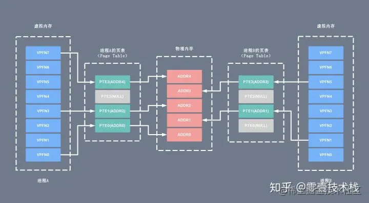
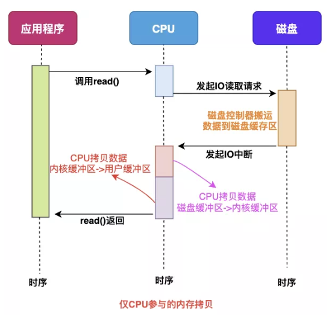
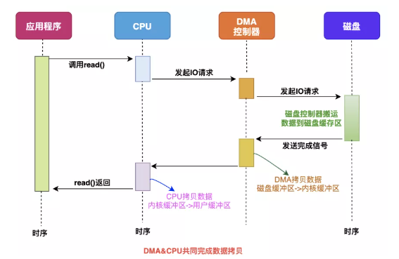
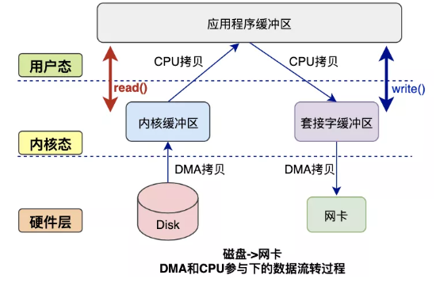
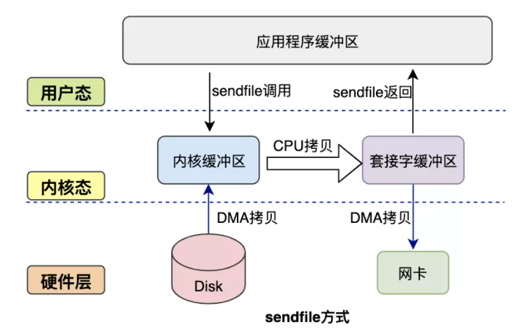

# 零拷贝

# 概述

零拷贝（Zero-copy）技术指在计算机执行操作时，CPU 不需要先将数据从一个内存区域复制到另一个内存区域，从而可以减少上下文切换以及 CPU 的拷贝时间。它的作用是在数据报从网络设备到用户程序空间传递的过程中，减少数据拷贝次数，减少系统调用，实现 CPU 的零参与，彻底消除 CPU 在这方面的负载。实现零拷贝用到的最主要技术是 DMA 数据传输技术和内存区域映射技术。

- 零拷贝机制可以减少数据在内核缓冲区和用户进程缓冲区之间反复的 I/O 拷贝操作。

- 零拷贝机制可以减少用户进程地址空间和内核地址空间之间因为上下文切换而带来的 CPU 开销。

## 物理内存和虚拟内存

进程之间是共享 CPU 和内存资源的，因此需要一套内存管理机制防止进程之间内存泄漏的问题。为了更加有效地管理内存并减少出错，现代操作系统提供了一种对主存的抽象概念，即是虚拟内存（Virtual Memory）。虚拟内存为每个进程提供了一个一致的、私有的地址空间，它让每个进程产生了一种自己在独享主存的错觉（每个进程拥有一片连续完整的内存空间）。

- **物理内存**：物理内存（Physical memory）是相对于虚拟内存（Virtual Memory）而言的。物理内存指通过物理内存条而获得的内存空间，而虚拟内存则是指将硬盘的一块区域划分来作为内存。内存主要作用是在计算机运行时为操作系统和各种程序提供临时储存。

- **虚拟内存**：是计算机系统内存管理的一种技术。 它使得应用程序认为它拥有连续的可用的内存（一个连续完整的地址空间）。而实际上，虚拟内存通常是被分隔成多个物理内存碎片，还有部分暂时存储在外部磁盘存储器上，在需要时进行数据交换，加载到物理内存中来。 目前，大多数操作系统都使用了虚拟内存，如 Windows 系统的虚拟内存、Linux 系统的交换空间等等。

虚拟内存地址和用户进程紧密相关，一般来说不同进程里的同一个虚拟地址指向的物理地址是不一样的，所以离开进程谈虚拟内存没有任何意义。每个进程所能使用的虚拟地址大小和 CPU 位数有关。在 32 位的系统上，虚拟地址空间大小是 2 ^ 32 = 4G，在 64位系统上，虚拟地址空间大小是 2 ^ 64 = 2 ^ 34G，而实际的物理内存可能远远小于虚拟内存的大小。每个用户进程维护了一个单独的页表（Page Table），虚拟内存和物理内存就是通过这个页表实现地址空间的映射的。下面给出两个进程 A、B 各自的虚拟内存空间以及对应的物理内存之间的地址映射示意图：

当进程执行一个程序时，需要先从内存中读取该进程的指令然后执行，获取指令时用到的就是虚拟地址。这个虚拟地址是程序链接时确定的（内核加载并初始化进程时会调整动态库的地址范围）。为了获取到实际的数据，CPU 需要将虚拟地址转换成物理地址，CPU 转换地址时需要用到进程的页表（Page Table），而页表（Page Table）里面的数据由操作系统维护。

其中页表（Page Table）可以简单的理解为单个内存映射（Memory Mapping）的链表（当然实际结构很复杂），里面的每个内存映射（Memory Mapping）都将一块虚拟地址映射到一个特定的地址空间（物理内存或者磁盘存储空间）。每个进程拥有自己的页表（Page Table），和其它进程的页表（Page Table）没有关系。

通过上面的介绍，我们可以简单的将用户进程申请并访问物理内存（或磁盘存储空间）的过程总结如下：

1. 用户进程向操作系统发出内存申请请求

1. 系统会检查进程的虚拟地址空间是否被用完，如果有剩余，给进程分配虚拟地址

1. 系统为这块虚拟地址创建的内存映射（Memory Mapping），并将它放进该进程的页表（Page Table）

1. 系统返回虚拟地址给用户进程，用户进程开始访问该虚拟地址

1. CPU 根据虚拟地址在此进程的页表（Page Table）中找到了相应的内存映射（Memory Mapping），但是这个内存映射（Memory Mapping）没有和物理内存关联，于是产生缺页中断

1. 操作系统收到缺页中断后，分配真正的物理内存并将它关联到页表相应的内存映射（Memory Mapping）。中断处理完成后 CPU 就可以访问内存了

1. 当然缺页中断不是每次都会发生，只有系统觉得有必要延迟分配内存的时候才用的着，也即很多时候在上面的第 3 步系统会分配真正的物理内存并和内存映射（Memory Mapping）进行关联。

在用户进程和物理内存（磁盘存储器）之间引入虚拟内存主要有以下的优点：

- 地址空间：提供更大的地址空间，并且地址空间是连续的，使得程序编写、链接更加简单

- 进程隔离：不同进程的虚拟地址之间没有关系，所以一个进程的操作不会对其它进程造成影响

- 数据保护：每块虚拟内存都有相应的读写属性，这样就能保护程序的代码段不被修改，数据块不能被执行等，增加了系统的安全性

- 内存映射：有了虚拟内存之后，可以直接映射磁盘上的文件（可执行文件或动态库）到虚拟地址空间。这样可以做到物理内存延时分配，只有在需要读相应的文件的时候，才将它真正的从磁盘上加载到内存中来，而在内存吃紧的时候又可以将这部分内存清空掉，提高物理内存利用效率，并且所有这些对应用程序是都透明的

- 共享内存：比如动态库只需要在内存中存储一份，然后将它映射到不同进程的虚拟地址空间中，让进程觉得自己独占了这个文件。进程间的内存共享也可以通过映射同一块物理内存到进程的不同虚拟地址空间来实现共享

- 物理内存管理：物理地址空间全部由操作系统管理，进程无法直接分配和回收，从而系统可以更好的利用内存，平衡进程间对内存的需求

## 内核空间和用户空间

操作系统的核心是内核，独立于普通的应用程序，可以访问受保护的内存空间，也有访问底层硬件设备的权限。为了避免用户进程直接操作内核，保证内核安全，操作系统将虚拟内存划分为两部分，一部分是内核空间（Kernel-space），一部分是用户空间（User-space）。 在 Linux 系统中，内核模块运行在内核空间，对应的进程处于内核态；而用户程序运行在用户空间，对应的进程处于用户态。

内核进程和用户进程所占的虚拟内存比例是 1:3，而 Linux x86_32 系统的寻址空间（虚拟存储空间）为 4G（2的32次方），将最高的 1G 的字节（从虚拟地址 0xC0000000 到 0xFFFFFFFF）供内核进程使用，称为内核空间；而较低的 3G 的字节（从虚拟地址 0x00000000 到 0xBFFFFFFF），供各个用户进程使用，称为用户空间。下图是一个进程的用户空间和内核空间的内存布局：

### 内核空间

内核空间总是驻留在内存中，它是为操作系统的内核保留的。应用程序是不允许直接在该区域进行读写或直接调用内核代码定义的函数的。上图左侧区域为内核进程对应的虚拟内存，按访问权限可以分为进程私有和进程共享两块区域。

- 进程私有的虚拟内存：每个进程都有单独的内核栈、页表、task 结构以及 mem_map 结构等。

- 进程共享的虚拟内存：属于所有进程共享的内存区域，包括物理存储器、内核数据和内核代码区域。

### 用户空间

每个普通的用户进程都有一个单独的用户空间，处于用户态的进程不能访问内核空间中的数据，也不能直接调用内核函数的 ，因此要进行系统调用的时候，就要将进程切换到内核态才行。用户空间包括以下几个内存区域：

- 运行时栈：由编译器自动释放，存放函数的参数值，局部变量和方法返回值等。每当一个函数被调用时，该函数的返回类型和一些调用的信息被存储到栈顶，调用结束后调用信息会被弹出弹出并释放掉内存。栈区是从高地址位向低地址位增长的，是一块连续的内在区域，最大容量是由系统预先定义好的，申请的栈空间超过这个界限时会提示溢出，用户能从栈中获取的空间较小。

- 运行时堆：用于存放进程运行中被动态分配的内存段，位于 BSS 和栈中间的地址位。由卡发人员申请分配（malloc）和释放（free）。堆是从低地址位向高地址位增长，采用链式存储结构。频繁地 malloc/free 造成内存空间的不连续，产生大量碎片。当申请堆空间时，库函数按照一定的算法搜索可用的足够大的空间。因此堆的效率比栈要低的多。

- 代码段：存放 CPU 可以执行的机器指令，该部分内存只能读不能写。通常代码区是共享的，即其它执行程序可调用它。假如机器中有数个进程运行相同的一个程序，那么它们就可以使用同一个代码段。

- 未初始化的数据段：存放未初始化的全局变量，BSS 的数据在程序开始执行之前被初始化为 0 或 NULL。

- 已初始化的数据段：存放已初始化的全局变量，包括静态全局变量、静态局部变量以及常量。

- 内存映射区域：例如将动态库，共享内存等虚拟空间的内存映射到物理空间的内存，一般是 mmap 函数所分配的虚拟内存空间。

内核态可以执行任意命令，调用系统的一切资源，而用户态只能执行简单的运算，不能直接调用系统资源。用户态必须通过系统接口（System Call），才能向内核发出指令。比如，当用户进程启动一个 bash 时，它会通过 getpid() 对内核的 pid 服务发起系统调用，获取当前用户进程的 ID；当用户进程通过 cat 命令查看主机配置时，它会对内核的文件子系统发起系统调用。

- 内核空间可以访问所有的 CPU 指令和所有的内存空间、I/O 空间和硬件设备。

- 用户空间只能访问受限的资源，如果需要特殊权限，可以通过系统调用获取相应的资源。

- 用户空间允许页面中断，而内核空间则不允许。

- 内核空间和用户空间是针对线性地址空间的。

- x86 CPU中用户空间是 0 - 3G 的地址范围，内核空间是 3G - 4G 的地址范围。x86_64 CPU 用户空间地址范围为0x0000000000000000 – 0x00007fffffffffff，内核地址空间为 0xffff880000000000 - 最大地址。

- 所有内核进程（线程）共用一个地址空间，而用户进程都有各自的地址空间。

有了用户空间和内核空间的划分后，Linux 内部层级结构可以分为三部分，从最底层到最上层依次是硬件、内核空间和用户空间，如下图所示:

## DMA技术由来

read读取磁盘数据的过程：

1. 当应用程序需要读取磁盘数据时，调用 read() 从用户态陷入内核态，read() 这个系统调用最终由 CPU 来完成。

1. CPU 向磁盘发起 I/O 请求，磁盘收到之后开始准备数据。

1. 磁盘将数据放到磁盘缓冲区之后，向 CPU 发起 I/O 中断，报告 CPU 数据已经 Ready 了。

1. CPU 收到磁盘控制器的 I/O 中断之后，开始拷贝数据，完成之后 read() 返回，再从内核态切换回用户态。

上面的过程中，CPU大量参与了数据拷贝工作， DMA可以帮助CPU干这些杂活。

最主要的变化是，CPU 不再和磁盘直接交互，而是 DMA 和磁盘交互并且将数据从磁盘缓冲区拷贝到内核缓冲区，之后还是需要CPU将数据从内核态搬运到用户态。

来看下完整的数据拷贝过程简图：

读数据过程：  

- 应用程序要读取磁盘数据，调用 read() 函数从而实现用户态切换内核态，这是第 1 次状态切换。

- DMA 控制器将数据从磁盘拷贝到内核缓冲区，这是第 1 次 DMA 拷贝。

- CPU 将数据从内核缓冲区复制到用户缓冲区，这是第 1 次 CPU 拷贝。

- CPU 完成拷贝之后，read() 函数返回实现用户态切换用户态，这是第 2 次状态切换。

写数据过程：

- 应用程序要向网卡写数据，调用 write() 函数实现用户态切换内核态，这是第 1 次切换。

- CPU 将用户缓冲区数据拷贝到内核缓冲区，这是第 1 次 CPU 拷贝。

- DMA 控制器将数据从内核缓冲区复制到 socket 缓冲区，这是第 1 次 DMA 拷贝。

- 完成拷贝之后，write() 函数返回实现内核态切换用户态，这是第 2 次切换。

可以看到，如果我们不对数据进行修改，是没必要将数据从内核态复制到用户态的。

零拷贝技术的几个实现手段包括：mmap+write、sendfile、sendfile+DMA 收集、splice 等。

## **mmap 方式**

mmap 是 Linux 提供的一种内存映射文件的机制，它实现了将内核中读缓冲区地址与用户空间缓冲区地址进行映射，从而实现内核缓冲区与用户缓冲区的共享。 这样就减少了一次用户态和内核态的 CPU 拷贝，但是在内核空间内仍然有一次 CPU 拷贝。

mmap 对大文件传输有一定优势，但是小文件可能出现碎片，并且在多个进程同时操作文件时可能产生引发 coredump 的 signal。

用户态和内核态共享数据缓冲区，避免了两者之间的复制。适用于大文件读取并处理的场景

## **sendfile 方式**

sendfile 相比于 mmap+write 有一定改进，但是由系统调用引起的状态切换并没有减少。

sendfile 方式只使用一个函数就可以完成之前的 read+write 和 mmap+write 的功能，这样就少了 2 次状态切换，由于数据不经过用户缓冲区，因此该数据无法被修改。

应用程序只需要调用 sendfile 函数即可完成，只有 2 次状态切换、1 次 CPU 拷贝、2 次 DMA 拷贝。但是 sendfile 在内核缓冲区和 socket 缓冲区仍然存在一次 CPU 拷贝。Linux 2.4 内核对此进行了优化，但是需要硬件 DMA 控制器的配合。升级后的 sendfile 将内核缓冲区中对应的数据描述信息（文件描述符、地址偏移量等信息）记录到 socket 缓冲区中。DMA 控制器根据 socket 缓冲区中的地址和偏移量将数据从内核缓冲区拷贝到网卡中，从而省去了内核空间中仅剩 1 次的 CPU 拷贝。

这种方式有 2 次状态切换、0 次 CPU 拷贝、2 次 DMA 拷贝，但是无法对数据进行修改，并且需要硬件层面 DMA 的支持，并且 sendfile 只能将文件数据拷贝到 socket 描述符上，有一定的局限性。

sendfile 直接发起系统调用，将数据直接发送到了网卡。避免了数据来回的复制。

## **splice 方式**

splice 系统调用是 Linux 在 2.6 版本引入的，其不需要硬件支持，并且不再限定于 socket 上，实现两个普通文件之间的数据零拷贝。

splice 系统调用可以在内核缓冲区和 socket 缓冲区之间建立管道来传输数据，避免了两者之间的 CPU 拷贝操作。

splice 也有一些局限，它的两个文件描述符参数中有一个必须是管道设备。

# Java NIO零拷贝实现

在 Java NIO 中的通道（Channel）就相当于操作系统的内核空间（kernel space）的缓冲区，而缓冲区（Buffer）对应的相当于操作系统的用户空间（user space）中的用户缓冲区（user buffer）。

- 通道（Channel）是全双工的（双向传输），它既可能是读缓冲区（read buffer），也可能是网络缓冲区（socket buffer）。

- 缓冲区（Buffer）分为堆内存（HeapBuffer）和堆外内存（DirectBuffer），这是通过 malloc() 分配出来的用户态内存。

堆外内存（DirectBuffer）在使用后需要应用程序手动回收，而堆内存（HeapBuffer）的数据在 GC 时可能会被自动回收。因此，在使用 HeapBuffer 读写数据时，为了避免缓冲区数据因为 GC 而丢失，NIO 会先把 HeapBuffer 内部的数据拷贝到一个临时的 DirectBuffer 中的本地内存（native memory），这个拷贝涉及到 sun.misc.Unsafe.copyMemory() 的调用，背后的实现原理与 memcpy() 类似。 最后，将临时生成的 DirectBuffer 内部的数据的内存地址传给 I/O 调用函数，这样就避免了再去访问 Java 对象处理 I/O 读写。

## MappedByteBuffer

MappedByteBuffer 是 NIO 基于内存映射（mmap）这种零拷贝方式的提供的一种实现，它继承自 ByteBuffer。FileChannel 定义了一个 map() 方法，它可以把一个文件从 position 位置开始的 size 大小的区域映射为内存映像文件。抽象方法 map() 方法在 FileChannel 中的定义如下：

public abstract MappedByteBuffer map(MapMode mode, long position, long size)

​     throws IOException;

- mode：限定内存映射区域（MappedByteBuffer）对内存映像文件的访问模式，包括只可读（READ_ONLY）、可读可写（READ_WRITE）和写时拷贝（PRIVATE）三种模式。

- position：文件映射的起始地址，对应内存映射区域（MappedByteBuffer）的首地址。

- size：文件映射的字节长度，从 position 往后的字节数，对应内存映射区域（MappedByteBuffer）的大小。

MappedByteBuffer 相比 ByteBuffer 新增了 fore()、load() 和 isLoad() 三个重要的方法：

- fore()：对于处于 READ_WRITE 模式下的缓冲区，把对缓冲区内容的修改强制刷新到本地文件。

- load()：将缓冲区的内容载入物理内存中，并返回这个缓冲区的引用。

- isLoaded()：如果缓冲区的内容在物理内存中，则返回 true，否则返回 false。

下面给出一个利用 MappedByteBuffer 对文件进行读写的使用示例：

private final static String CONTENT = "Zero copy implemented by MappedByteBuffer";

private final static String FILE_NAME = "/mmap.txt";

private final static String CHARSET = "UTF-8";

写文件数据：打开文件通道 fileChannel 并提供读权限、写权限和数据清空权限，通过 fileChannel 映射到一个可写的内存缓冲区 mappedByteBuffer，将目标数据写入 mappedByteBuffer，通过 force() 方法把缓冲区更改的内容强制写入本地文件。

@Test

public void writeToFileByMappedByteBuffer() {

   Path path = Paths.get(getClass().getResource(FILE_NAME).getPath());

   byte[] bytes = CONTENT.getBytes(Charset.forName(CHARSET));

   try (FileChannel fileChannel = FileChannel.open(path, StandardOpenOption.READ,

​       StandardOpenOption.WRITE, StandardOpenOption.TRUNCATE_EXISTING)) {

​     MappedByteBuffer mappedByteBuffer = fileChannel.map(READ_WRITE, 0, bytes.length);

​     if (mappedByteBuffer != null) {

​      mappedByteBuffer.put(bytes);

​      mappedByteBuffer.force();

​     }

   } catch (IOException e) {

​    e.printStackTrace();

   }

}

读文件数据：打开文件通道 fileChannel 并提供只读权限，通过 fileChannel 映射到一个只可读的内存缓冲区 mappedByteBuffer，读取 mappedByteBuffer 中的字节数组即可得到文件数据。

@Test

public void readFromFileByMappedByteBuffer() {

   Path path = Paths.get(getClass().getResource(FILE_NAME).getPath());

   int length = CONTENT.getBytes(Charset.forName(CHARSET)).length;

   try (FileChannel fileChannel = FileChannel.open(path, StandardOpenOption.READ)) {

​     MappedByteBuffer mappedByteBuffer = fileChannel.map(READ_ONLY, 0, length);

​     if (mappedByteBuffer != null) {

​       byte[] bytes = new byte[length];

​      mappedByteBuffer.get(bytes);

​       String content = new String(bytes, StandardCharsets.UTF_8);

​       assertEquals(content, "Zero copy implemented by MappedByteBuffer");

​     }

   } catch (IOException e) {

​    e.printStackTrace();

   }

}

# 应用

RocketMQ 选择了 mmap + write 这种零拷贝方式，适用于业务级消息这种小块文件的数据持久化和传输；

而 Kafka 采用的是 sendfile 这种零拷贝方式，适用于系统日志消息这种高吞吐量的大块文件的数据持久化和传输。

但是值得注意的一点是，Kafka 的索引文件使用的是 mmap + write 方式，数据文件使用的是 sendfile 方式。
